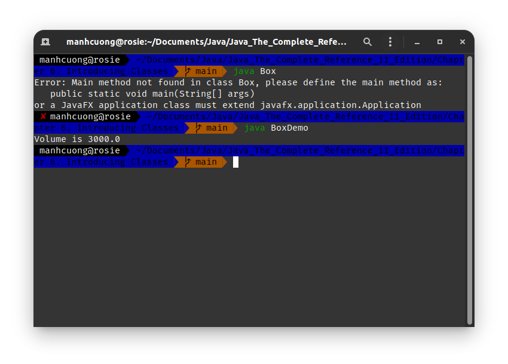
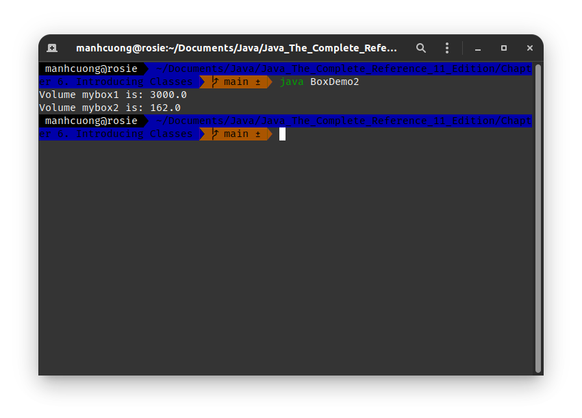
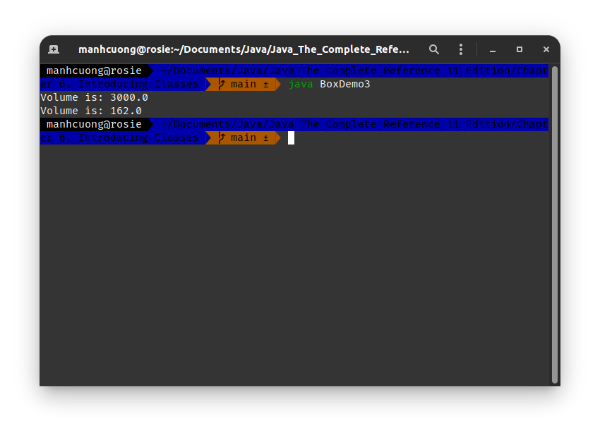
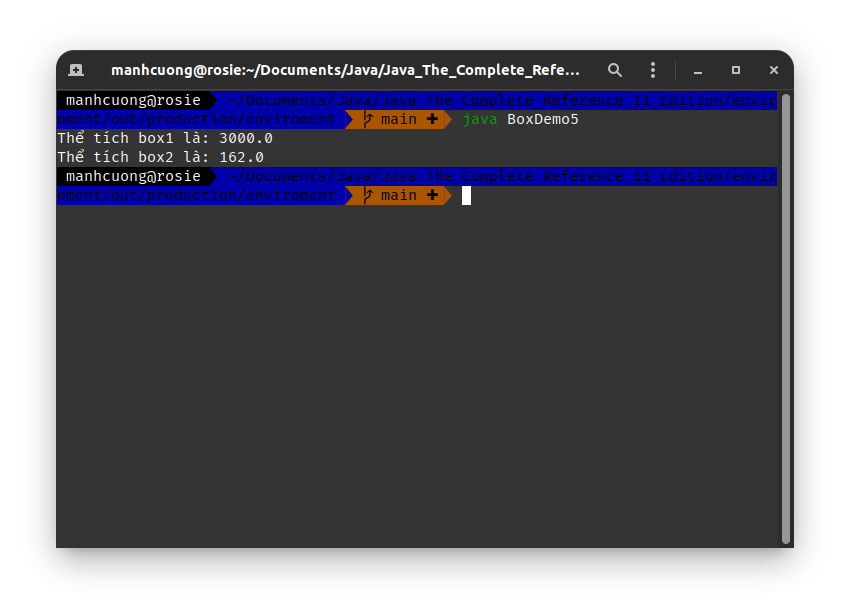
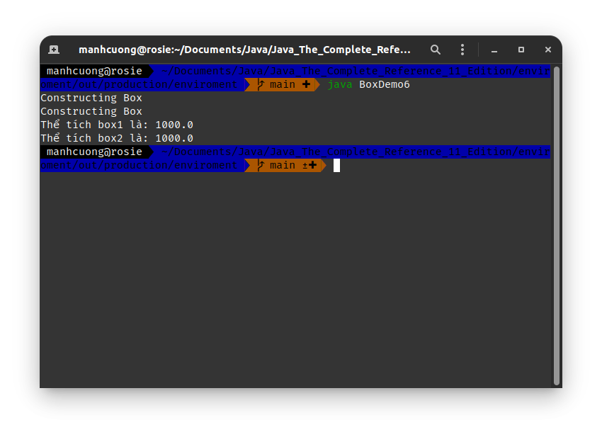
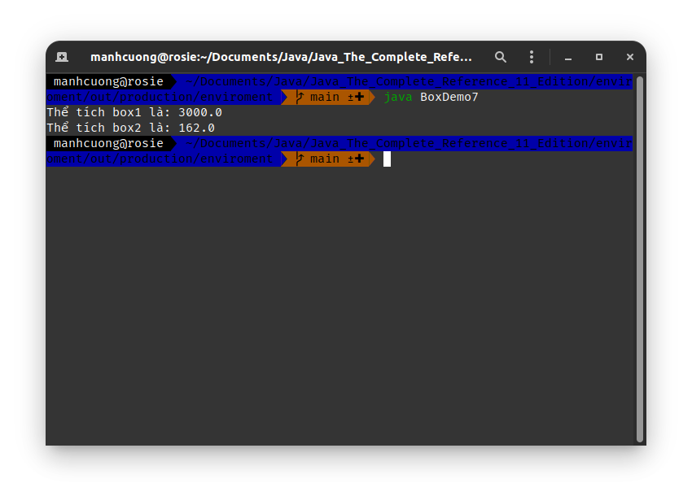
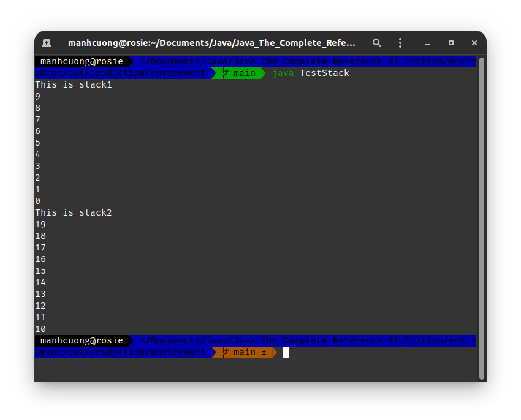

# 1. Cơ bản về `class` _[Class Fundamentals]_
###### BoxDemo.java _[source code](./BoxDemo.java)_
```java
class Box {
    double width, height, depth;
}

class BoxDemo {
    public static void main(String args[]) {
        Box mybox = new Box();
        double vol;

        mybox.width = 10;
        mybox.height = 20;
        mybox.depth = 15;

        vol = mybox.width * mybox.height * mybox.depth;

        System.out.println("Volume is " + vol);
    }
}
```


###### BoxDemo2.java _[source code](./BoxDemo2.java)_
```java
class Box {
    double width, height, depth;
}


class BoxDemo2 {
    public static void main(String[] args) {
        Box mybox1 = new Box();
        Box mybox2 = new Box();
        double vol;

        mybox1.width = 10;
        mybox1.height = 20;
        mybox1.depth = 15;

        mybox2.width = 3;
        mybox2.height = 6;
        mybox2.depth = 9;

        vol = mybox1.width * mybox1.height * mybox1.depth;
        System.out.println("Volume mybox1 is: " + vol);

        vol = mybox2.width * mybox2.height * mybox2.depth;
        System.out.println("Volume mybox2 is: " + vol);
    }
}
```


# 2. Gán biến tham chiếu đến Object
```java
Box b1 = new Box();
Box b2 = b1;
```
* Lúc này `b1` và `b2` cùng tham chiếu đến cùng một object, mọi thay đổi trên `b1` đều sẽ ảnh hưởng đến `b2` và ngược lại.
* Để xóa bỏ việc `b2` tham chiếu đến `b1` hoặc ngược lại thì làm như sau:
```java
b2 = null;
// or
b1 = null;
```

# 3. Phương thức _[methods]_
###### BoxDemo3.java _[source code](./BoxDemo3.java)_
```java
class Box {
    double width, height, depth;

    void volume() {
        System.out.print("Volume is: ");
        System.out.println(width * height * depth);
    }
}

class BoxDemo3 {
    public static void main(String[] args) {
        Box box1 = new Box();
        Box box2 = new Box();

        box1.width = 10;
        box1.height = 20;
        box1.depth = 15;

        box2.width = 3;
        box2.height = 6;
        box2.depth = 9;

        box1.volume();

        box2.volume();
    }
}
```


## 3.1. Trả về giá trị _[Returning a Value]_
###### BoxDemo4.java _[source code](./BoxDemo4.java)_
```java
class Box {
    double width, height, depth;

    double volume() {
        return width * height * depth;
    }
}

class BoxDemo4 {
    public static void main(String args[]) {
        Box box1 = new Box();
        Box box2 = new Box();
        double vol;

        box1.width = 10;
        box1.height = 20;
        box1.depth = 15;

        box2.width = 3;
        box2.height = 6;
        box2.depth = 9;

        vol = box1.volume();
        System.out.println("Thể tích box1 là: " + vol);

        vol = box2.volume();
        System.out.println("Thể tích box2 là: " + vol);
    }
}
```


## 3.2. Phương thức có tham số _[Adding a Method That Takes Parameters]_
###### BoxDemo5.java _[source code](./BoxDemo5.java)_
```java
class Box {
    double width, height, depth;

    double volume() {
        return width * height * depth;
    }

    void setDim(double w, double h, double d) {
        width = w;
        height = h;
        depth = d;
    }
}

class BoxDemo5 {
    public static void main(String args[]) {
        Box box1 = new Box();
        Box box2 = new Box();
        double vol;

        box1.setDim(10, 20, 15);
        box2.setDim(3, 6, 9);

        vol = box1.volume();
        System.out.println("Thể tích box1 là: " + vol);

        vol = box2.volume();
        System.out.println("Thể tích box2 là: " + vol);
    }
}
```


# 4. Constructor
###### BoxDemo6.java _[source code](./BoxDemo6.java)_
```java
class Box {
    double width, height, depth;

    Box() {
        System.out.println("Constructing Box");
        width = 10;
        height = 10;
        depth = 10;
    }

    double volume() {
        return width * height * depth;
    }
}

class BoxDemo6 {
    public static void main(String args[]) {
        Box box1 = new Box();
        Box box2 = new Box();
        double vol;

        vol = box1.volume();
        System.out.println("Thể tích box1 là: " + vol);

        vol = box2.volume();
        System.out.println("Thể tích box2 là: " + vol);
    }
}
```


## 4.1. Truyền tham số vào Constructor _[Paramterized Constructors]_
```java
class Box {
    double width, height, depth;

    Box(double w, double h, double d) {
        width = w;
        height = h;
        depth = d;
    }

    double volume() {
        return width * height * depth;
    }
}

class BoxDemo7 {
    public static void main(String args[]) {
        Box box1 = new Box(10, 20, 15);
        Box box2 = new Box(3, 6, 9);
        double vol;

        vol = box1.volume();
        System.out.println("Thể tích box1 là: " + vol);

        vol = box2.volume();
        System.out.println("Thể tích box2 là: " + vol);
    }
}
```


# 5. Ví dụ về class Stack _[A Stack Class]_
###### TestStack.java _[source code](./TestStack.java)_
```java
class Stack {
    int stack[] = new int[10];
    int tos;

    Stack() {
        tos = -1;
    }

    // Thêm một item vào `this.stack`
    void push(int item) {
        if (tos == 9) {
            System.out.println("Stack is full");
        } else {
            stack[++tos] = item;
        }
    }

    // Lấy + xóa phần tử đầu tiên ra khỏi `this.stack`
    int pop() {
        if (tos < 0) {
            System.out.println("Stack underflow");

            return 0;
        } else {
            return stack[tos--];
        }
    }
}

class TestStack {
    public static void main(String args[]) {
        Stack stack1 = new Stack();
        Stack stack2 = new Stack();

        for (int i = 0; i < 10; ++i) {
            stack1.push(i);
        }

        for (int i = 10; i < 20; ++i) {
            stack2.push(i);
        }

        System.out.println("This is stack1");
        for (int i = 0; i < 10; ++i) {
            System.out.println(stack1.pop());
        }

        System.out.println("This is stack2");
        for (int i = 0; i < 10; ++i) {
            System.out.println(stack2.pop());
        }
    }
}
```
