# 1. Nạp chồng phương thức _[Overloading Methods]_
* Java tự động tìm phương thức phù hợp dựa vào kiểu dữ liệu của tham số và kết quả trả về.
###### Overload.java _[source code](./Overload.java)_
```java
class OverloadDemo {
    void test() {
        System.out.println("Hàm test: ko tham số");
    }

    void test(int a) {
        System.out.println("a: " + a);
    }

    void test(int a, int b) {
        System.out.println("a và b: " + a + " - " + b);
    }

    double test(double a) {
        System.out.println("double a: " + a);
        return a*a;
    }
}

class Overload {
    public static void main(String args[]) {
        OverloadDemo od = new OverloadDemo();
        double res;

        od.test();
        od.test(10);
        od.test(10, 20);
        res = od.test(123.45);
        System.out.println("Kết quả của od.test(123.45) là: " + res);
    }
}
```
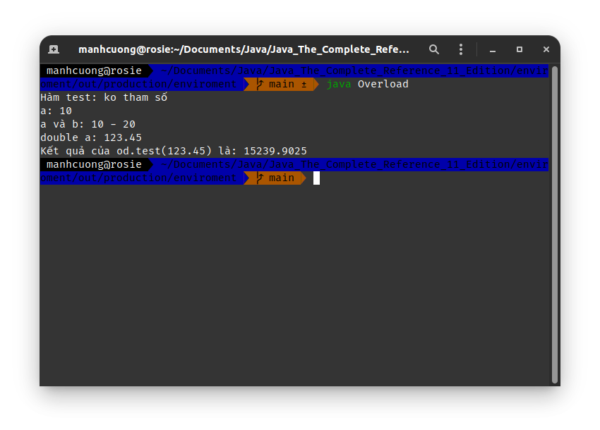

<hr>

* Tuy nhiên ko phải lúc nào Java cũng đủ khôn để chọn ra phương thức chính xác, bỏi vì Java có cơ chế là tự động **thăng kiểu dữ liệu** hãy xem ví dụ dưới đây.

###### Overload1.java _[source code](./Overload1.java)_
```java
class OverloadDemo {
    void test() {
        System.out.println("Hàm test: ko tham số");
    }

    void test(int a, int b) {
        System.out.println("a và b: " + a + " - " + b);
    }

    void test(double a) {
        System.out.println("double a: " + a);
    }
}

class Overload1 {
    public static void main(String args[]) {
        OverloadDemo od = new OverloadDemo();
        int integer = 69;

        od.test();
        od.test(10, 20);

        od.test(integer); // gọi đến `test(double a)` do cơ chế thăng kiểu dữ liệu
        od.test(123.45);
    }
}
```
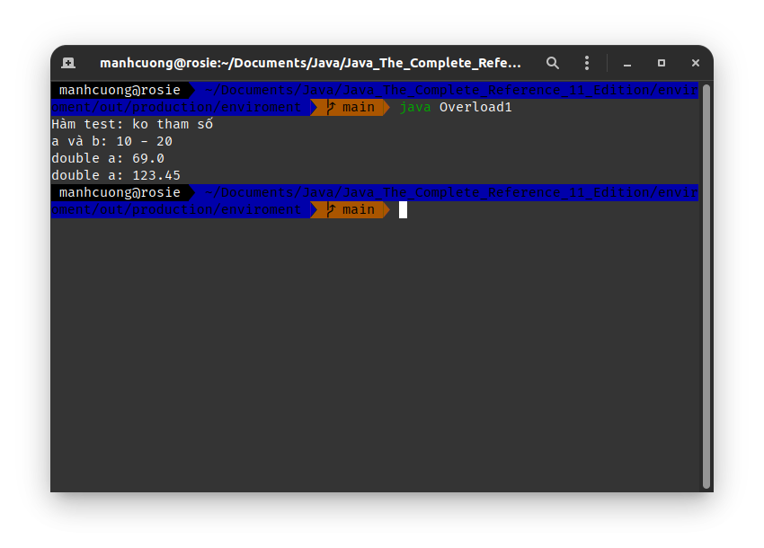

* Vì trong class `OverloadDemo` ko có phương thức `void test(int a)` nên khi Java ko tìm thấy nó thăng hạng tham số đầu vào và sau đó gọi đến phương thức `void test(double a)`.

## 1.1. Overloading Constructors
###### OverloadCons.java _[source code](./OverloadCons.java)_
```java
class Box {
    double width, height, depth;

    Box(double w, double h, double d) {
        width = w;
        height = h;
        depth = d;
    }

    Box() {
        width = height = depth = -1;
    }

    Box(double len) {
        width = height = depth = len;
    }

    double volume() {
        return width * height * depth;
    }
}

class OverloadCons {
    public static void main(String args[]) {
        Box box1 = new Box(10, 20, 15);
        Box box2 = new Box();
        Box box3 = new Box(7);

        System.out.println("Thể tích của box1 là: " + box1.volume());
        System.out.println("Thể tích của box2 là: " + box2.volume());
        System.out.println("Thể tích của box3 là: " + box3.volume());
    }
}
```
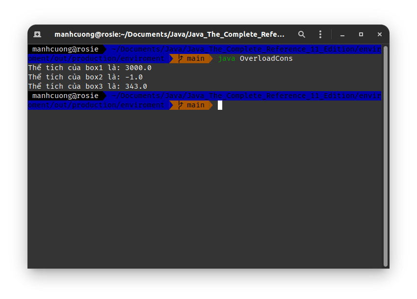

# 2. Sử dụng Object như là một tham số _[Using Objects as Parameters]_
###### PassOb.java _[source code](./PassOb.java)_
```java
class Test {
    int a, b;

    Test(int i, int j) {
        a = i;
        b = j;
    }

    boolean equalTo(Test other) {
        if (other.a == a && other.b == b) {
            return true;
        }

        return false;
    }
}

class PassOb {
    public static void main(String args[]) {
        Test ob1 = new Test(100, 22);
        Test ob2 = new Test(100, 22);
        Test ob3 = new Test(-1, -1);

        System.out.println("ob1 == ob2: " + ob1.equalTo(ob2));
        System.out.println("ob1 == ob3: " + ob1.equalTo(ob3));
    }
}
```
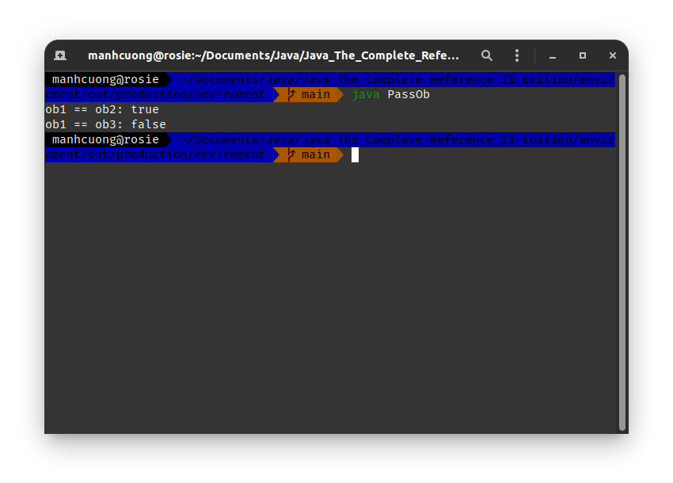

<hr>

* Đôi khi ta cần phải copy một object sang một object khác, ta có thể sử dụng phương thức constructor để làm điều này.
```java
class Box {
    double width, height, depth;

    // copy constructor
    Box(Box other) {
        width = other.width;
        height = other.height;
        depth = other.depth;
    }

    Box(double w, double h, double d) {
        width = w;
        height = h;
        depth = d;
    }

    Box() {
        width = height = depth = -1;
    }

    Box(double len) {
        width = height = depth = len;
    }

    double volume() {
        return width * height * depth;
    }
}

class OverloadCons2 {
    public static void main(String args[]) {
        Box box1 = new Box(10, 20, 15);
        Box box2 = new Box();
        Box box3 = new Box(7);
        Box box_clone = new Box(box1);

        System.out.println("Thể tích của box1 là: " + box1.volume());
        System.out.println("Thể tích của box2 là: " + box2.volume());
        System.out.println("Thể tích của box3 là: " + box3.volume());
        System.out.println("Thể tích của box_clone là: " + box_clone.volume());
    }
}
```
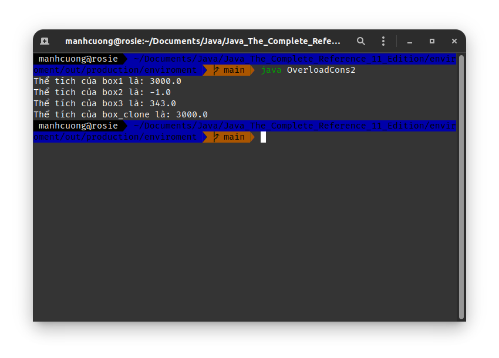

# 3. Tìm hiểu về cách truyền đối số _[A Closer Look at Argument Passing]_
* Khi ta truyền đối số vào một phương thức mà kiểu giá trị của đối số này là các kiểu giá trị nguyên thủy của Java, thì dù trong phương thức đó ta có xào nấu biến này thành giống gì đi nữa thì sau khi kết thúc phương thức, giá trị của các đối số vẫn sẽ **ko thay đổi**.
###### CallByValue.java _[source code](./CallByValue.java)_
```java
class Test {
    void meth(int i, int j) {
        i *= 2;
        j /= 2;
        // Biến tấu cỡ nào cũng ko thay đổi giá trị của i và j sau khi kết thúc phương thức
    }
}

class CallByValue {
    public static void main(String args[]) {
        Test ob = new Test();

        int a = 15, b = 20;

        System.out.println("Giá trị của a và b trc khi gọi hàm meth: " + a + " " + b);

        ob.meth(a, b);

        System.out.println("Giá trị của a và b sau khi gọi hàm meth: " + a + " " + b);
    }
}
```
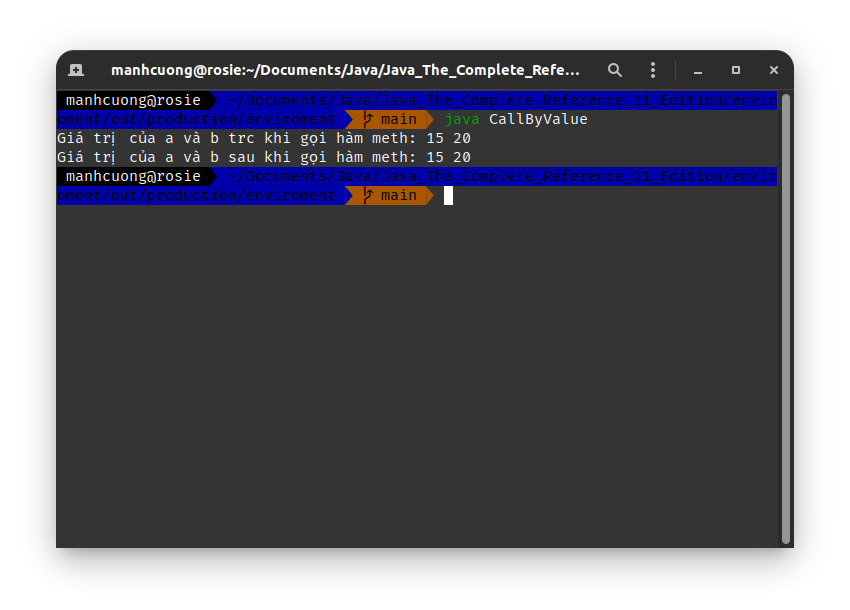

<hr>

* Tuy nhiên khi đối số truyền vào ko phải là kiểu dữ liệu nguyên thủy của Java, thì khi các thuộc tính của object này bị xào nấu trong phương thức mà nó dc truyền vào - sau khi phương thức kết thúc, các thuộc tính này sẽ bị thay đổi.
###### PassObjRef.java _[source code](./PassObjRef.java)_
```java
class Test {
    int a, b;

    Test(int i, int j) {
        a = i;
        b = j;
    }

    void meth(Test other) {
        other.a *= 2;
        other.b /= 2;
        // Các thuộc tính của một object sẽ bị thay đổi khi kết thúc phương thức
    }
}

class PassObjRef {
    public static void main(String args[]) {
        Test ob = new Test(15, 20);

        System.out.println("Giá trị của ob.a và ob.b trc khi gọi hàm meth: " + ob.a + " " + ob.b);

        ob.meth(ob);

        System.out.println("Giá trị của ob.a và ob.b sau khi gọi hàm meth: " + ob.a + " " + ob.b);
    }
}
```
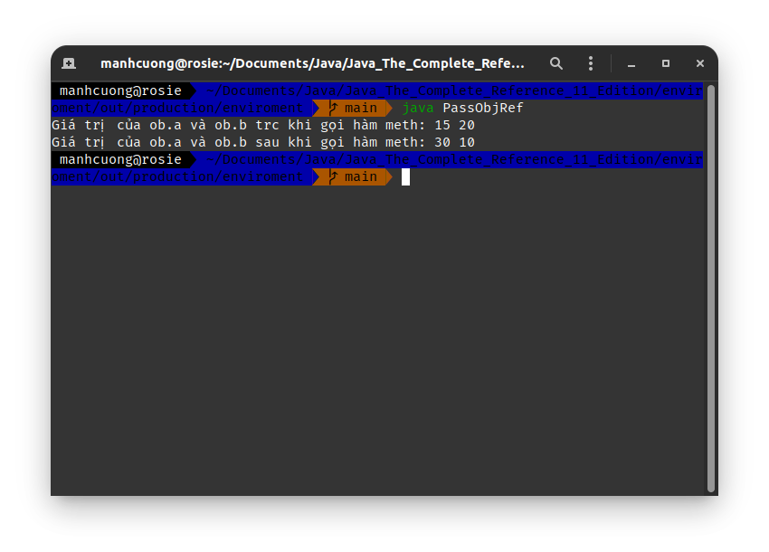

# 4. Phương thức trả về object _[Returning Objects]_
###### RetOb.java _[source code](./RetOb.java)_
```java
class Test {
    int a;

    Test(int i) {
        a = i;
    }

    Test incrByTen() {
        return new Test(a + 10);
    }
}


class RetOb {
    public static void main(String args[]) {
        Test ob1 = new Test(2);
        Test ob2;

        ob2 = ob1.incrByTen();

        System.out.println("ob1.a: " + ob1.a);
        System.out.println("ob2.a: " + ob2.a);

        ob2 = ob2.incrByTen();
        System.out.println("ob2.a sau khi gọi p.thức incrByTen() hai lần: " + ob2.a);
    }
}
```
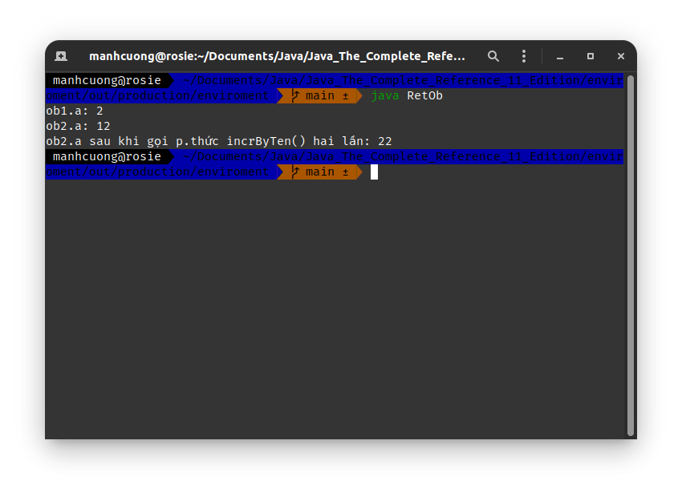

# 5. Đệ quy _[Recursion]_
###### Recursion.java _[source code](./Recursion.java)_
```java
class Factorial {
    int fact(int n) {
        int res;

        if (n == 1) {
            return 1;
        }

        res = fact(n - 1) * n;
        return res;
    }
}

class Recursion {
    public static void main(String args[]) {
        Factorial f = new Factorial();

        System.out.println("3 giai thừa bằng " + f.fact(3));
        System.out.println("4 giai thừa bằng " + f.fact(4));
        System.out.println("5 giai thừa bằng " + f.fact(5));
    }
}
```
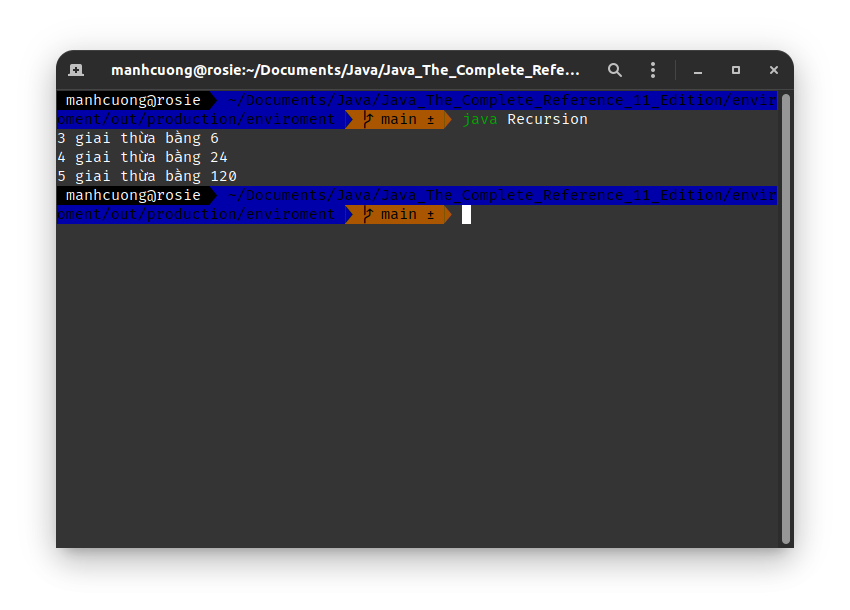

###### Recursion2.java _[source code](./Recursion2.java)_
```java
class RecTest {
    int values[];

    RecTest(int i) {
        values = new int[i];
    }

    void printArray(int i) {
        if (i == 0) return;

        printArray(i - 1);
        System.out.println("[" + (i - 1) + "] " + values[i - 1]);
    }
}

class Recursion2 {
    public static void main(String args[]) {
        RecTest ob = new RecTest(10);

        for (int i = 0; i < 10; ++i) {
            ob.values[i] = i;
        }

        ob.printArray(10);
    }
}
```
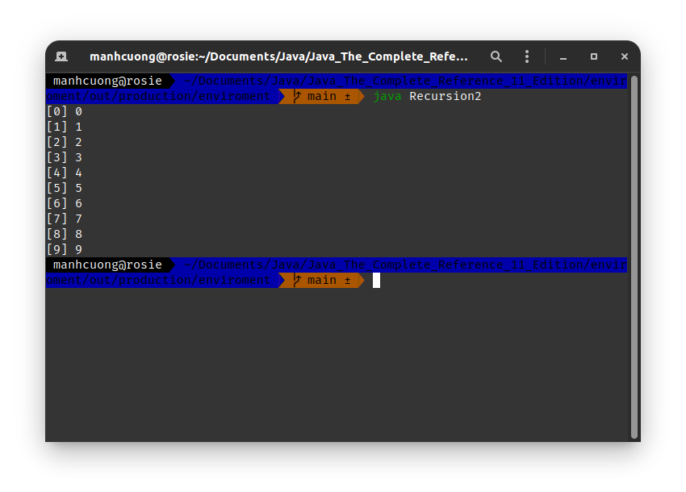

# 6. Quyền truy cập _[Introducing Access Control]_
* Hãy bắt đầu với hai quyền là **public** và **private**:
###### AccessTest.java _[source code](./AccessTest.java)_
```java
class Test {
    int a;
    public int b;
    private int c;

    void setc(int i) {
        c = i;
    }

    int getc() {
        return c;
    }
}

class AccessTest {
    public static void main(String args[]) {
        Test ob = new Test();
        ob.a = 10;
        ob.b = 20;

        // ob.c = 100; // dòg này sai vì `c` dc định nghĩa là private
        ob.setc(100);
        System.out.println("Giá trị của a, b, c lần lượt là: " + ob.a + " " + ob.b + " " + ob.getc());
    }
}
```
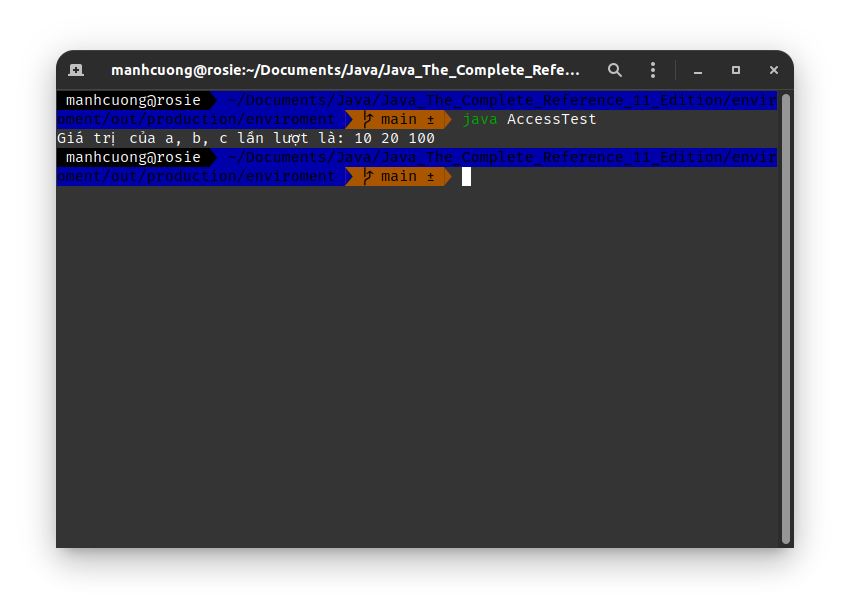

###### TestStack.java _[source code](./TestStack.java)_
```java
class Stack {
    private int stack[] = new int[10];
    private int tos;

    Stack() {
        tos = -1;
    }

    void push(int item) {
        if (tos == 9) {
            System.out.println("Stack is fulll");
        } else {
            stack[++tos] = item;
        }
    }

    int pop() {
        if (tos < 0) {
            System.out.println("Stack underflow");
            return 0;
        }

        return stack[tos--];
    }
}

class TestStack {
    public static void main(String args[]) {
        Stack stack1 = new Stack();
        Stack stack2 = new Stack();

        for (int i = 0; i < 10; ++i) stack1.push(i);
        for (int i = 10; i < 20; ++i) stack2.push(i);

        System.out.println("--> stack1:");
        for (int i = 0; i < 10; ++i) {
            System.out.println(stack1.pop());
        }

        System.out.println("--> stack2:");
        for (int i = 0; i < 10; ++i) {
            System.out.println(stack2.pop());
        }

        // stack1.tos = -2; // ko dc vì `tos` dc định nghĩa là private
        // stack2.stack[3] = 100; // ko dc vì `stack` dc định nghiã là private
    }
}
```
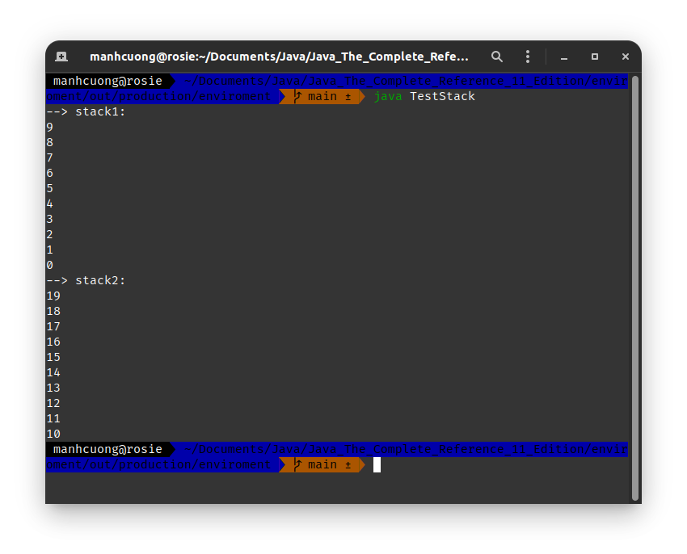

# 7. `static` _[Understanding static]_
* Đôi khi, chúng ta muốn tạo ra một thuộc tính của một class mà toàn bộ các object dc tạo ra từ class này đều có thể truy cập vào nó, ns dễ  hiểu nếu một object nào đó chỉnh sửa thuộc tính này thì toàn bộ các object khác cũng sẽ nhận dc giá trị mới của thuộc tính này, tức thuộc tính này chỉ có một vùng nhớ duy nhất nhưng toàn bộ các object thuộc class này đều có thể sử dụng nó.
* Để tạo ra một thuộc tính như vậy, thì ta dùng `static`.
* Một cách bao quát, một thuộc tính dc định nghĩa là `static` thì lúc này nó có nghĩa là toàn cục trên toàn bộ class của nó, khi một object dc khai báo sẽ ko có một bản sao của thuộc tính `static` này dc tạo ra mà toàn bộ object thuộc class này sẽ dùng chung một thuộc tính `static` này.
* Ta cũng có thể định nghĩa `static` cho các phương thức, nhưng cần lưu ý:
  * Chúng chỉ có thể gọi các phương thức `static` khác trong chính class của nó.
  * Chúng chỉ có thể truy cập đến các thuộc tính `static`.
  * Ko thể dùng `this` hoặc `super` _(tìm hiểu 2 keyword này sau trong chương 8)_.
* Trong trường hợp ta cần thực hiện một vài tính toán trong biến `static` trc khi một object dc `new` ra, thì ta sẽ khai báo một **khối tĩnh**, khối này sẽ chạy duy nhất một lần khi object đầu tiên tham chiều đến class này.
###### UseStatic.java _[source code](./UseStatic.java)_
```java
class UseStatic {
    static int a = 3;
    static int b;
    int c = 100;

    static void meth(int x) {
        System.out.println("x = " + x);
        System.out.println("a = " + a);
        System.out.println("b = " + b);
        // System.out.println("c = " + c); // sai vì static method chỉ có thể truy cập đến các static variable
    }

    // khai báo một static block (khối tĩnh)
    static {
        System.out.println("Đây là khối tĩnh dc khai báo");
        b = a * 4;
        // c = 10; // dòng này cũng sai, vì statai method chỉ có thể truy cập vào static variable
    }

    public static void main(String args[]) {
        System.out.println("--> Gọi hàm meth() lần đầu");
        meth(42);

        System.out.println("--> Gọi hàm meth() lần hai");
        meth(69);
    }
}
```
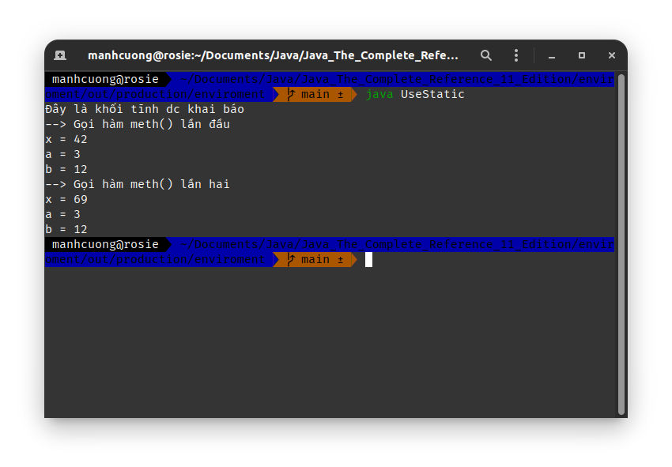
* Khôi tĩnh chỉ chạy duy nhất một lần khi object đầu tiên tham chiếu đến class.

<hr>

* Ngoài ra, từ một class cụ thể nào đó, ta hoàn toàn có thể truy cập vào các static variable và static method của một class khác như sau:
###### StaticByName.java _[source code](./StaticByName.java)_
```java
class StaticDemo {
    static int a = 42;
    static int b = 99;

    static void callme() {
        System.out.println("a = " + a);
    }
}

class StaticByName {
    public static void main(String args[]) {
        StaticDemo.callme(); // gọi static method `callme` của class `StaticDemo`
        System.out.println("StaticDemo.b = " + StaticDemo.b);
    }
}
```
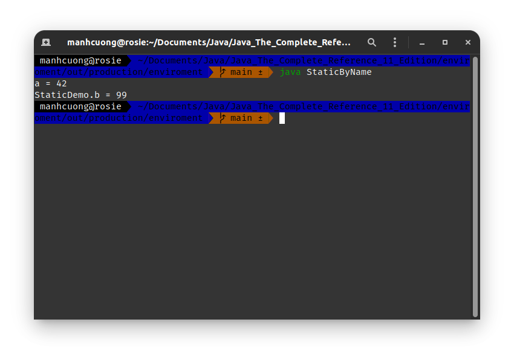

# 8. `final` _[Introducing final]_
###### FinalTest.java _[source code](./FinalTest.java)_
```java
class FinalTest {
    final String DATABASE = "./data/db_STUDENTS.txt";

    void showDB() {
        // DATABASE = "./data/db_PRODUCTS.txt"; // sai, ko thể thay đổi nếu dc định nghĩa là final
        System.out.println("DATABASE's path: " + DATABASE);
    }

    public static void main(String args[]) {
        FinalTest tmp = new FinalTest();
        tmp.showDB();
    }
}
```
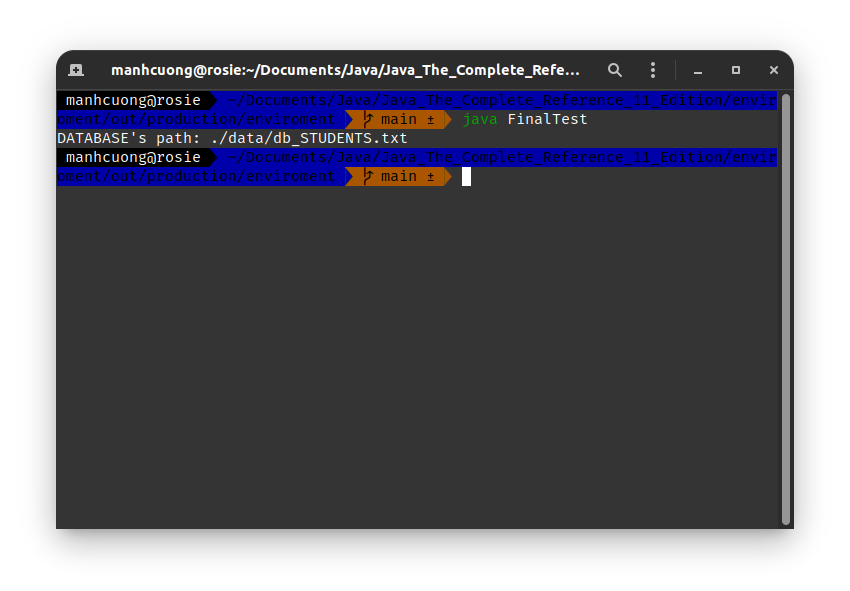

# 9. Quay lại với mảng _[Arrays Revisited]_
###### Length.java _[source code](./Length.java)_
```java
class Length {
    public static void main(String args[]) {
        int a1[] = new int[10];
        int a2[] = {3, 5, 7, 1, 8, 99, 44, -10};
        int a3[] = {4, 3, 2, 1};

        System.out.println("Chiều dài của mảng a1 là: " + a1.length);
        System.out.println("Chiều dài của mảng a2 là: " + a2.length);
        System.out.println("Chiều dài của mảng a3 là: " + a3.length);
    }
}
```
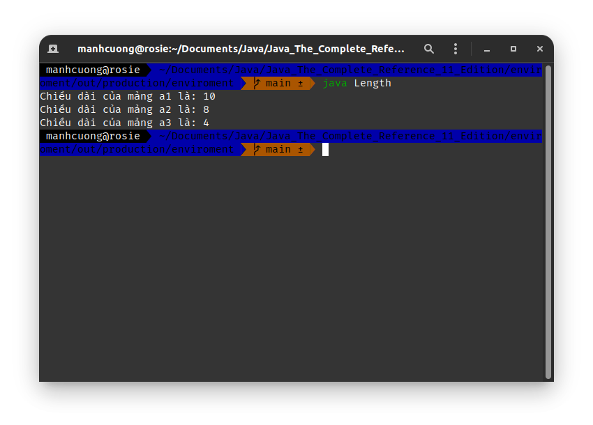

###### TestStack2.java _[source code](./TestStack2.java)_
```java
import javax.swing.text.SimpleAttributeSet;

class Stack {
    private int stack[];
    private int tos;

    Stack(int size) {
        stack = new int[size];
        tos = -1;
    }

    void push(int item) {
        if (tos == stack.length - 1) {
            System.out.println("Stack is full");
        } else {
            stack[++tos] = item;
        }
    }

    int pop() {
        if (tos < 0) {
            System.out.println("Stack underflow");
            return 0;
        }

        return stack[--tos];
    }
}

class TestStack2 {
    int a = 10;

    public static void main(String args[]) {
        Stack stack1 = new Stack(5);
        Stack stack2 = new Stack(8);

        System.out.println("--> Đây là stack1:");
        for (int i = 0; i < 5; ++i) {
            System.out.println(stack1.pop());
        }

        System.out.println("--> Đây là stack2:");
        for (int i = 0; i < 8; ++i) {
            System.out.println(stack2.pop());
        }
    }
}
```
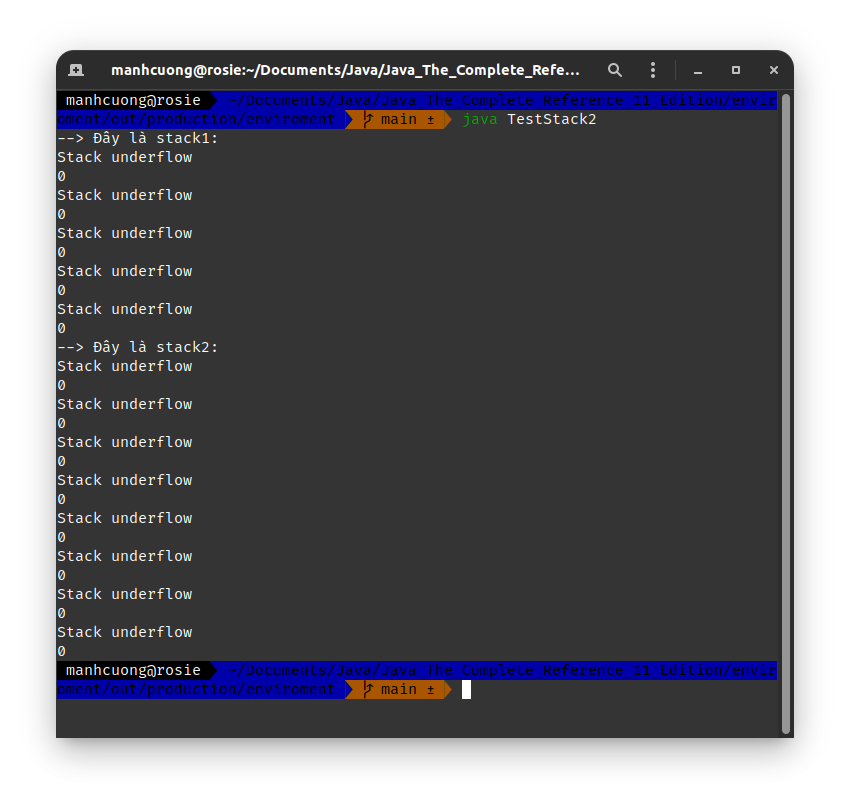

# 10. Nested & inner class _[Introducing Nested and Inner Classes]_
###### InnerClassDemo.java _[source code](./InnerClassDemo.java)_
```java
class Outer {
    int outer_x = 100;

    void test() {
        Inner inner = new Inner();
        inner.display();
    }

    class Inner {
        void display() {
            System.out.println("Hàm Inner.display - outer_x: " + outer_x); // biến outer_x nằm ngoài lớp Inner
        }
    }
}

class InnerClassDemo {
    public static void main(String args[]) {
        Outer outer = new Outer();
        outer.test();
    }
}
```
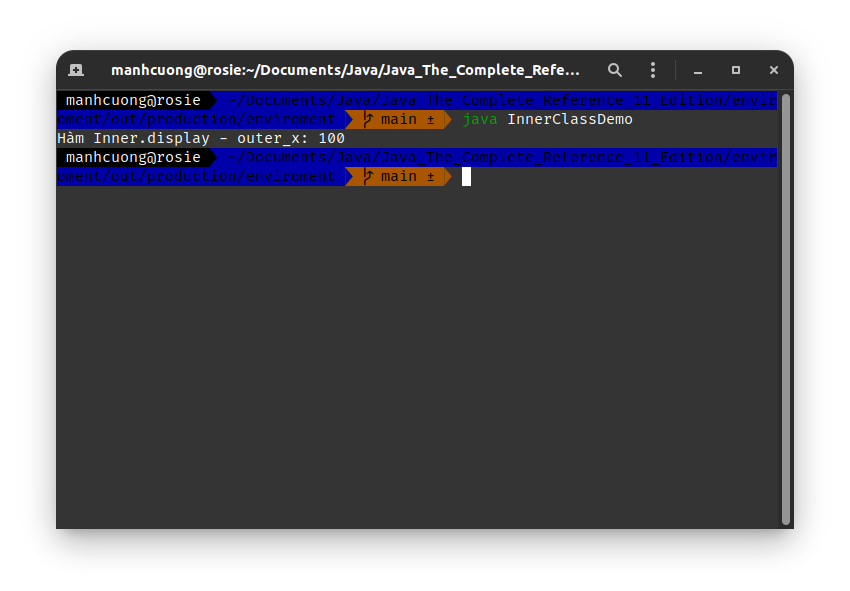

###### InnerClassDemo1.java _[source code](./InnerClassDemo1.java)_
```java
class Outer {
    int outer_x = 100;

    void test() {
        Inner inner = new Inner();
        inner.display();
    }

    class Inner {
        int y = 10; // y là biến local thuộc Inner

        void display() {
            System.out.println("Inside Inner.display(), call Outer.outer_x = " + outer_x);
        }
    }

    void showy() {
        System.out.println("--> This is Outer.showy()");
        // System.out.println(y); // dòg này sai, ko thể access đến biến Inner.y dc
    }
}

class InnerClassDemo1 {
    public static void main(String args[]) {
        Outer outer = new Outer();
        outer.test();
        outer.showy();
    }
}
```
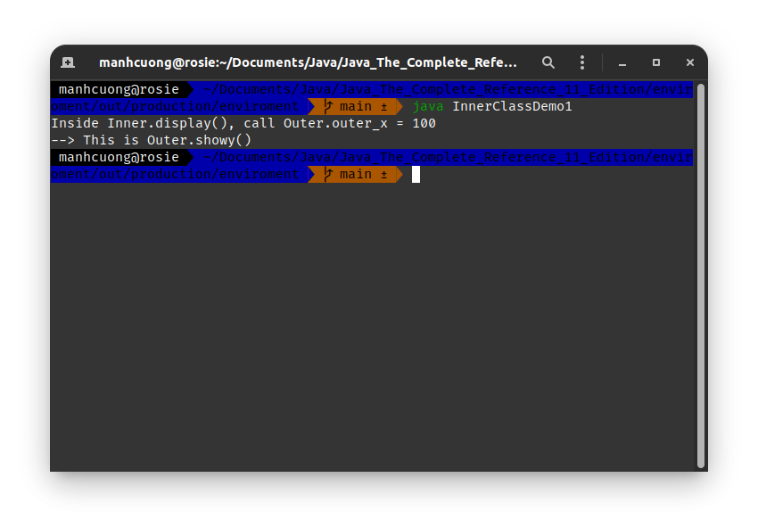

###### InnerClassDemo2.java _[source code](./InnerClassDemo2.java)_
```java
class Outer {
    int outer_x = 100;

    void test() {
        for (int i = 0; i < 10; ++i) {
            class Inner {
                void display() {
                    System.out.println("Inner.display() - outer_x = " + outer_x);
                }
            }

            Inner inner = new Inner();
            inner.display();
        }
    }
}

class InnerClassDemo2 {
    public static void main(String args[]) {
        Outer outer = new Outer();
        outer.test();
    }
}
```
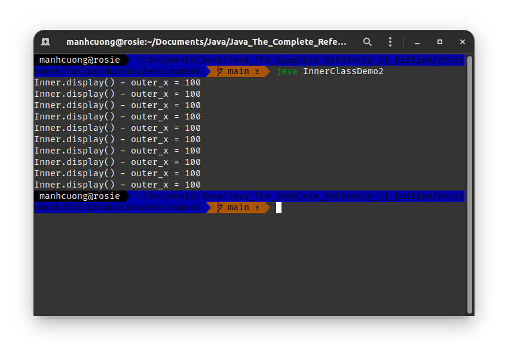

# 11. class `String` _[Exploring the `String` class]_
###### StringDemo.java _[source code](./StringDemo.java)_
```java
class StringDemo {
    public static void main(String args[]) {
        String s1 = "First String";
        String s2 = "Second String";
        String s3 = s1 + " + " + s2;

        System.out.println(s1);
        System.out.println(s2);
        System.out.println(s3);
    }
}
```
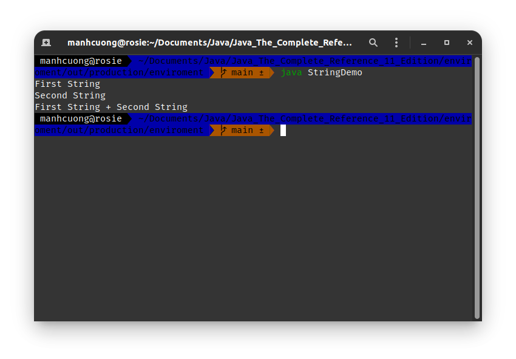

###### StringDemo2.java _[source code](./StringDemo2.java)_
```java
class StringDemo2 {
    public static void main(String args[]) {
        String s1 = "First String";
        String s2 = "Second String";
        String s3 = s1;

        System.out.println("Chiều dài của s1: " + s1.length());
        System.out.println("Kí tự tại index-3 của s1: " + s1.charAt(3));

        if (s1.equals(s2)) {
            System.out.println("s1 == s2");
        } else {
            System.out.println("s1 != s2");
        }

        if (s1.equals(s3)) {
            System.out.println("s1 == s3");
        } else {
            System.out.println("s1 != s3");
        }
    }
}
```
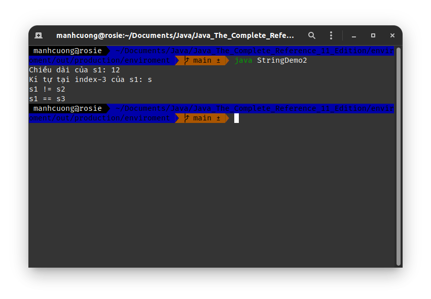

###### StringDemo3.java _[source code](./StringDemo3.java)_
```java
class StringDemo3 {
    public static void main(String args[]) {
        String str[] = {"one", "two", "three"};

        for (int i = 0; i < str.length; ++i) {
            System.out.println("str[" + i + "]: " + str[i]);
        }
    }
}
```
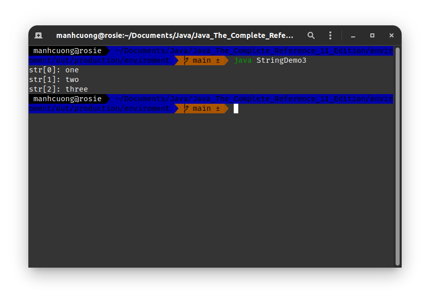

# 12. Sử dụng đối số dòng lệnh _[Using Command-Line Arguments]_
###### CommandLine.java _[source code](./CommandLine.java)_
```java
class CommandLine {
    public static void main(String args[]) {
        for (int i = 0; i < args.length; ++i) {
            System.out.println("args[" + i + "]: " + args[i]);
        }
    }
}
```
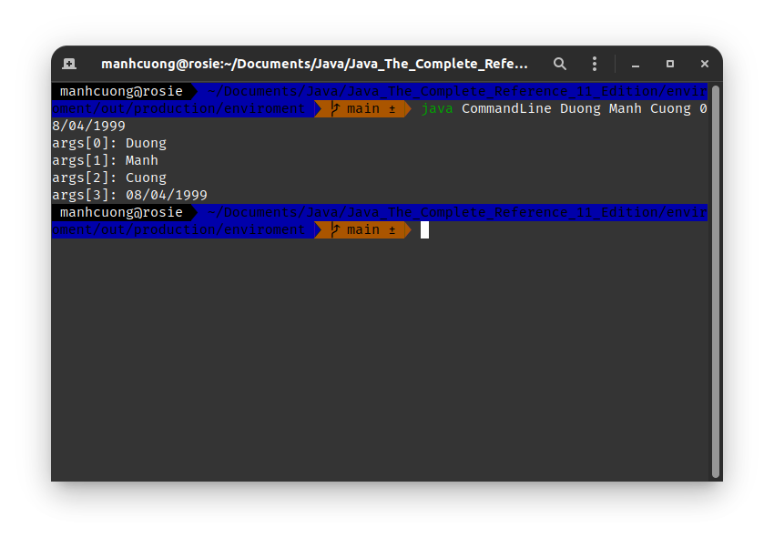

# 13. Varargs - Variable-Length Arguments
###### PassArray.java _[source code](./PassArray.java)_
```java
class PassArray {
    static void vaTest(int v[]) {
        System.out.println("Số lượng args là: " + v.length);
        System.out.print("Các giá trị: ");

        for (int x: v) {
            System.out.print(x + " ");
        }

        System.out.println();
    }

    public static void main(String args[]) {
        int n1[] = {10};
        int n2[] = {1, 2, 3};
        int n3[] = {};

        vaTest(n1);
        vaTest(n2);
        vaTest(n3);
    }
}
```
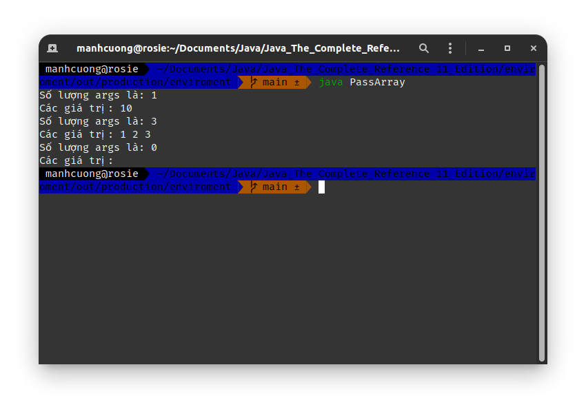

###### Varargs.java _[source code](./Varargs.java)_
```java
class VarArgs {
    static void vaTest(int ...v) {
        System.out.println("Số lượng args: " + v.length);
        System.out.print("Các thành phần của args: ");

        for (int x: v) {
            System.out.print(x + " ");
        }

        System.out.println();
    }

    public static void main(String args[]) {
        vaTest(10);
        vaTest(1, 2, 3);
        vaTest();
    }
}
```
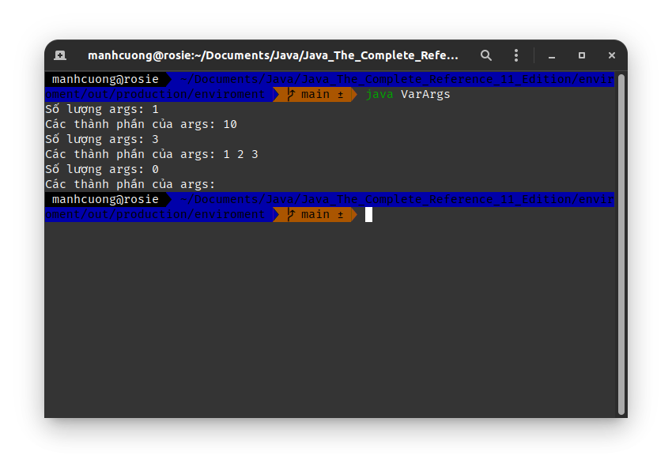

###### VarArgs2.java _[source code](./VarArgs2.java)_
```java
class VarArgs2 {
    static void vaTest(String msg, int ...v) {
        System.out.println("msg: " + msg + " - v.length: " + v.length);
        System.out.print("Content of v: ");

        for (int x: v) {
            System.out.print(x + " ");
        }
        System.out.println();
    }

    public static void main(String args[]) {
        vaTest("Hủ tiếu", 10);
        vaTest("trân châu, plan, kem", 1, 2, 3);
        vaTest("Ko có varargs");
    }
}
```
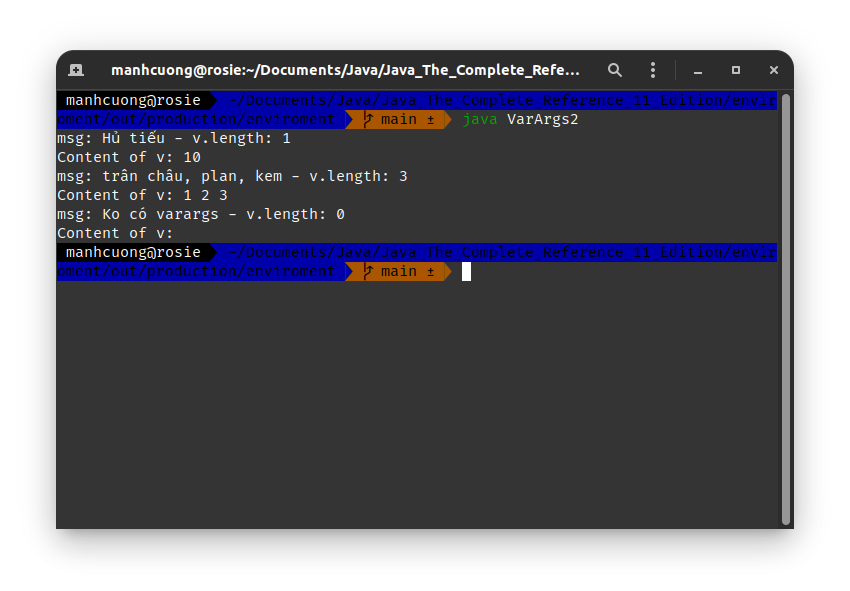

## 13.1. Overloading Vararg Methods
###### VarArgs3.java _[source code](./VarArgs3.java)_
```java
class VarArgs3 {
    static void vaTest(int ...v) {
        System.out.print("vaTest(int ...v): " + "Number of args: " + v.length + " Contents; ");

        for (int x: v) {
            System.out.print(x + " ");
        }

        System.out.println();
    }

    static void vaTest(boolean ...v) {
        System.out.print("vaTest(boolean ...v): " + "Number of args: " + v.length + " Contents; ");
        for (boolean x: v) {
            System.out.print(x + " ");
        }

        System.out.println();
    }

    static void vaTest(String msg, int ...v) {
        System.out.print("vaTest(String, int ...): " + msg + " v.length: " + v.length + " Contents: ");

        for (int x: v) {
            System.out.print(x + " ");
        }

        System.out.println();
    }

    public static void main(String args[]) {
        vaTest(1, 2, 3);
        vaTest("Testing", 10, 20);
        vaTest(true, false, false);
    }
}
```
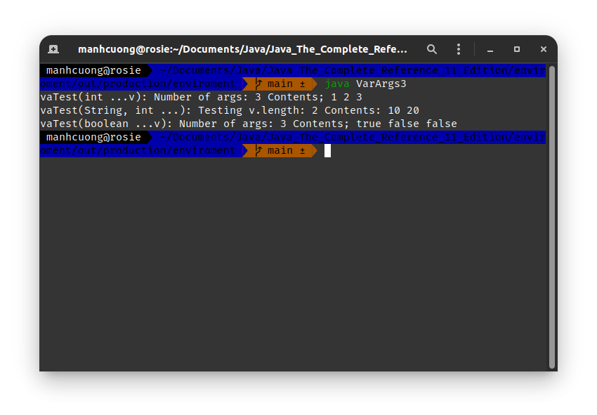

###### VarArgs4.java _[source code](./VarArgs4.java)_
```java
public class VarArgs4 {
    static void vaTest(int ...v) {
        System.out.print("vaTest(int ...v): " + "Number of args: " + v.length + " Contents; ");

        for (int x: v) {
            System.out.print(x + " ");
        }

        System.out.println();
    }

    static void vaTest(boolean ...v) {
        System.out.print("vaTest(boolean ...v): " + "Number of args: " + v.length + " Contents; ");
        for (boolean x: v) {
            System.out.print(x + " ");
        }

        System.out.println();
    }

    public static void main(String args[]) {
        vaTest(1, 2, 3); //OK
        vaTest(true, false, false); //OK
        // vaTest(); //Error, vì ko có tham số truyền vào, Java ko biết nên áp dụng
                    // phương thức vaTest(int ...) hay vaTest(boolean ...)
    }
}
```
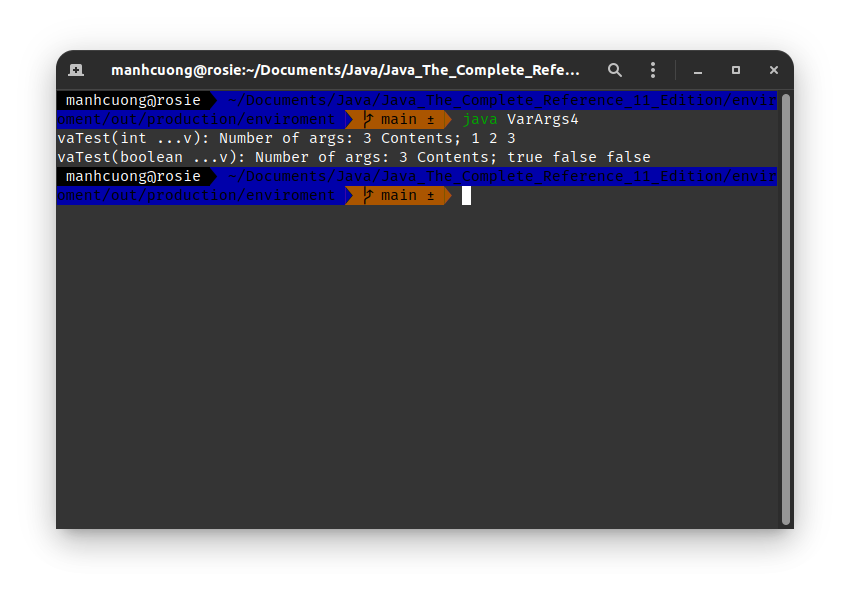

###### VarArgs5.java _[source code](./VarArgs5.java)_
```java
import java.util.stream.StreamSupport;

class VarArgs5 {
    static void vaTest(int x, int ...v) {
        System.out.println("vaTest(int, int ...) - x: " + x);
        System.out.print("v contents: ");

        for (int val: v) {
            System.out.print(val + " ");
        }
    }

    static void vaTest(int x) {
        System.out.println("vaTest(int) - x: " + x);
    }

    public static void main(String args[]) {
        vaTest(1);
    }
}
```
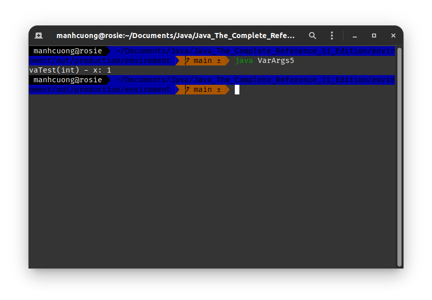

# 14. Sử dụng biến suy luận vs defined class _[Local Variable Type Interence with Reference Types]_
###### RefVarDemo.java _[source code](./RefVarDemo.java)_
```java
class MyClass {
    private int i;

    MyClass(int k) {
        i = k;
    }

    int geti() {
        return i;
    }

    void seti(int k) {
        if (k >= 0) {
            i = k;
        }
    }
}

class RefVarDemo {
    public static void main(String args[]) {
        var mc = new MyClass(10);

        System.out.println("Giá trị của i trong mc: " + mc.geti());
        mc.seti(69);
        System.out.println("Giá trị của i trong mc sau khi set(): " + mc.geti());
    }
}
```
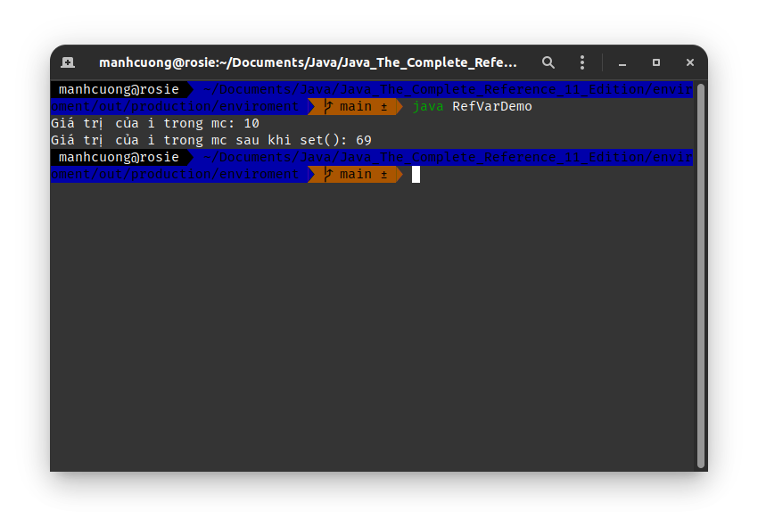