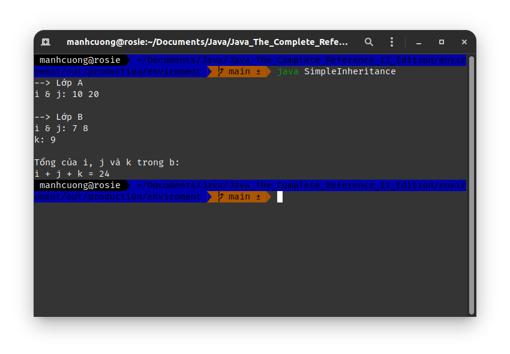
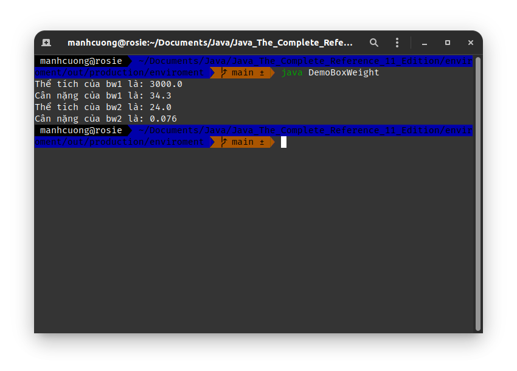
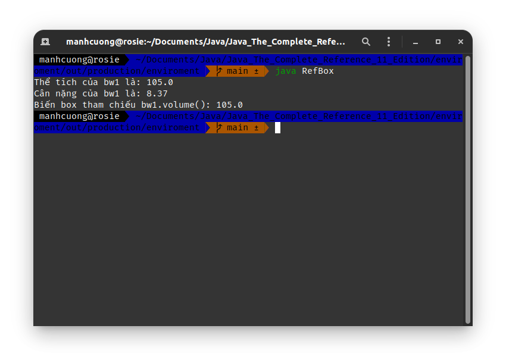
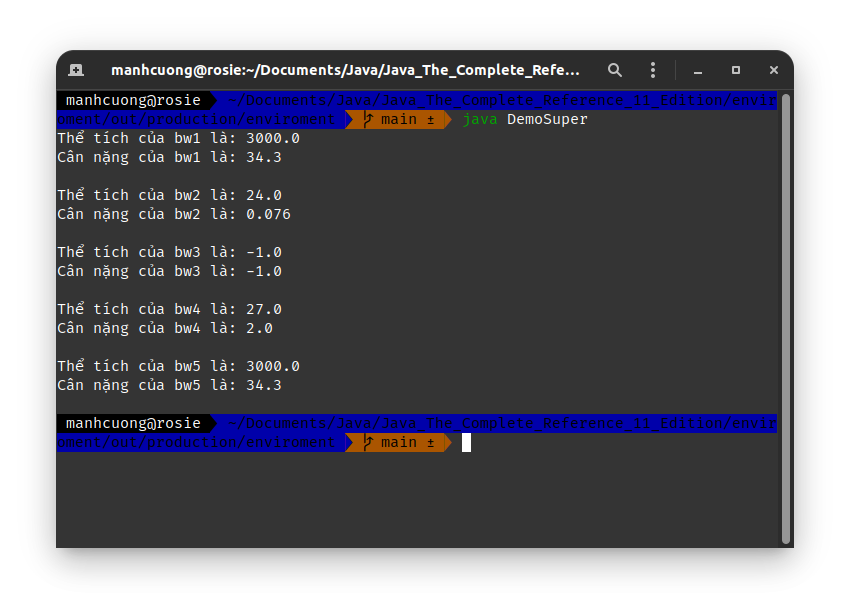
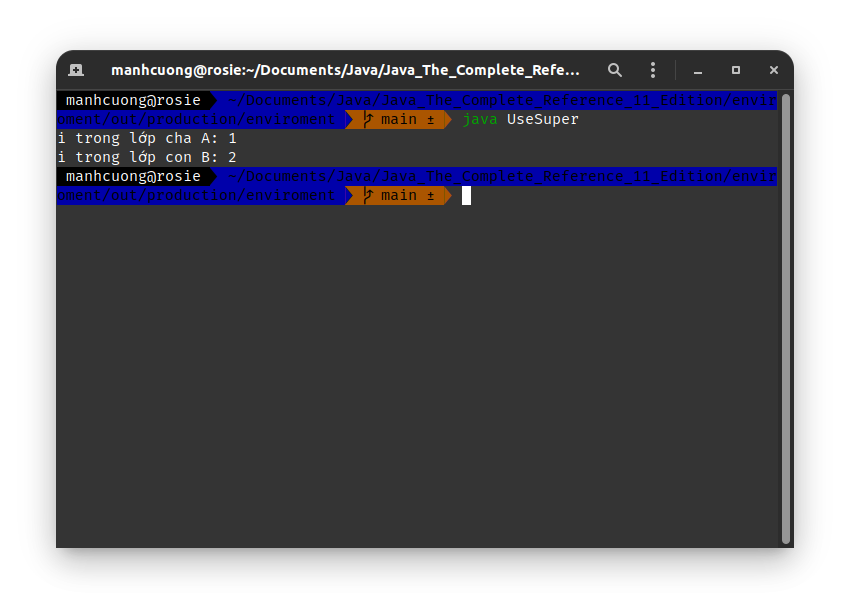
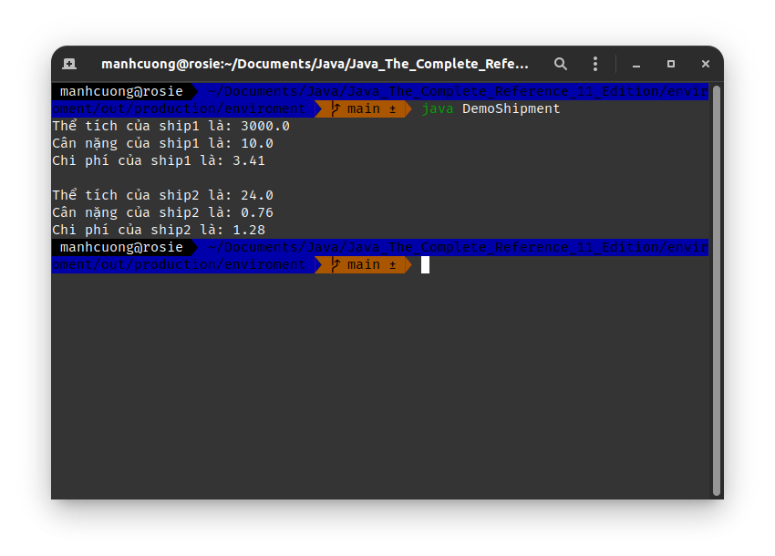
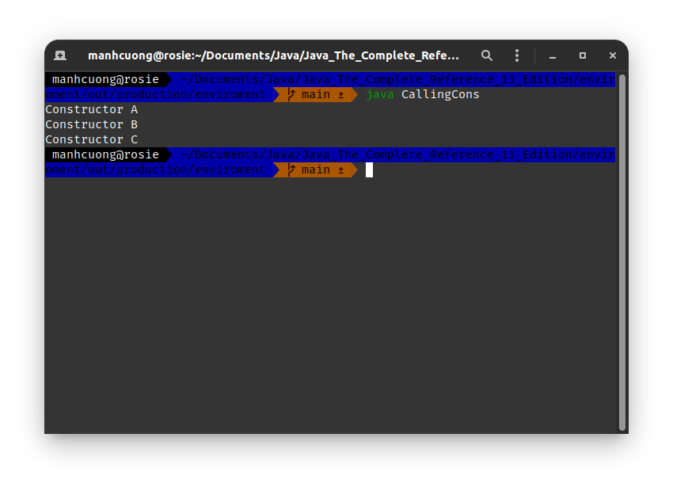
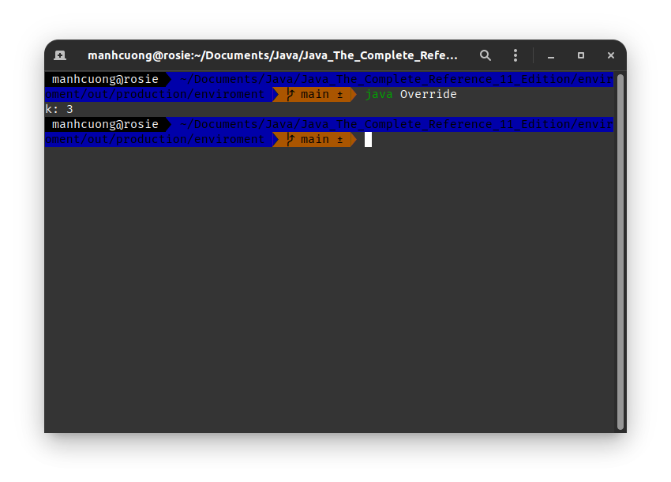
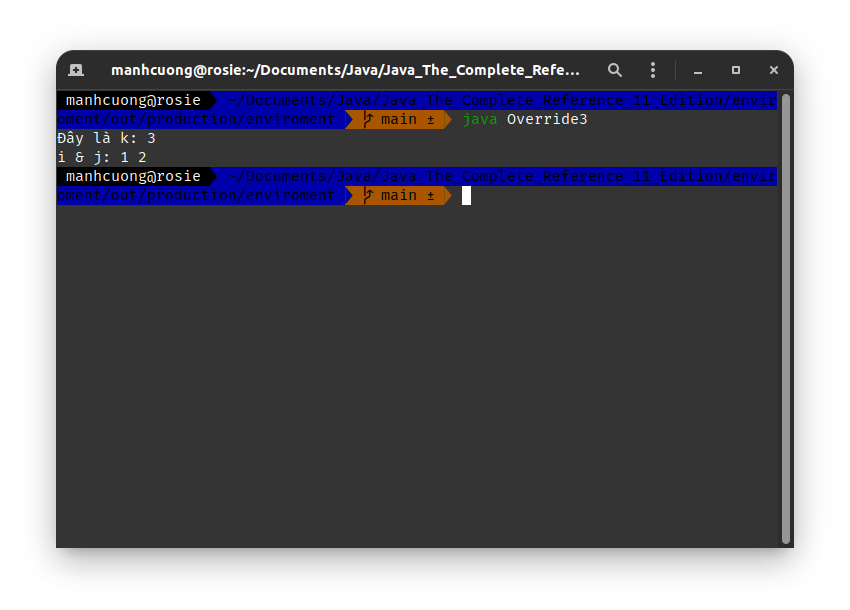
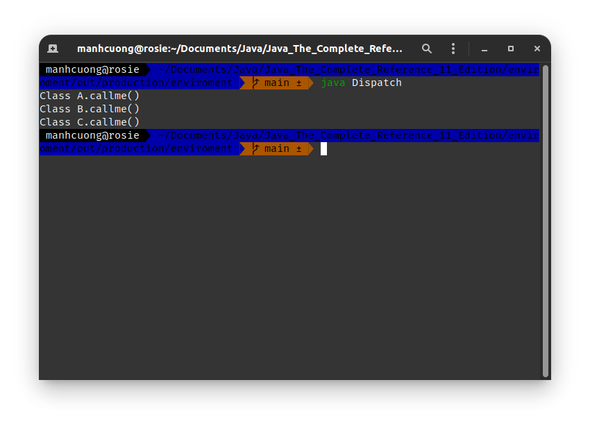

# 1. Kế thừa _[Inheritance Basics]_
###### SimpleInheritance.jav _[source code](./SimpleInheritance.java)_
```java
class A {
    int i, j;

    void showij() {
        System.out.println("i & j: " + i + " " + j);
    }
}

class B extends A {
    int k;

    void showk() {
        System.out.println("k: " + k);
    }

    void sum() {
        System.out.println("i + j + k = " + (i + j + k));
    }
}

class SimpleInheritance {
    public static void main(String args[]) {
        A a = new A();
        B b = new B();

        a.i = 10; a.j = 20;
        System.out.println("--> Lớp A");
        a.showij();
        System.out.println();

        b.i = 7;
        b.j = 8;
        b.k = 9;
        System.out.println("--> Lớp B");
        b.showij();
        b.showk();
        System.out.println();

        System.out.println("Tổng của i, j và k trong b: ");
        b.sum();
    }
}
```


## 1.1. Member access and Inheritance
###### Access.java _[source code](./Access.java)_
```java
class A {
    int i;
    private int j;

    void setij(int x, int y) {
        i = x; j = y;
    }
}

class B extends A {
    int total; // default khi biến dc khai báo Java sẽ assign nó bằng 0

    void sum() {
        // total = i + j; // dòng này lỗi, do biến j chỉ dc định nghĩa là private, nên
                // các lớp khác dù có kế thừa cũng ko thể sử dụng biến này
        System.out.println("Đây là B.sum()");
    }
}

class Access {
    public static void main(String args[]) {
        B b = new B();
        b.setij(10, 12);
        b.sum();

        System.out.println("B.total = " + b.total);
    }
}
```


## 1.2. A More Practical Example
###### DemoBoxWeight.java _[source code](./DemoBoxWeight.java)_
```java
class Box {
    double width, height, depth;

    Box(Box other) {
        width = other.width;
        height = other.height;
        depth = other.depth;
    }

    Box(double w, double h, double d) {
        width = w;
        height = h;
        depth = d;
    }

    Box() {
        width = height = depth = -1;
    }

    Box(double len) {
        width = height = depth = len;
    }

    double volume() {
        return width * height * depth;
    }
}

class BoxWeight extends Box {
    double weight;

    BoxWeight(double w, double h, double d, double m) {
        width = w;
        height = h;
        depth = d;
        weight = m;
    }
}

class ColorBox extends Box {
    int color;

    ColorBox(double w, double h, double d, int c) {
        width = w;
        height = h;
        depth = h;
        color = c;
    }
}

class DemoBoxWeight {
    public static void main(String args[]) {
        BoxWeight bw1 = new BoxWeight(10, 20, 15, 34.3);
        BoxWeight bw2 = new BoxWeight(2, 3, 4, 0.076);

        System.out.println("Thể tích của bw1 là: " + bw1.volume());
        System.out.println("Cân nặng của bw1 là: " + bw1.weight);

        System.out.println("Thể tích cùa bw2 là: " + bw2.volume());
        System.out.println("Cân nặng của bw2 là: " + bw2.weight);
    }
}

```


## 1.3. Các biến lớp cha có thể tham chiếu đến các biến lớp con _[A Suplerclass Variable Can Reference a Subclass Object]_
###### RefDemo.java _[source code](./RefDemo.java)_
```java
class Box {
    double width, height, depth;

    Box(Box other) {
        width = other.width;
        height = other.height;
        depth = other.depth;
    }

    Box(double w, double h, double d) {
        width = w;
        height = h;
        depth = d;
    }

    Box() {
        width = height = depth = -1;
    }

    Box(double len) {
        width = height = depth = len;
    }

    double volume() {
        return width * height * depth;
    }
}

class BoxWeight extends Box {
    double weight;

    BoxWeight(double w, double h, double d, double m) {
        width = w;
        height = h;
        depth = d;
        weight = m;
    }
}

class RefBox {
    public static void main(String args[]) {
        BoxWeight bw1 = new BoxWeight(3, 5, 7, 8.37);
        Box box = new Box();

        System.out.println("Thể tích của bw1 là: " + bw1.volume());
        System.out.println("Cân nặng của bw1 là: " + bw1.weight);

        box = bw1; // tham chiếu đến bw1 để sử dụng các method của nó
        System.out.println("Biến box tham chiếu bw1.volume(): " + box.volume());
        // System.out.println("Biến box tham chiếu bw1.weight: " + box.weight); // dòng này
            // ko hợp lệ vì Box ko có thuộc tính weight
    }
}
```

* Khi này `box` tham chiếu đến `bw1` để lấy các thuộc tính thuộc về chính nó _(tức dc khai báo trong class `Box`)_, từ đó sử dụng các thuộc tính dc lấy này để tính toán p.thức `box.volume()`.

# 2. Sử dụng `super` _[Using `super`]_
## 2.1. Sử dụng `super` để gọi các constructor của lớp cha từ lớp con _[Using `super` to Call Superclass Constructors]_
###### DemoSuper.java _[source code](./DemoSuper.java)_
```java
class Box {
    private double width, height, depth;

    Box(Box other) {
        width = other.width;
        height = other.height;
        depth = other.depth;
    }

    Box(double w, double h, double d) {
        width = w;
        height = h;
        depth = d;
    }

    Box() {
        width = height = depth = -1;
    }

    Box(double len) {
        width = height = depth = len;
    }

    double volume() {
        return width * height * depth;
    }
}

class BoxWeight extends Box {
    double weight;

    BoxWeight(double w, double h, double d, double m) {
        super(w, h, d);
        weight = m;
    }

    BoxWeight(BoxWeight other) {
        super(other);
        weight = other.weight;
    }

    BoxWeight() {
        super();
        weight = -1;
    }

    BoxWeight(double len, double m) {
        super(len);
        weight = m;
    }
}

class DemoSuper {
    public static void main(String args[]) {
        BoxWeight bw1 = new BoxWeight(10, 20, 15, 34.3);
        BoxWeight bw2 = new BoxWeight(2, 3, 4, 0.076);
        BoxWeight bw3 = new BoxWeight();
        BoxWeight bw4 = new BoxWeight(3, 2);
        BoxWeight bw5 = new BoxWeight(bw1);

        System.out.println("Thể tích của bw1 là: " + bw1.volume());
        System.out.println("Cân nặng của bw1 là: " + bw1.weight);
        System.out.println();

        System.out.println("Thể tích của bw2 là: " + bw2.volume());
        System.out.println("Cân nặng của bw2 là: " + bw2.weight);
        System.out.println();

        System.out.println("Thể tích của bw3 là: " + bw3.volume());
        System.out.println("Cân nặng của bw3 là: " + bw3.weight);
        System.out.println();

        System.out.println("Thể tích của bw4 là: " + bw4.volume());
        System.out.println("Cân nặng của bw4 là: " + bw4.weight);
        System.out.println();

        System.out.println("Thể tích của bw5 là: " + bw5.volume());
        System.out.println("Cân nặng của bw5 là: " + bw5.weight);
        System.out.println();
    }
}
```


## 2.2. Cách thứ hai sử dụng `super` _[A Second Use for `super`]_
###### UseSuper.java _[source code](./UseSuper.java)_
```java
class A {
    int i;
}

class B extends A {
    int i; // biến nay sẽ ẩn biến i trong A, tức bây h gọi i thì Java sẽ hiểu là gọi B.i

    B(int a, int b) {
        super.i = a;
        i = b;
    }

    void show() {
        System.out.println("i trong lớp cha A: " + super.i);
        System.out.println("i trong lớp con B: " + i);
    }
}

class UseSuper {
    public static void main(String args[]) {
        B b = new B(1, 2);

        b.show();
    }
}
```


# 3. Cấu trúc phân đa cấp _[Creating a Multilevel Hierarchy]_
###### DemoShipment.java _[source code](./DemoShipment.java)_
```java
class Box {
    private double width, height, depth;

    Box(Box other) {
        width = other.width;
        height = other.height;
        depth = other.depth;
    }

    Box(double w, double h, double d) {
        width = w;
        height = h;
        depth = d;
    }

    Box() {
        width = height = depth = -1;
    }

    Box(double len) {
        width = height = depth = len;
    }

    double volume() {
        return width * height * depth;
    }
}

class BoxWeight extends Box {
    double weight;

    BoxWeight(double w, double h, double d, double m) {
        super(w, h, d);
        weight = m;
    }

    BoxWeight(BoxWeight other) {
        super(other);
        weight = other.weight;
    }

    BoxWeight() {
        super();
        weight = -1;
    }

    BoxWeight(double len, double m) {
        super(len);
        weight = m;
    }
}

class Shipment extends BoxWeight {
    double cost;

    Shipment(Shipment other) {
        super(other);
        cost = other.cost;
    }

    Shipment(double w, double h, double d, double m, double c) {
        super(w, h, d, m);
        cost = c;
    }

    Shipment() {
        super();
        cost = -1;
    }

    Shipment(double len, double m, double c) {
        super(len, m);
        cost = c;
    }
}

class DemoShipment {
    public static void main(String args[]) {
        Shipment ship1 = new Shipment(10, 20, 15, 10, 3.41);
        Shipment ship2 = new Shipment(2, 3, 4, .76, 1.28);

        System.out.println("Thể tích của ship1 là: " + ship1.volume());
        System.out.println("Cân nặng của ship1 là: " + ship1.weight);
        System.out.println("Chi phí của ship1 là: " + ship1.cost);
        System.out.println();

        System.out.println("Thể tích của ship2 là: " + ship2.volume());
        System.out.println("Cân nặng của ship2 là: " + ship2.weight);
        System.out.println("Chi phí của ship2 là: " + ship2.cost);
    }
}
```


# 4. Các constructors hoạt động như thế nào trong cấu trúc phân cấp _[When Constructors Are Executed]_
###### CallingCons.java _[source code](./CallingCons.java)_
```java
class A {
    A() {
        System.out.println("Constructor A");
    }
}

class B extends A {
    B() {
        System.out.println("Constructor B");
    }
}

class C extends B {
    C() {
        System.out.println("Constructor C");
    }
}

class CallingCons {
    public static void main(String args[]) {
        C c = new C();
    }
}
```


# 5. Method Overriding
###### Override.java _[source code](./Override.java)_
```java
class A {
    int i, j;
    
    A(int a, int b) {
        i = a;
        j = b;
    }
    
    void show() {
        System.out.println("i & j: " + i + " " + j);
    }
}

class B extends A {
    int k;

    B(int a, int b, int c) {
        super(a, b);
        k = c;
    }

    void show() {
        System.out.println("k: " + k);
    }
}

class Override {
    public static void main(String args[]) {
        B b = new B(1, 2, 3);
        b.show();
    }
}
```


###### Override2.java _[source code](./Override2.java)_
```java
class A {
    int i, j;

    A(int a, int b) {
        i = a;
        j = b;
    }

    void show() {
        System.out.println("i & j: " + i + " " + j);
    }
}

class B extends A {
    int k;

    B(int a, int b, int c) {
        super(a, b);
        k = c;
    }

    void show() {
        super.show();
        System.out.println("k: " + k);
    }
}

class Override2 {
    public static void main(String args[]) {
        B b = new B(1, 2, 3);
        b.show();
    }
}
```


###### Override3.java _[source code](./Override3.java)_
```java
class A {
    int i, j;

    A(int a, int b) {
        i = a;
        j = b;
    }

    void show() {
        System.out.println("i & j: " + i + " " + j);
    }
}

class B extends A {
    int k;

    B(int a, int b, int c) {
        super(a, b);
        k = c;
    }

    void show(String msg) {
        System.out.println(msg + k);
    }
}

class Override3 {
    public static void main(String args[]) {
        B b = new B(1, 2, 3);

        b.show("Đây là k: "); // gọi hàm B.show()
        b.show(); // gọi hàm A.show()
    }
}
```


# 6. Điều phối phương thức động _[Dynamic Method Dispatch]_
###### Dispatch.java _[source code](./Dispatch.java)_
```java
class A {
    void callme() {
        System.out.println("Class A.callme()");
    }
}

class B extends A {
    void callme() {
        System.out.println("Class B.callme()");
    }
}

class C extends A {
    void callme() {
        System.out.println("Class C.callme()");
    }
}

class Dispatch {
    public static void main(String args[]) {
        A a = new A();
        B b = new B();
        C c = new C();

        A r;

        r = a;
        r.callme();

        r = b;
        r.callme();

        r = c;
        r.callme();
    }
}
```


## 6.1. Tại sao cần ghi đè các phương thưc _[Why Overridden Methods]_