# 1. _[Packages]_
###### mypack/AccountBalance.java _[source code](.mypack/../mypack/AccountBalance.java)_
```java
package mypack;

class Balance {
    String name;
    double bal;

    Balance(String n, double b) {
        name = n;
        bal = b;
    }

    void show() {
        if (bal < 0) {
            System.out.print("--> ");
        }

        System.out.println(name + ": $" + bal);
    }
}

class AccountBalance {
    public static void main(String args[]) {
        Balance current[] = new Balance[3];

        current[0] = new Balance("Harry Potter", 123.23);
        current[1] = new Balance("Ron Weasley", 154.56);
        current[2] = new Balance("Hermione Ranger", -89.02);

        for (var x: current) x.show();
    }
}
```


# 2. _[Packages and Member Access]_
<div align="center">

  

</div>

## 2.1. _[An Access Example]_
###### p1 _[source code](./p1)_


###### p2 _[source code](./p2)_
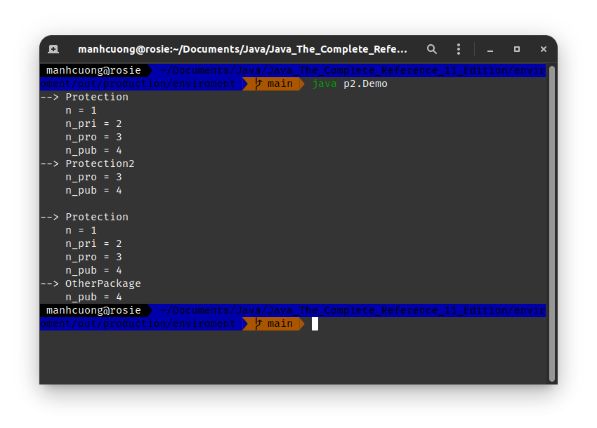

# 3. _[Importing Packages]_
###### TestBalance.java _[source code](./TestBalance.java)_
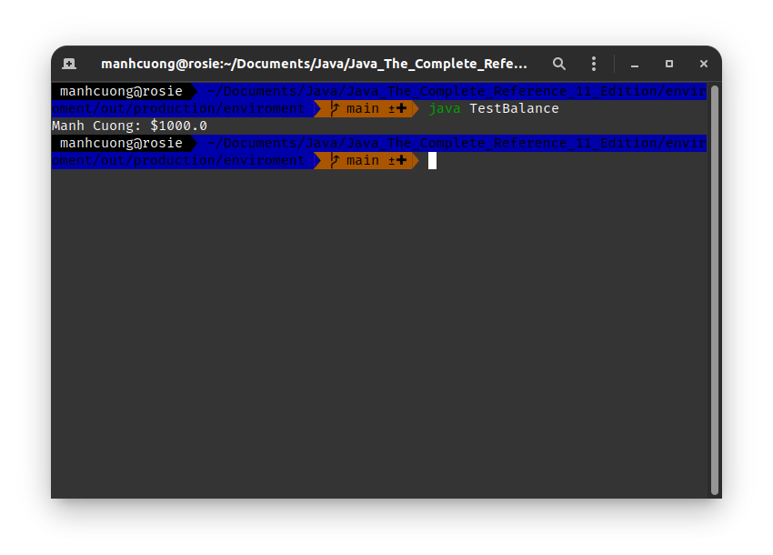
# 4. _[Interfaces]_
* Khi một class implement một interface, thì class này phải định nghĩa toàn bộ các p.thức mà interface đó có và toàn bộ các method này phải dc định nghĩa là `public`.
###### TestIface.java _[source code](./TestIface.java)_
```java
interface CallBack {
    void callback(int param);
}

class Client implements CallBack {
    public void callback(int p) { // bắt buộc method phải là public
        System.out.println("Client.callback() với giá trị p = " + p);
    }

    void nonIfaceMeth() {
        System.out.println("Một p.thức thông thường trong một class của Java");
    }
}

class TestIface {
    public static void main(String args[]) {
        CallBack c = new Client(); // dùng interface để tạo một object từ class khác
        c.callback(42);
    }
}
```
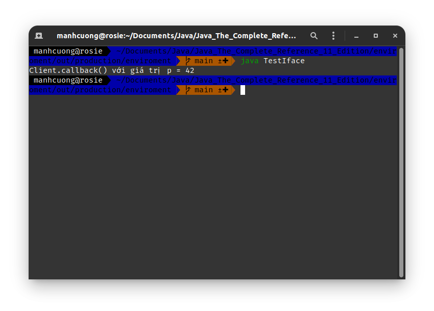

###### TestIface2.java _[source code](./TestIface2.java)_
```java
interface CallBack {
    void callback(int param);
}

class Client implements CallBack {
    public void callback(int p) { // bắt buộc method phải là public
        System.out.println("Client.callback() với giá trị p = " + p);
    }

    void nonIfaceMeth() {
        System.out.println("Một p.thức thông thường trong một class của Java");
    }
}

class AnotherClient implements CallBack {
    public void callback(int p) {
        System.out.println("--> AnotherClient.callback()");
        System.out.println("    p^2 = " + (p * p));
    }
}

class TestIface2 {
    public static void main(String args[]) {
        CallBack c = new Client(); // dùng interface để tạo một object từ class khác
        AnotherClient ac = new AnotherClient();

        c.callback(7);

        System.out.println();
        c = ac;
        c.callback(42);
    }
}
```
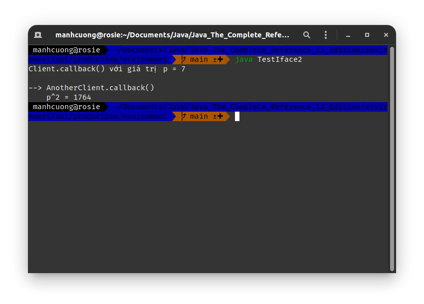

<hr>

* Trong trường hợp lớp implement lớp interface mà ko định nghĩa toàn bộ method mà lớp interface định nghĩa, thì lớp đó phải dc định nghĩa `abstract`.
###### TestIface3.java _[source code](./TestIface3.java)_
```java
interface CallBack {
    void callback(int param);
}

abstract class Client implements CallBack {
    static void show() {
        System.out.println("Đây là p.thức Client.show()");
    }
}

class TestIface3 {
    public static void main(String args[]) {
        // CallBack c = new Client(); // dòng này lỗi do lúc này Client là abstract
        Client.show();
    }
}
```
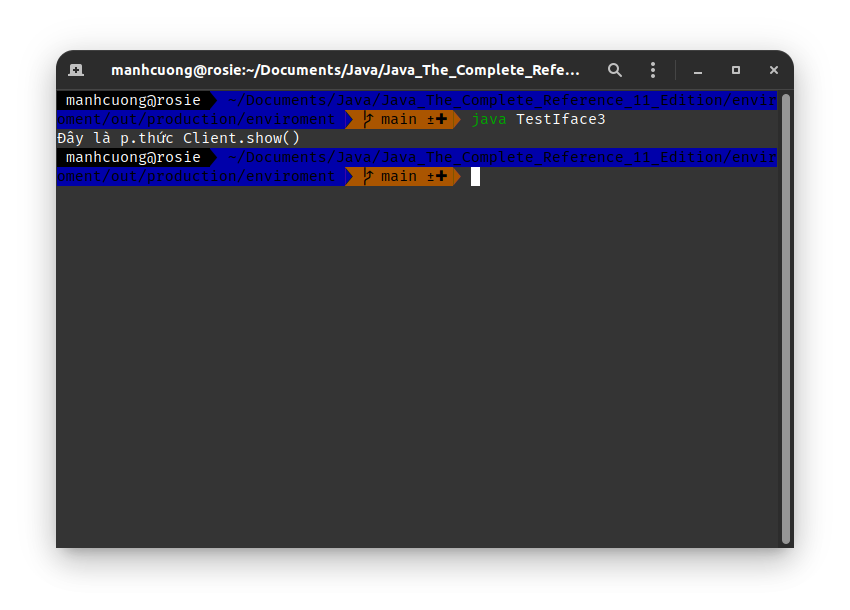

## 4.1. Interface lồng nhau _[Nested Interfaces]_
###### NestedIfDemo.java _[source code](./NestedIfDemo.java)_
```java
class A {
    public interface NestIf {
        boolean isNegative(int x);
    }
}

class B implements A.NestIf {
    public boolean isNegative(int x) {
        return x >= 0 ? true : false;
    }
}

class NestedIfDemo {
    public static void main(String args[]) {
        A.NestIf nif = new B();

        if (nif.isNegative(10)) {
            System.out.println("10 là số dương");
        }

        if (!nif.isNegative(-69)) {
            System.out.println("-69 là số âm");
        }
    }
}
```
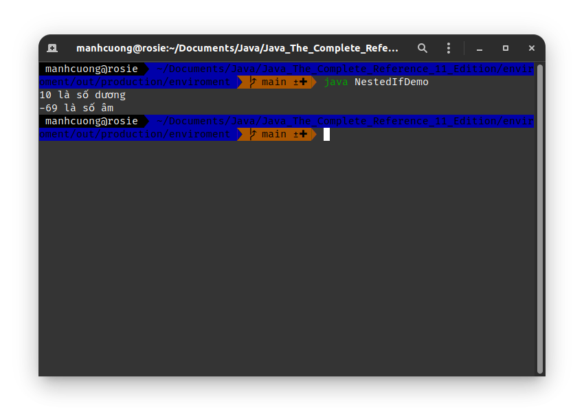

## 4.2. _[Applying Interfaces]_
###### IfTest.java _[source code](./IfTest.java)_
```java
interface IntStack {
    void push(int item);
    int pop();
}

class FixedStack implements IntStack {
    private int stack[];
    private int tos;

    FixedStack(int size) {
        stack = new int[size];
        tos = -1;
    }

    public void push(int item) {
        if (tos == stack.length - 1) {
            System.out.println("Stack is full.");
        } else {
            stack[++tos] = item;
        }
    }

    public int pop() {
        if (tos < 0) {
            System.out.println("Stack underflow.");
            return 0;
        }

        return stack[tos--];
    }
}

class IfTest {
    public static void main(String args[]) {
        FixedStack stack1 = new FixedStack(5);
        FixedStack stack2 = new FixedStack(8);

        for (int i = 0; i < 5; ++i) stack1.push(i);
        for (int i = 0; i < 8; ++i) stack2.push(i);

        System.out.println("--> stack1");
        for (int i = 0; i < 5; ++i) {
            System.out.println("    " + stack1.pop());
        }

        System.out.println("\n--> stack2");
        for (int i = 0; i < 8; ++i) {
            System.out.println("    " + stack2.pop());
        }
    }
}
```
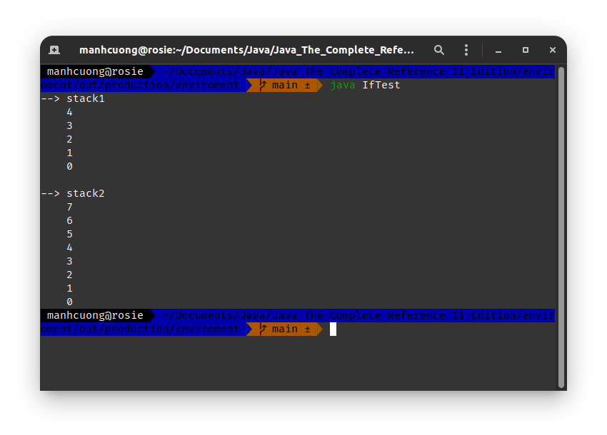

###### IfTest2.java _[source code](./IfTest2.java)_
```java
interface IntStack {
    void push(int item);
    int pop();
}

class DynStack implements IntStack {
    private int stack[];
    private int tos;

    DynStack(int size) {
        stack = new int[size];
        tos = -1;
    }

    public void push(int item) {
        if (tos == stack.length - 1) {
            int tmp[] = new int[stack.length * 2];
            for (int i = 0; i < stack.length; ++i) tmp[i] = stack[i];
            stack = tmp;
        }

        stack[++tos] = item;
    }

    public int pop() {
        if (tos < 0) {
            System.out.println("Stack underflow.");
            return 0;
        } else {
            return stack[tos--];
        }
    }
}

class IfTest2 {
    public static void main(String args[]) {
        DynStack stack1 = new DynStack(5);
        DynStack stack2 = new DynStack(8);

        for (int i = 0; i < 12; ++i) stack1.push(i);
        for (int i = 0; i < 20; ++i) stack2.push(i);

        System.out.println("--> stack1");
        for (int i = 0; i < 12; ++i) {
            System.out.println("    " + stack1.pop());
        }

        System.out.println("\n--> stack2");
        for (int i = 0; i < 20; ++i) {
            System.out.println("    " + stack2.pop());
        }
    }
}
```
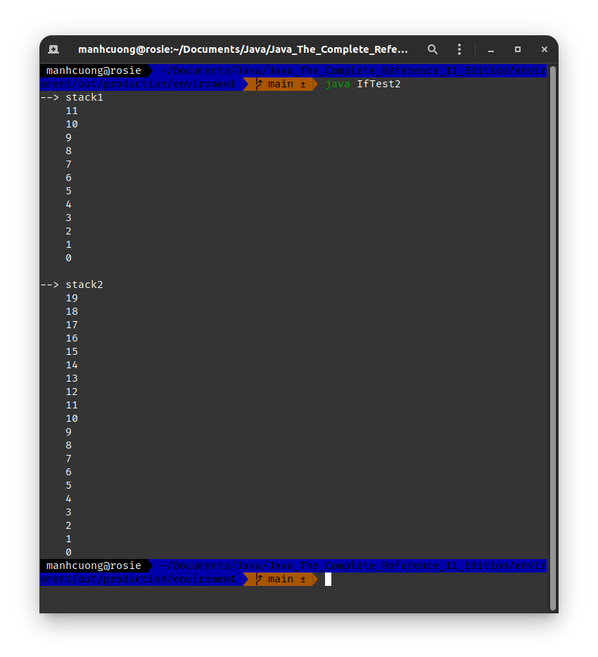

###### IfTest3.java _[source code](./IfTest3.java)_
```java
interface IntStack {
    void push(int item);
    int pop();
}

class FixedStack implements IntStack {
    private int stack[];
    private int tos;

    FixedStack(int size) {
        stack = new int[size];
        tos = -1;
    }

    public void push(int item) {
        if (tos == stack.length - 1) {
            System.out.println("Stack is full.");
        } else {
            stack[++tos] = item;
        }
    }

    public int pop() {
        if (tos < 0) {
            System.out.println("Stack underflow.");
            return 0;
        }

        return stack[tos--];
    }
}

class DynStack implements IntStack {
    private int stack[];
    private int tos;

    DynStack(int size) {
        stack = new int[size];
        tos = -1;
    }

    public void push(int item) {
        if (tos == stack.length - 1) {
            int tmp[] = new int[stack.length * 2];
            for (int i = 0; i < stack.length; ++i) tmp[i] = stack[i];
            stack = tmp;
        }

        stack[++tos] = item;
    }

    public int pop() {
        if (tos < 0) {
            System.out.println("Stack underflow.");
            return 0;
        } else {
            return stack[tos--];
        }
    }
}

class IfTest3 {
    public static void main(String args[]) {
        IntStack stack;
        DynStack stack1 = new DynStack(5);
        FixedStack stack2 = new FixedStack(8);

        stack = stack1;
        for (int i = 0; i < 12; ++i) stack.push(i);

        stack = stack2;
        for (int i = 0; i < 8; ++i) stack.push(i);

        stack = stack1;
        System.out.println("--> stack1 - Dynamic");
        for (int i = 0; i < 12; ++i) {
            System.out.println("    " + stack.pop());
        }

        stack = stack2;
        System.out.println("\n--> stack2 - Fixed");
        for (int i = 0; i < 8; ++i) {
            System.out.println("    " + stack.pop());
        }
    }
}
```
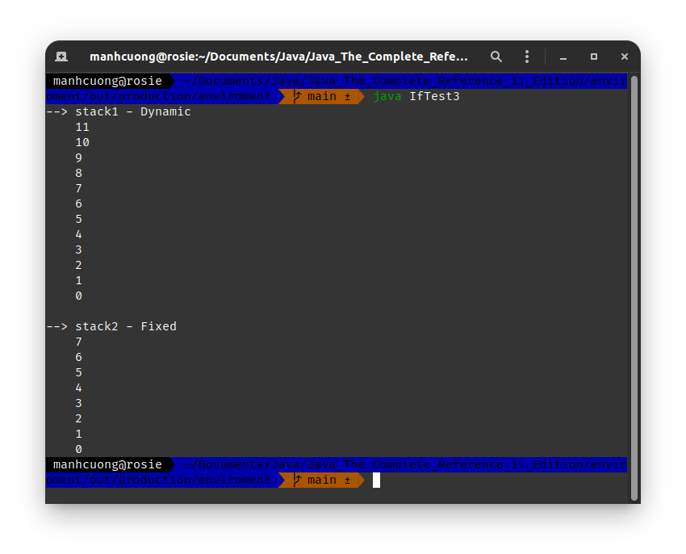

###### AskMe.java _[source code](./AskMe.java)
```java
import java.util.Random;

interface SharedConstants {
    final int NO = 0;
    final int YES = 1;
    final int MAYBE = 2;
    final int LATER = 3;
    final int SOON = 4;
    final int NEVER = 5;
}

class Question implements SharedConstants {
    Random rand = new Random();

    int ask() {
        int prob = (int)(100 * rand.nextDouble());

        if (prob < 30) {
            return NO;
        } else if (prob < 60) {
            return YES;
        } else if (prob < 75) {
            return LATER;
        } else if (prob < 98) {
            return SOON;
        }

        return NEVER;
    }
}

class AskMe implements SharedConstants {
    static void answer(int res) {
        switch (res) {
            case NO:
                System.out.println("No");
                break;
            case YES:
                System.out.println("Yes");
                break;
            case MAYBE:
                System.out.println("Maybe");
                break;
            case LATER:
                System.out.println("Later");
                break;
            case SOON:
                System.out.println("Soon");
                break;
            case NEVER:
                System.out.println("Never");
                break;
        }
    }

    public static void main(String args[]) {
        Question q = new Question();

        for (int i = 0; i < 4; ++i) {
            answer(q.ask());
        }
    }
}
```
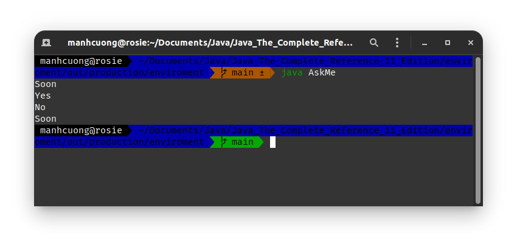

## 4.3. Interface có thể mở rộng _[Interface Can Be Extended]_
* Một interface **x** có thể kế thừa từ một interface **y** khác bằng cách sử dụng từ khóa **`extends`**. Khi một class kế thừa từ interface **x**, thì class này phải định nghĩa toàn bộ các p.thức từ **x** và **y**.
###### IfExtend.java _[source code](./IfExtend.java)_
```java
interface A {
    void meth1();
    void meth2();
}

interface B extends A {
    void meth3();
}

class MyClass implements B {
    public void meth1() {
        System.out.println("--> Đây là meth1()");
    }

    public void meth2() {
        System.out.println("--> Đây là meth2()");
    }

    public void meth3() {
        System.out.println("--> Đây là meth3()");
    }
}

class IfExtend {
    public static void main(String args[]) {
        MyClass ob = new MyClass();

        ob.meth1();
        ob.meth2();
        ob.meth3();
    }
}
```
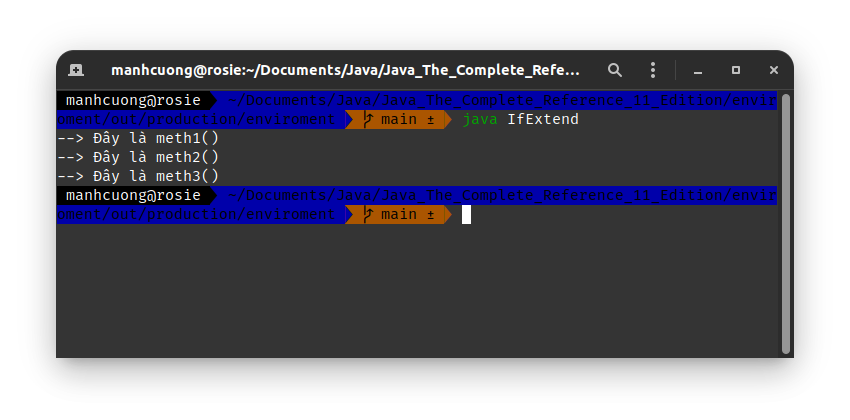

# 5. Phương thức mặc định của Interface _[Default Interface Methods]_
## 5.1. _[Default Method Fundamentals]_
* Để khai báo một phương thức mặc định của interface, ta dùng từ khóa **`default`** đặt trc p.thức đó.
###### DefaultMethodDemo.java _[source code](./DefaultMethodDemo.java)_
```java
interface MyIf {
    int getNumber();

    default String getString() {
        return "--> Đây là p.thức MyIf.getString()";
    }
}

class MyIfImp implements MyIf {
    /*
    * Chỉ có thể định nghĩa các p.thức ko có keyword `default` trong class `MyIf`
    * */
    public int getNumber() {
        return 69;
    }
}

class DefaultMethodDemo {
    public static void main(String args[]) {
        MyIfImp ob1 = new MyIfImp();

        System.out.println(ob1.getNumber());
        System.out.println(ob1.getString());
    }
}
```
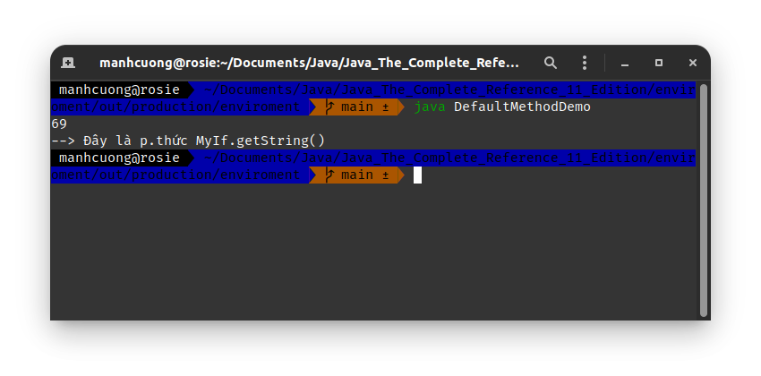

<hr>

* Khi một interface **x** định nghĩa một p.thức **m** là `default`, thì các class khác kế  thừa từ **x** hoàn toàn có thể định nghĩa riêng lại **m** này trong chính class của nó.
###### DefaultMethodDemo2.java _[source code](./DefaultMethodDemo2.java)_
```java
interface MyIf {
    int getNumber();

    default String getString() {
        return "--> Đây là p.thức MyIf.getString()";
    }
}

class MyIfImp implements MyIf {
    /*
     * Chỉ có thể định nghĩa các p.thức ko có keyword `default` trong class `MyIf`
     * */
    public int getNumber() {
        return 69;
    }

    public String getString() {
        return "--> Đây là p.thức MyIfImp.getString()";
    }
}

class DefaultMethodDemo2 {
    public static void main(String args[]) {
        MyIfImp ob1 = new MyIfImp();

        System.out.println(ob1.getNumber());
        System.out.println(ob1.getString());
    }
}
```


## 5.2. _[Multiple Inheritance Issues]_
* Trường hợp kế thừa đa hình dưới đây là sai.
```java
interface Alpha {
    default void reset() {
        System.out.println("--> Đây là Alpha.reset()");
    }
}

interface Beta {
    default void reset() {
        System.out.println("--> Đây là Beta.reset()");
    }
}

/*
* `MyClass` lúc này bị lỗi, do nó kề thừa từ 2 interface là `Alpha` và `Beta`
*   nhưng cả hai interface này đều có cùng một default method là `reset`, nên lúc
*   này `MyClass` ko biết liệu nên kế thừa phiên bản nào của hàm `reset`.
* */
/* class MyClass implements Alpha, Beta {
    // do something
} */
```

* Nhưng nếu trong `MyClass` định nghĩa chính hàm `reset` có riêng nó thì sẽ ko lỗi.
###### DemoMultiInter3.java _[source code](./DemoMultiInter3.java)_
```java
interface Alpha {
    default void reset() {
        System.out.println("--> Đây là Alpha.reset()");
    }
}

interface Beta {
    default void reset() {
        System.out.println("--> Đây là Beta.reset()");
    }
}

/*
 * `MyClass` lúc này bị lỗi, do nó kề thừa từ 2 interface là `Alpha` và `Beta`
 *   nhưng cả hai interface này đều có cùng một default method là `reset`, nên lúc
 *   này `MyClass` ko biết liệu nên kế thừa phiên bản nào của hàm `reset`.
 * */
class MyClass implements Alpha, Beta {
    public void reset() {
        System.out.println("--> Đây là MyClass.reset()");
    }
}

public class DemoMultiInter3 {
    public static void main(String args[]) {
        MyClass ob = new MyClass();
        ob.reset();
    }
}
```
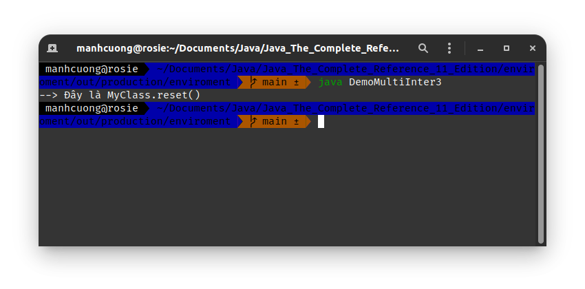

<hr>

###### DemoMultiInter.java _[source code](./DemoMultiInter.java)_
```java
interface Alpha {
    default void reset() {
        System.out.println("--> Đây là Alpha.reset()");
    }
}

interface Beta extends Alpha { // Beta kế thừa Alpha
    default void reset() {
        System.out.println("--> Đây là Beta.reset()");
    }
}

class MyClass implements Alpha, Beta {

}

class DemoMultiInter {
    public static void main(String args[]) {
        MyClass ob = new MyClass();
        ob.reset();
    }
}
```

* Class `MyClass` sẽ gọi p.thức của lớp **con nhất** _(lớp con nhất lúc này là `Beta`)_.

<hr>

* Ta hoàn toàn có thể bắt p.thức **con nhất** gọi lại chính phương thức `reset` bằng từ khóa `super`.
###### DemoMultiInter4.java _[source code](./DemoMultiInter4.java)_
```java
interface Alpha {
    default void reset() {
        System.out.println("--> Đây là Alpha.reset()");
    }
}

interface Beta extends Alpha { // Beta kế thừa Alpha
    default void reset() {
        System.out.println("Gọi tham chiếu đến Alpha.reset() thông qua Beta");
        Alpha.super.reset();
    }
}

class MyClass implements Alpha, Beta {

}

class DemoMultiInter4 {
    public static void main(String args[]) {
        MyClass ob = new MyClass();
        ob.reset();
    }
}
```
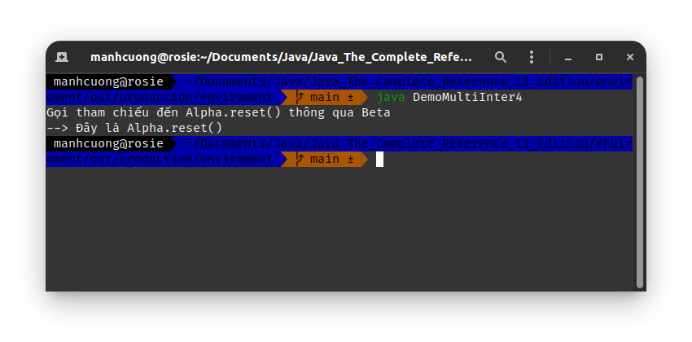

<hr>

* Nếu trong `MyClass` có định nghĩa hàm `reset` riêng thì nó sẽ gọi `MyClass.reset()`.
###### DemoMultiInter2.java _[source code](./DemoMultiInter2.java)_
```java
interface Alpha {
    default void reset() {
        System.out.println("--> Đây là Alpha.reset()");
    }
}

interface Beta extends Alpha { // Beta kế thừa Alpha
    default void reset() {
        System.out.println("--> Đây là Beta.reset()");
    }
}

class MyClass implements Alpha, Beta {
    public void reset() {
        System.out.println("--> Đây là MyClass.reset()");
    }
}

class DemoMultiInter2 {
    public static void main(String args[]) {
        MyClass ob = new MyClass();
        ob.reset();
    }
}
```


# 6. Sử dụng static method trong Interface _[Use static Methods in an Interace]_
###### StaticMethodInter.java _[source code](./StaticMethodInter.java)_
```java
interface MyIf {
    int getNumber();

    default String getString() {
        return "Đây là interface MyIf.getString()";
    }

    static int testStaticMethod() {
        return 69;
    }
}

class StaticMethodInter {
    public static void main(String args[]) {
        System.out.println("Gọi static method MyIf.testStaticMethod(): " + MyIf.testStaticMethod());
    }
}
```
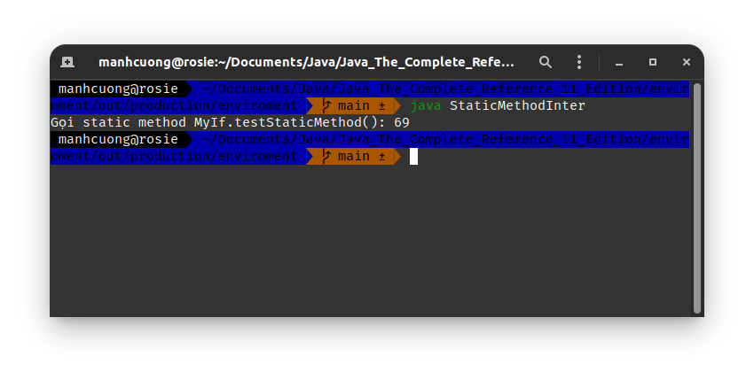

# 7. _[Private Interface Methods]_
###### IfTest4.java _[source code](./IfTest4.java)_
```java
interface IntStack {
    void push(int item);
    int pop();

    default int[] popNElements(int n) {
        return getElements(n);
    }

    default int[] skipAndPopNElements(int skip, int n) {
        getElements(skip);
        return getElements(n);
    }

    private int[] getElements(int n) {
        int elements[] = new int[n];

        for (int i = 0; i < n; ++i) elements[i] = pop();
        return elements;
    }
}

class FixedStack implements IntStack {
    private int stack[];
    private int tos;

    FixedStack(int size) {
        stack = new int[size];
        tos = -1;
    }

    public void push(int item) {
        if (tos == stack.length - 1) {
            System.out.println("Stack is full.");
        } else {
            stack[++tos] = item;
        }
    }

    public int pop() {
        if (tos < 0) {
            System.out.println("Stack underflow.");
            return 0;
        }

        return stack[tos--];
    }
}

class DynStack implements IntStack {
    private int stack[];
    private int tos;

    DynStack(int size) {
        stack = new int[size];
        tos = -1;
    }

    public void push(int item) {
        if (tos == stack.length - 1) {
            int tmp[] = new int[stack.length * 2];
            for (int i = 0; i < stack.length; ++i) tmp[i] = stack[i];
            stack = tmp;
        }

        stack[++tos] = item;
    }

    public int pop() {
        if (tos < 0) {
            System.out.println("Stack underflow.");
            return 0;
        } else {
            return stack[tos--];
        }
    }
}

class IfTest4 {
    public static void main(String args[]) {
        IntStack stack;
        DynStack stack1 = new DynStack(5);
        FixedStack stack2 = new FixedStack(8);
        int[] res;

        stack = stack1;
        for (int i = 0; i < 12; ++i) stack.push(i);

        stack = stack2;
        for (int i = 0; i < 8; ++i) stack.push(i);

        stack = stack1;
        res = stack.skipAndPopNElements(5, 3);
        System.out.println("--> stack1 - Dynamic");
        for (int i = 0; i < res.length; ++i) {
            System.out.println("    res[" + i + "] = " + res[i]);
        }

        stack = stack2;
        res = stack.popNElements(3);
        System.out.println("\n--> stack2 - Fixed");
        for (int i = 0; i < res.length; ++i) {
            System.out.println("    res[" + i + "] = " + res[i]);
        }
    }
}
```
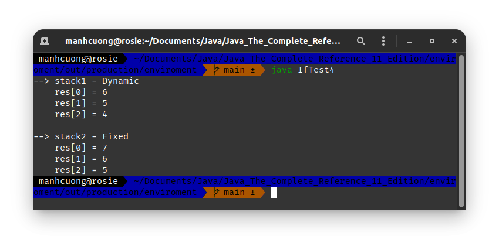