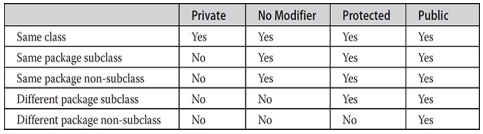

# 1. _[Packages]_
###### mypack/AccountBalance.java _[source code](.mypack/../mypack/AccountBalance.java)_
```java
package mypack;

class Balance {
    String name;
    double bal;

    Balance(String n, double b) {
        name = n;
        bal = b;
    }

    void show() {
        if (bal < 0) {
            System.out.print("--> ");
        }

        System.out.println(name + ": $" + bal);
    }
}

class AccountBalance {
    public static void main(String args[]) {
        Balance current[] = new Balance[3];

        current[0] = new Balance("Harry Potter", 123.23);
        current[1] = new Balance("Ron Weasley", 154.56);
        current[2] = new Balance("Hermione Ranger", -89.02);

        for (var x: current) x.show();
    }
}
```


# 2. _[Packages and Member Access]_
<div align="center">

  

</div>

## 2.1. _[An Access Example]_
###### p1 _[source](./p1)_
