# 1. _[Exception-Handling Fundamentals]_
# 2. Các loại ngoại lệ _[Exception Type]_
# 3. _[Uncaught Exceptions]_
# 4. _[Using `try` and `catch`]_
###### Exc22.java _[source code](./Exc2.java)_
```java
class Exc2 {
    public static void main(String args[]) {
        int d, a;

        try {
            d = 0;
            a = 42 / d;

            System.out.println("Dòng này sẽ ko bao h dc in ra.");
        } catch (ArithmeticException err) { // bắt lỗi chia cho 0
            System.out.println("==> Lỗi chia 0.");
        }

        System.out.println("--> Dòng này dc in ra sau khi bắt lỗi.");
    }
}
```
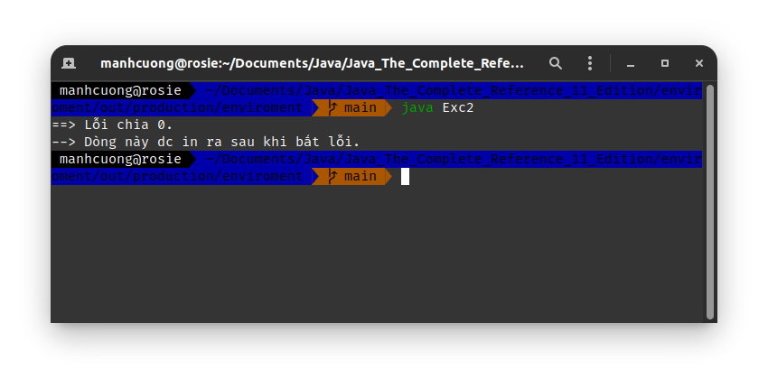

###### HandleError.java _[source code](./HandleError.java)_
```java
import java.util.Random;

class HandleError {
    public static void main(String args[]) {
        int a, b, c;
        a = b = c = 0;

        Random r = new Random();

        for (int i = 0; i < 32000; ++i) {
            try {
                b = r.nextInt();
                c = r.nextInt();
                a = 12345 / (b / c);
            } catch (ArithmeticException err) {
                System.out.println("==> Lỗi chia 0.");
                System.out.println("b & c: " + b + " " + c);

                return;
            }
        }
    }
}
```
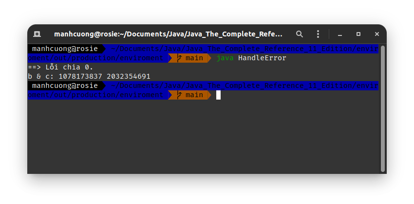

## 4.1. Hiển thị chi tiết lỗi _[Displaying a Description of an Exception]_
###### HandleError2.java _[source code](./HandleError2.java)_
```java
import java.util.Random;

class HandleError2 {
    public static void main(String args[]) {
        int a, b, c;
        a = b = c = 0;

        Random r = new Random();

        for (int i = 0; i < 32000; ++i) {
            try {
                b = r.nextInt();
                c = r.nextInt();
                a = 12345 / (b / c);
            } catch (ArithmeticException err) {
                System.out.println("==> Error: " + err);
                System.out.println("b & c: " + b + " " + c);

                return;
            }
        }
    }
}
```
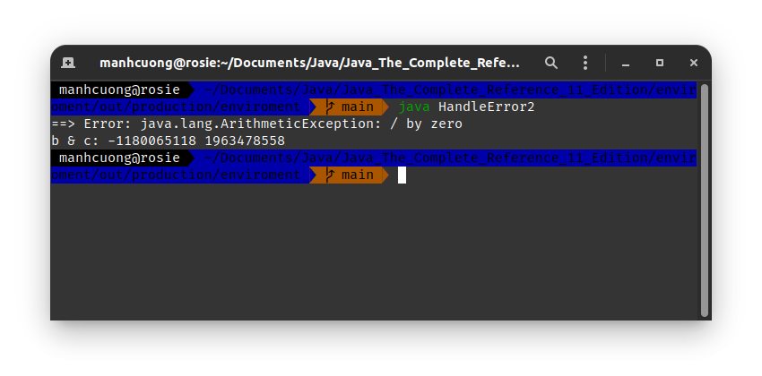

# 5. _[Multiple `catch` Clauses]_
###### MultipleCatches.java _[source code](./MultipleCatches.java)_
```java
class MultipleCatches {
    public static void main(String args[]) {
        try {
            int a = args.length;
            System.out.println("args.length = " + a);

            int b = 42/a;
            int c[] = {1};
            c[42] = 99;
        } catch (ArithmeticException err) {
            System.out.println("==> Lỗi toán học: " + err);
        } catch (ArrayIndexOutOfBoundsException err) {
            System.out.println("==> Lỗi tràn vùng nhớ mảng: " + err);
        }

        System.out.println("--> Sau khi bắt xong lỗi.");
    }
}
```
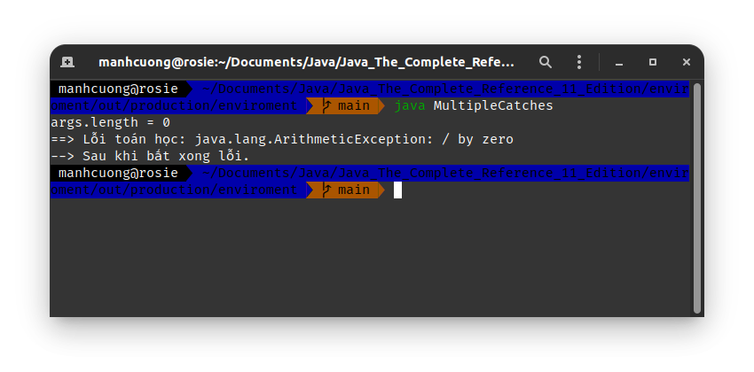
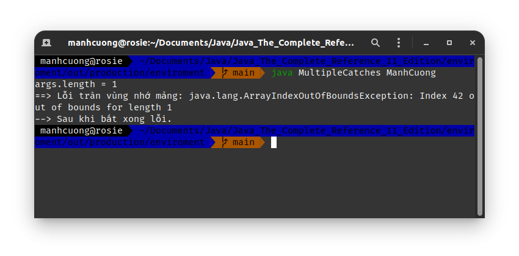

<hr>

* Cần lưu ý trường hợp dưới đây.

```java
class SuperSubCatch {
    public static void main(String args[]) {
        try {
            int a = 0;
            int b = 42/a;
        } catch (Exception err) {
            System.out.println("==> Lỗi ngoại lệ: " + err);
        } /* catch (ArithmeticException err) {
            System.out.println("==> Lỗi toán học: " + err);
        } */
        /*
        * Dòng trên ko cần thiết, vì ArithmeticException là lớp con của Exception, nên
        *   nếu lỗi Exception dc bắt thì lỗi ArithmeticException sẽ ko bao h dc chạy, nên
        *   Java sẽ la làng lên ns là m code ngu, code thừa, thông báo lỗi chính tả.
        * */
    }
}
```

# 6. `try` lồng nhau _[Nested `try` Statements]_
###### NestTry.java _[source code](./NestTry.java)_
```java
class NestTry {
    public static void main(String args[]) {
        try {
            int a = args.length;
            int b = 42 / a;

            System.out.println("a = " + a);

            try {
                if (a == 1) {
                    a = a/ (a - a);
                }

                if (a == 2) {
                    int[] c = {1};
                    c[42] = 99;
                }
            } catch (ArrayIndexOutOfBoundsException err) {
                System.out.println("==> Lỗi tràn index mảng: " + err);
            }
        } catch (ArithmeticException err) {
            System.out.println("==> Lỗi toán học: " + err);
        }
    }
}
```
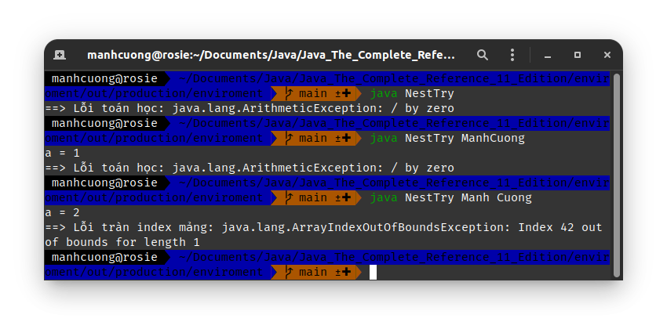

###### MethNestTry.java _[source code](./MethNestTry.java)_
```java
class MethNestTry {
    static void nestTry(int a) {
        try {
            if (a == 1) {
                a = a / (a - a);
            }

            if (a == 2) {
                int[] c = {1};
                c[42] = 99;
            }
        } catch (ArrayIndexOutOfBoundsException err) {
            System.out.println("==> Lỗi tràn index mảng: " + err);
        }
    }

    public static void main(String args[]) {
        try {
            int a = args.length;
            int b = 42/a;

            System.out.println("a = " + a);
            nestTry(a);
        } catch (ArithmeticException err) {
            System.out.println("==> Lỗi toán học: " + err);
        }
    }
}
```
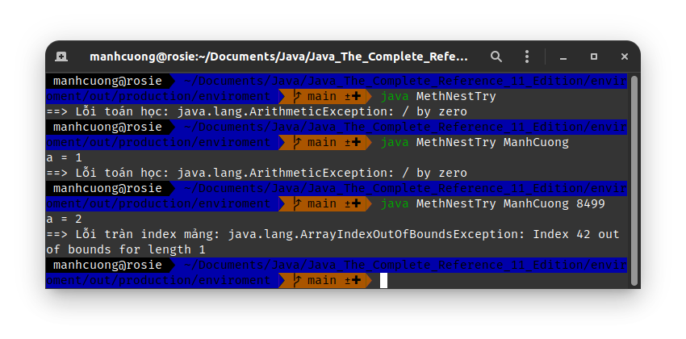


# 7. _[`throw`]_
###### ThrowDemo.java _[source code](./ThrowDemo.java)_
```java
class ThrowDemo {
    static void demoProc() {
        try {
            throw new NullPointerException("CÓ LỖI LÀNG NƯỚC ƠI!!!");
        } catch (NullPointerException err) {
            System.out.println("==> Có lỗi trong method demoProc().");
            throw err;
        }
    }

    public static void main(String[] args) {
        try {
            demoProc();
        } catch (NullPointerException err) {
            System.out.println("==> Lỗi: " + err);
        }
    }
}
```
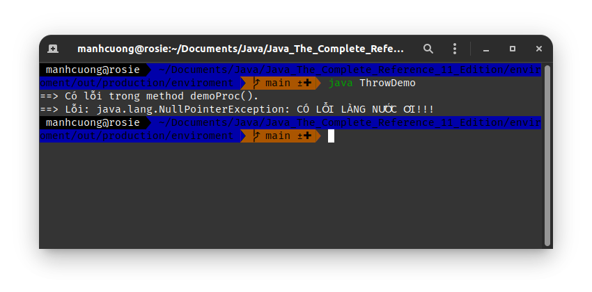

# 8. _[`throws`]_
###### ThrowsDemo.java _[source code](./ThrowsDemo.java)_
```java
class ThrowsDemo {
    static void throwOne() throws IllegalAccessException {
        System.out.println("--> Đây là hàm throwOne()");
        throw new IllegalAccessException("CÓ LỖI LÀNG NƯỚC ƠI!");
    }

    public static void main(String[] args) {
        try {
            throwOne();
        } catch (IllegalAccessException err) {
            System.out.println("==> Lỗi: " + err);
        }
    }
}
```
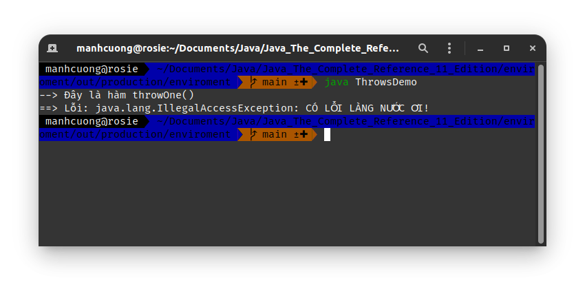

# 9. _[`finally`]_
###### FinallyDemo.java _[source code](./FinallyDemo.java)_
```java
class FinallyDemo {
    static void procA() {
        try {
            System.out.println("--> Bên trong hàm procA");
            throw new RuntimeException("CÓ LỖI LÀNG NƯỚC ƠI.");
        } finally {
            System.out.println("--> procA block finally.");
        }
    }

    static void procB() {
        try {
            System.out.println("--> Bên trong hàm procB");
            return;
        } finally {
            System.out.println("--> procB block finally.");
        }
    }

    static void procC() {
        try {
            System.out.println("--> Bên trong hàm procC");
            return;
        } finally {
            System.out.println("--> procC block finally.");
        }
    }

    public static void main(String[] args) {
        try {
            procA();
        } catch (Exception err) {
            System.out.println("==> Lỗi hàm main: " + err);
        }

        procB();
        procC();
    }
}
```
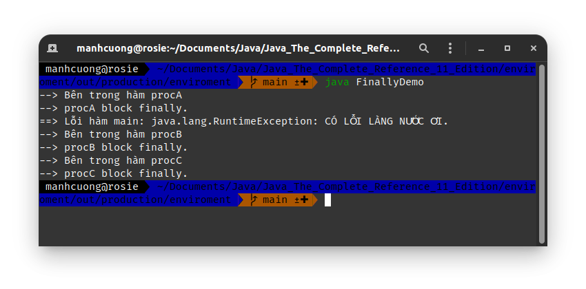

# 10. _[Java's Built-in Exceptions]_
|Exception|Meaning|
|-|-|
|`ArithmeticException`| lỗi toán học, điển hình là chia cho 0|
|`ArrayIndexOutOfBoundsException`| lỗi index nằm ngoài kích thước mảng|
|`ArrayStoreException`|gán cho mảng một phần tử một kiểu dữ liệu ko tương tích với kiểu của mảng|
|`ClassCastException`|lỗi casting dữ liệu vô lí|
|`EnumConstantNotPresentException`|...|

* Tìm hiểu sau

# 11. _[Creating Your Own Exception Subclasses]_
###### ExceptionDemo.java _[source code](./ExceptionDemo.java)_
```java
class MyException extends Exception {
    private int detail;

    MyException(int a) {
        detail = a;
    }

    public String toString() {
        return "MyException[" + detail + "]";
    }
}

class ExceptionDemo {
    static void compute(int a) throws MyException {
        System.out.println("--> Tính toán với a = " + a);

        if (a > 10) {
            throw new MyException(a);
        }

        System.out.println("==> Kết thúc.");
    }

    public static void main(String[] args) {
        try {
            compute(1);
            compute(20);
        } catch (MyException err) {
            System.out.println("==> Lỗi: " + err);
        }
    }
}
```
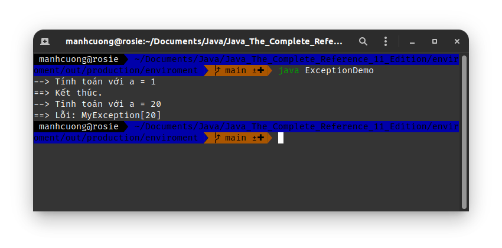

# 12. _[Chained Exceptions]_
###### ChainExcDemo.java _[source code](./ChainExcDemo.java)_
```java
class ChainExcDemo {
    static void demoProc() {
        NullPointerException err = new NullPointerException("CÓ LỖI LÀNG NƯỚC ƠI");
        err.initCause(new ArithmeticException("lỗi là tại mày, chia 0 nè con"));

        throw err;
    }

    public static void main(String[] args) {
        try {
            demoProc();
        } catch (NullPointerException err) {
            System.out.println("==> Lỗi: " + err);
            System.out.println("==> Nguyên nhân: " + err.getCause());
        }
    }
}
```
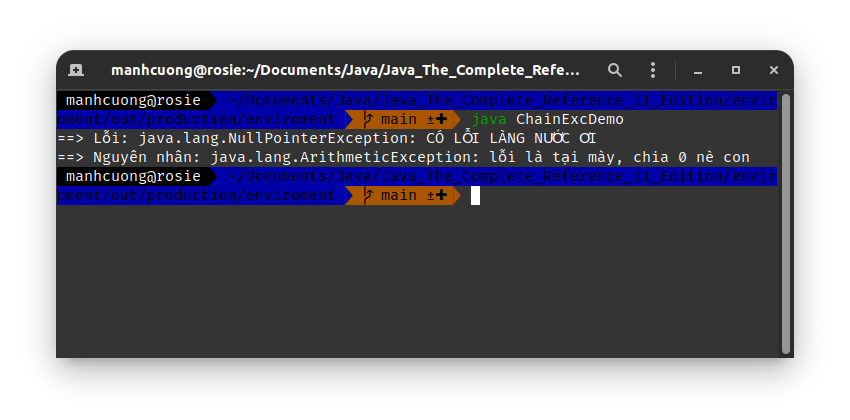

# 13. _[Three Additional Exception Features]_
###### MultiCatch.java _[source code](./MultiCatch.java)_
```java
class MultiCatch {
    public static void main(String[] args) {
        int a = 10, b = 0;
        int[] vals = { 1, 2, 3 };

        try {
            // int res = a / b;
            vals[10] = 19;
        } catch (ArithmeticException | ArrayIndexOutOfBoundsException err) {
            // bắt nhiều lỗi cùng 1 lúc, ko cần phải chia nh` `catch`
            System.out.println("==> Lỗi: " + err);
        }

        System.out.println("Kết thúc.");
    }
}
```
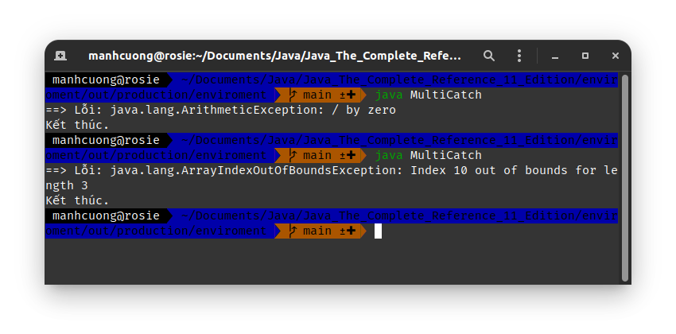