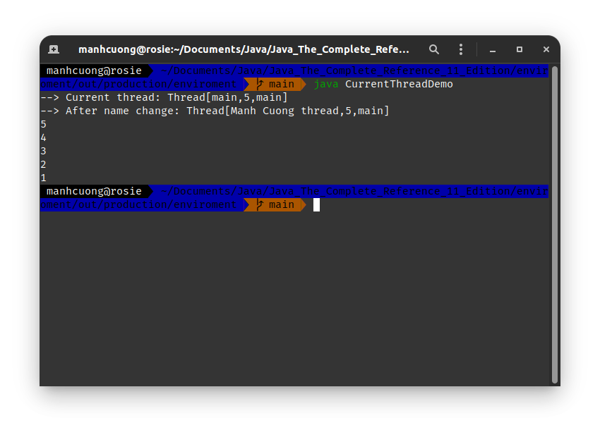

# 2. _[The Main Thread]_
###### CurrentThreadDemo.java _[source code](./CurrentThreadDemo.java)_
```java
class CurrentThreadDemo {
    public static void main(String[] args) {
        Thread m_thread = Thread.currentThread();
        System.out.println("--> Current thread: " + m_thread);

        // change the name of the thread
        m_thread.setName("Manh Cuong thread");
        System.out.println("--> After name change: " + m_thread);

        try {
            for (int i = 5; i > 0; --i) {
                System.out.println(i);
                Thread.sleep(1000); // ngủ 1 giây
            }
        } catch (InterruptedException err) {
            System.out.println("==> Main thread đã bị ngắt...");
        }
    }
}
```


* Trong chương trình này 1 tham chiếu trỏ đến luồng hiện tại _(thông qua p.thức `currentThread()`)_ và dc chứa trong biến `m_thread`. Tiếp theo chương trình cho biết thông tin chi tiết của `m_thread`, cuối cùng là đặt tên lại cho `m_thread` rồi hiển thị lên lại.
* Tiếp theo một cái loop count down từ 5, mỗi loop như vậy dừng lại 1s _(dc thực thi bởi hàm `sleep`). Cần lưu ý khối `try/catch` trong hàm main, vì p.thức `sleep` có thể gây ra một `InterruptException`, lỗi này sẽ xảy ra khi có một luồng khác ngăn luồng đang **ngủ** này, trong ví dụ nay đơn thuần là chỉ in một tin nhắn ra màn hình luồng bị ngắt, nhưng trong thực tế thì kinh khủng hơn nh.