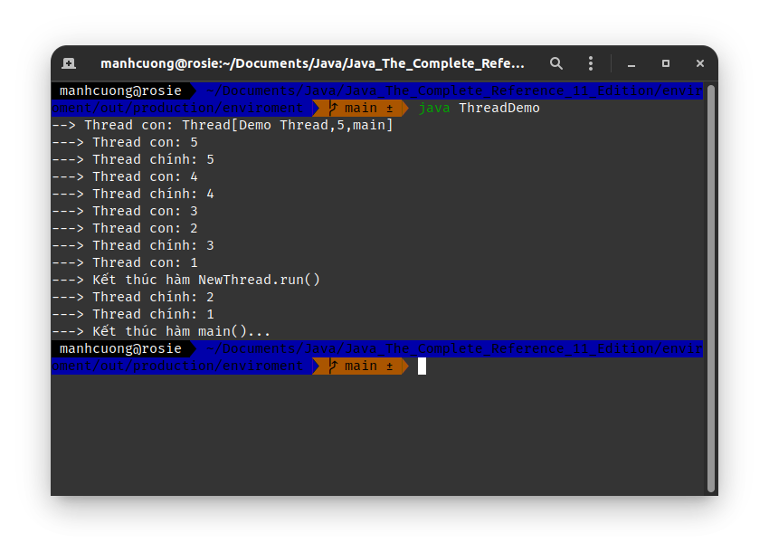
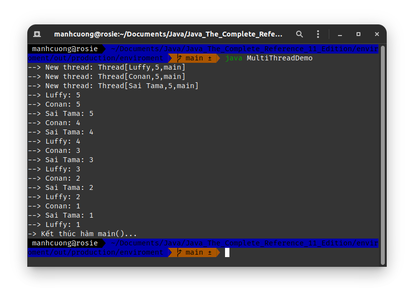
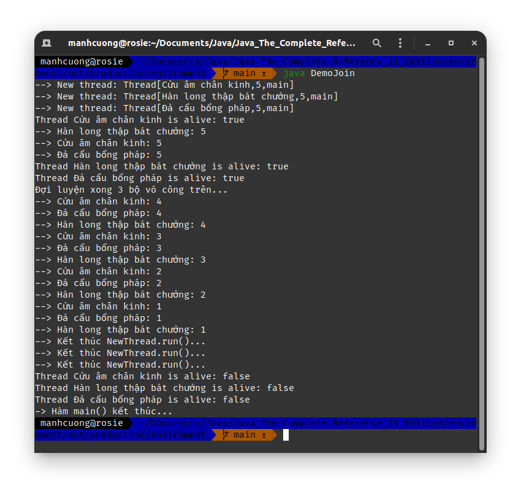
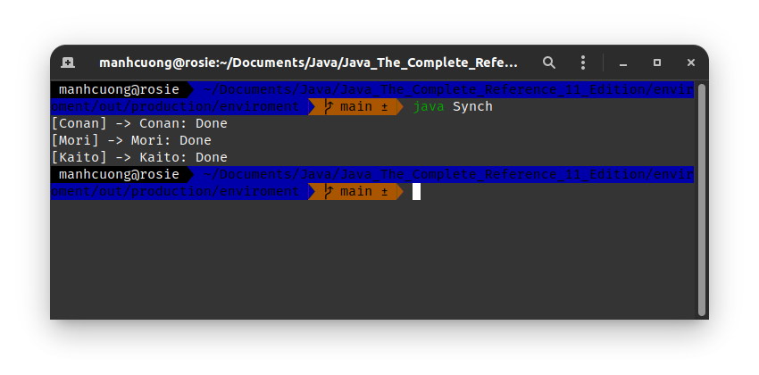
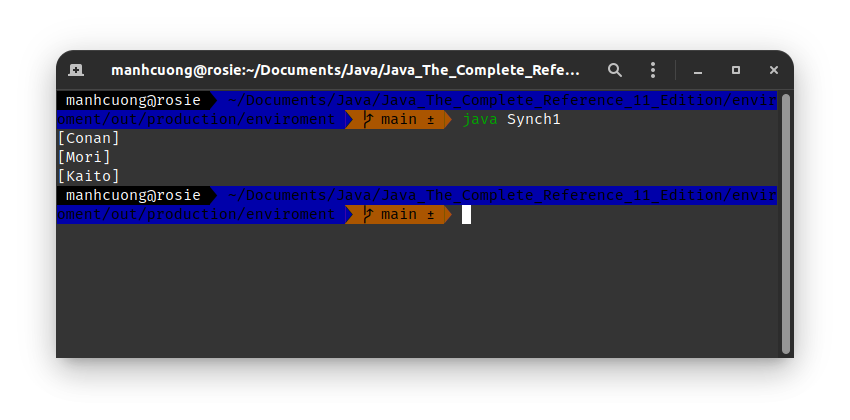
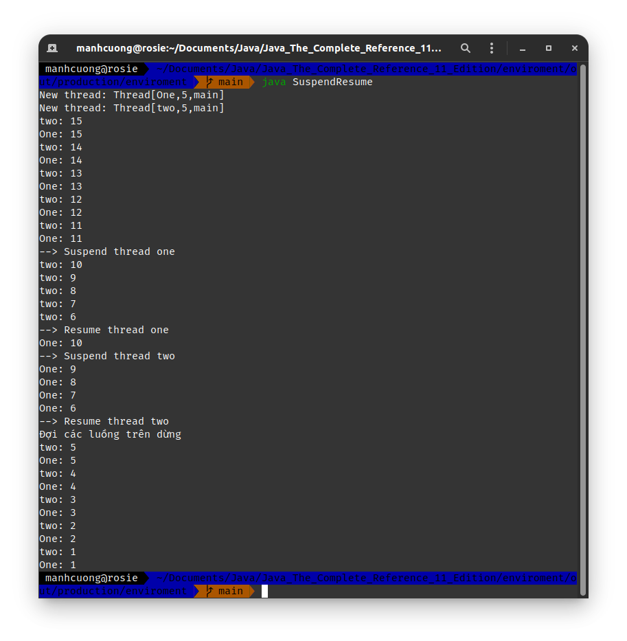
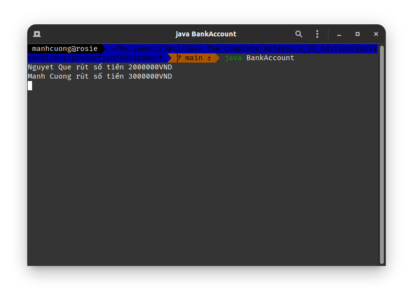
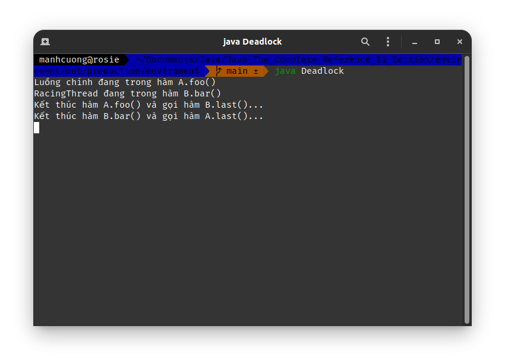

# 2. _[The Main Thread]_
###### CurrentThreadDemo.java _[source code](./CurrentThreadDemo.java)_
```java
class CurrentThreadDemo {
    public static void main(String[] args) {
        Thread m_thread = Thread.currentThread();
        System.out.println("--> Current thread: " + m_thread);

        // change the name of the thread
        m_thread.setName("Manh Cuong thread");
        System.out.println("--> After name change: " + m_thread);

        try {
            for (int i = 5; i > 0; --i) {
                System.out.println(i);
                Thread.sleep(1000); // ngủ 1 giây
            }
        } catch (InterruptedException err) {
            System.out.println("==> Main thread đã bị ngắt...");
        }
    }
}
```


* Trong chương trình này 1 tham chiếu trỏ đến luồng hiện tại _(thông qua p.thức `currentThread()`)_ và dc chứa trong biến `m_thread`. Tiếp theo chương trình cho biết thông tin chi tiết của `m_thread`, cuối cùng là đặt tên lại cho `m_thread` rồi hiển thị lên lại.
* Tiếp theo một cái loop count down từ 5, mỗi loop như vậy dừng lại 1s _(dc thực thi bởi hàm `sleep`). Cần lưu ý khối `try/catch` trong hàm main, vì p.thức `sleep` có thể gây ra một `InterruptException`, lỗi này sẽ xảy ra khi có một luồng khác ngăn luồng đang **ngủ** này, trong ví dụ nay đơn thuần là chỉ in một tin nhắn ra màn hình luồng bị ngắt, nhưng trong thực tế thì kinh khủng hơn nh.

# 3. _[Creating a Thread]_
## 3.1. _[Implementing Runnable]_
###### ThreadDemo.java _[source code](./ThreadDemo.java)_
```java 
class NewThread implements Runnable {
    Thread t;

    NewThread() {
        t = new Thread(this, "Demo Thread"); // tham số this ý muốn ns luồn ms sẽ dc khởi chạy trên đối tượng này.
        System.out.println("--> Thread con: " + t);
    }

    public void run() {
        try {
            for (int i = 5; i > 0; --i) {
                System.out.println("---> Thread con: " + i);
                Thread.sleep(500);
            }
        } catch (InterruptedException err) {
            System.out.println("---> Thread con bị ngắt...");
        }

        System.out.println("---> Kết thúc hàm NewThread.run()");
    }
}

class ThreadDemo {
    public static void main(String[] args) {
        NewThread nt = new NewThread(); // tạo ra một luồng mới
        nt.t.start(); // khởi động thread

        try {
            for (int i = 5; i > 0; --i) {
                System.out.println("---> Thread chính: " + i);
                Thread.sleep(1000);
            }
        } catch (InterruptedException err) {
            System.out.println("---> Thread chính bị ngắt...");
        }

        System.out.println("---> Kết thúc hàm main()...");
    }
}
```


## 3.2. _[Extending Thread]_
###### ExtendThread.java _[source code](./ExtendThread.java)_
```java
class NewThread extends Thread {
    NewThread() {
        super("Demo Thread");
        System.out.println("---> Luồng con: " + this);
    }

    public void run() {
        try {
            for (int i = 5; i > 0; --i) {
                System.out.println("---> Luồng con: " + i);
                Thread.sleep(500);
            }
        } catch (InterruptedException err) {
            System.out.println("---> Luồng con kết thúc...");
        }

        System.out.println("---> Kết thúc hàm NewThread.run()...");
    }
}

class ExtendThread {
    public static void main(String[] args) {
        NewThread nt = new NewThread();
        nt.start();

        try {
            for (int i = 5; i > 0; --i) {
                System.out.println("--> Luồng chính: " + i);
                Thread.sleep(1000);
            }
        } catch (InterruptedException err) {
            System.out.println("--> Luồng chính kết thúc...");
        }

        System.out.println("--> Kết thúc hàm main()...");
    }
}
```


# 4. _[Creating Multiple Threads]_
###### MultiThreadDemo.java _[source code](./MultiThreadDemo.java)_
```java
class NewThread implements Runnable {
    String name; // tên của luồng
    Thread thread;

    NewThread(String thread_name) {
        name = thread_name;
        thread = new Thread(this, name);
        System.out.println("--> New thread: " + thread);
    }

    public void run() {
        try {
            for (int i = 5; i > 0; --i) {
                System.out.println("--> " + name + ": " + i);
                Thread.sleep(1000);
            }
        } catch (InterruptedException err) {
            System.out.println("--> " + name + " bị ngắt...");
        }
    }
}

class MultiThreadDemo {
    public static void main(String[] args) {
        NewThread nt1 = new NewThread("Luffy");
        NewThread nt2 = new NewThread("Conan");
        NewThread nt3 = new NewThread("Sai Tama");

        nt1.thread.start();
        nt2.thread.start();
        nt3.thread.start();

        // Đợi 3 luồng trên chạy xong
        try {
            Thread.sleep(10000);
        } catch (InterruptedException err) {
            System.out.println("-> Luồng chính bị ngắt");
        }

        System.out.println("-> Kết thúc hàm main()...");
    }
}
```


# 5. _[Using `isAlive()` and `join()`]_
###### DemoJoin.java _[source code](./DemoJoin.java)_
```java
class NewThread implements Runnable {
    String name;
    Thread thread;

    NewThread(String thread_name) {
        name = thread_name;
        thread = new Thread(this, name);
        System.out.println("--> New thread: " + thread);
    }

    public void run() {
        try {
            for (int i = 5; i > 0; --i) {
                System.out.println("--> " + name + ": " + i);
                Thread.sleep(1000);
            }
        } catch (InterruptedException err) {
            System.out.println("-->" + name + " bị ngắt...");
        }

        System.out.println("--> Kết thúc NewThread.run()...");
    }
}

class DemoJoin {
    public static void main(String[] args) {
        NewThread nt1 = new NewThread("Cửu âm chân kinh");
        NewThread nt2 = new NewThread("Hàn long thập bát chưởng");
        NewThread nt3 = new NewThread("Đả cẩu bổng pháp");

        nt1.thread.start();
        nt2.thread.start();
        nt3.thread.start();

        System.out.println("Thread " + nt1.name + " is alive: " + nt1.thread.isAlive());
        System.out.println("Thread " + nt2.name + " is alive: " + nt2.thread.isAlive());
        System.out.println("Thread " + nt3.name + " is alive: " + nt3.thread.isAlive());

        try {
            System.out.println("Đợi luyện xong 3 bộ võ công trên...");
            nt1.thread.join();
            nt2.thread.join();
            nt3.thread.join();
        } catch (InterruptedException err) {
            System.out.println("-> Luồng chính bị ngắt...");
        }

        System.out.println("Thread " + nt1.name + " is alive: " + nt1.thread.isAlive());
        System.out.println("Thread " + nt2.name + " is alive: " + nt2.thread.isAlive());
        System.out.println("Thread " + nt3.name + " is alive: " + nt3.thread.isAlive());

        System.out.println("-> Hàm main() kết thúc...");
    }
}
```


# 7. _[Synchronization]_
## 7.1. _[Using Synchronized Methods]_
###### Synch.java _[source code](./Synch.java)_
```java
class Callme {
    synchronized void call(String msg) {
        System.out.print("[" + msg);

        try {
            Thread.sleep(1000);
        } catch (InterruptedException err) {
            System.out.println("-> Bị ngắt...");
        }

        System.out.println("] -> " + msg + ": Done");
    }
}

class Caller implements Runnable {
    String msg;
    Callme target;
    Thread thread;

    public Caller(Callme targ, String s) {
        target = targ;
        msg = s;
        thread = new Thread(this);
    }

    public void run() {
        target.call(msg);
    }
}

class Synch {
    public static void main(String[] args) {
        Callme target = new Callme();
        Caller ob1 = new Caller(target, "Conan");
        Caller ob2 = new Caller(target, "Kaito");
        Caller ob3 = new Caller(target, "Mori");

        // khởi động các luồng
        ob1.thread.start();
        ob2.thread.start();
        ob3.thread.start();

        // đợi 3 luồng trên chạy xog
        try {
            ob1.thread.join();
            ob2.thread.join();
            ob3.thread.join();
        } catch (InterruptedException err) {
            System.out.println("-> Trong main() bị ngắt...");
        }
    }
}
```


<hr>

* Trong trường hợp một class nào đó do một bên thử ba cung cấp chẳng hạn, và class này trong code của chúng ta cũng cần thực hiện sync, nhưng ko may code của bên thứ 3 đã dc đóng gói nên ta ko thể chỉnh mã nguồn dc, thì bây giờ để có thể chạy dc đồng bộ hóa trên class này, ta chỉ cần sài từ khóa **synchronized** trc object dc tạo ra từ class này.

###### Synch1.java _[source code](./Synch1.java)_
```java
class Callme {
    void call(String msg) {
        System.out.print("[" + msg);

        try {
            Thread.sleep(1000);
        } catch (InterruptedException err) {
            System.out.println("--> " + msg + " bị ngắt...");
        }

        System.out.println("]");
    }
}

class Caller implements Runnable {
    String msg;
    Callme target;
    Thread thread;

    public Caller(Callme targ, String s) {
        target = targ;
        msg = s;
        thread = new Thread(this);
    }

    public void run() {
        synchronized (target) { // chú ý dòng này
            target.call(msg);
        }
    }
}

class Synch1 {
    public static void main(String[] args) {
        Callme target = new Callme();
        Caller ob1 = new Caller(target, "Conan");
        Caller ob2 = new Caller(target, "Kaito");
        Caller ob3 = new Caller(target, "Mori");

        // khởi động các luồng
        ob1.thread.start();
        ob2.thread.start();
        ob3.thread.start();

        // đợi 3 luồng trên chạy xog
        try {
            ob1.thread.join();
            ob2.thread.join();
            ob3.thread.join();
        } catch (InterruptedException err) {
            System.out.println("-> Trong main() bị ngắt...");
        }
    }
}
```


###### PC.java _[source code](./PC.java)_
```java
class Q {
    int n;
    boolean value_set = false;

    synchronized int get() {
        while (!value_set) {
            try {
                wait();
            } catch (InterruptedException err) {
                System.out.println("--> Ngắt set...");
            }
        }

        System.out.println("Got: " + n);
        value_set = false;
        notify();
        return n;
    }

    synchronized void put(int n) {
        while (value_set) {
            try {
                wait();
            } catch (InterruptedException err) {
                System.out.println("--> Ngắt put...");
            }
        }
        this.n = n;
        value_set = true;
        System.out.println("Put: " + n);
        notify();
    }
}

class Producer implements Runnable {
    Q q;
    Thread thread;

    Producer (Q q) {
        this.q = q;
        thread = new Thread(this, "Producer");
    }

    public void run() {
        int i = 0;

        while (true) {
            q.put(i++);
        }
    }
}

class Consumer implements Runnable {
    Q q;
    Thread thread;

    Consumer(Q q) {
        this.q = q;
        thread = new Thread(this, "Consumer");
    }

    public void run() {
        while (true) {
            q.get();
        }
    }
}

class PC {
    public static void main(String[] args) {
        Q q = new Q();
        Producer p = new Producer(q);
        Consumer c = new Consumer(q);

        p.thread.start();
        c.thread.start();

        System.out.println("--> Nhấn Ctrl + C để dừng...");
    }
}
```


###### SuspendResume.java _[source code](./SuspendResume.java)_
```java
import java.nio.channels.NonWritableChannelException;

class NewThread implements Runnable {
    String name;
    Thread thread;
    boolean suspend_flag;

    NewThread(String thread_name) {
        name = thread_name;
        thread = new Thread(this, name);
        System.out.println("New thread: " + thread);
        suspend_flag = false;
    }

    public void run() {
        try {
            for (int i = 15; i > 0; --i) {
                System.out.println(name + ": " + i);
                Thread.sleep(200);

                synchronized (this) {
                    while (suspend_flag) {
                        wait();
                    }
                }
            }
        } catch (InterruptedException err) {
            System.out.println(name + " exiting");
        }
    }

    synchronized void mySuspend() {
        suspend_flag = true;
    }

    synchronized void myResume() {
        suspend_flag = false;
        notify();
    }
}

class SuspendResume {
    public static void main(String[] args) {
        NewThread ob1 = new NewThread("One");
        NewThread ob2 = new NewThread("two");

        ob1.thread.start();
        ob2.thread.start();

        try {
            Thread.sleep(1000);
            ob1.mySuspend();
            System.out.println("--> Suspend thread one");
            Thread.sleep(1000);
            ob1.myResume();
            System.out.println("--> Resume thread one");

            ob2.mySuspend();
            System.out.println("--> Suspend thread two");
            Thread.sleep(1000);
            ob2.myResume();
            System.out.println("--> Resume thread two");
        } catch (InterruptedException err) {
            System.out.println("Main thread interrupted");
        }

        try {
            System.out.println("Đợi các luồng trên dừng");

            ob1.thread.join();
            ob2.thread.join();
        } catch (InterruptedException err) {
            System.out.println("Luồng chính dừng");
        }
    }
}
```


# 8. [Deadlock]
###### BankAccount.java _[source code](./BankAccount.java)_
```java
class BankAccount {
    long amount = 5_000_000;
    String account_name = "";

    BankAccount(String account_name) {
        this.account_name = account_name;
    }

    synchronized void withdraw(long amount) {
        System.out.println(account_name + " rút số tiền " + amount + "VND");
        this.amount -= amount;
    }

    synchronized void deposit(long amount) {
        System.out.println(account_name + " nạp số tiền " + amount + "VND");
        this.amount += amount;
    }

    void transferTo(BankAccount other, long amount) {
        synchronized (this) {
            // trừ tiền từ tài khoản này
            this.withdraw(amount);

            // nạp tiền vào tài khoản other
            synchronized (other) {
                other.deposit(amount);
            }

            System.out.println(this.account_name + " số dư là " + this.amount);
            System.out.println(other.account_name + " số dư là " + other.amount);
        }
    }

    public static void main(String[] args) {
        BankAccount acc1 = new BankAccount("Manh Cuong");
        BankAccount acc2 = new BankAccount("Nguyet Que");

        Thread thread1 = new Thread() {
            public void run() {
                acc1.transferTo(acc2, 3_000_000);
            }
        };

        Thread thread2 = new Thread() {
            public void run() {
                acc2.transferTo(acc1, 2_000_000);
            }
        };

        thread1.start();
        thread2.start();
    }
}
```


###### Deadlock.java _[source code](./Deadlock.java)_
```java
class A {
    synchronized void foo(B b) {
        String name = Thread.currentThread().getName();
        System.out.println(name + " đang trong hàm A.foo()");

        try {
            Thread.sleep(1000);
        } catch (Exception err) {
            System.out.println("Hàm A.foo() bị ngắt.");
        }

        System.out.println("Kết thúc hàm A.foo() và gọi hàm B.last()...");
        b.last();
    }

    synchronized void last() {
        System.out.println("Bên trong hàm A.last()");
    }
}

class B {
    synchronized void bar(A a) {
        String name = Thread.currentThread().getName();
        System.out.println(name + " đang trong hàm B.bar()");

        try {
            Thread.sleep(1000);
        } catch (Exception err) {
            System.out.println("Hàm B.bar() bị ngắt.");
        }

        System.out.println("Kết thúc hàm B.bar() và gọi hàm A.last()...");
        a.last();
    }

    synchronized void last() {
        System.out.println("Bên trong hàm B.last()");
    }
}

class Deadlock implements Runnable {
    A a = new A();
    B b = new B();
    Thread thread;

    Deadlock() {
        Thread.currentThread().setName("Luồng chính");
        thread = new Thread(this, "RacingThread");
    }

    void deadlockStart() {
        thread.start();
        a.foo(b);
        System.out.println("Quay về luồng chính...");
    }

    public void run() {
        b.bar(a);
        System.out.println("Quay về một luồng khác...");
    }

    public static void main(String[] args) {
        Deadlock dl = new Deadlock();
        dl.deadlockStart();
    }
}
```
