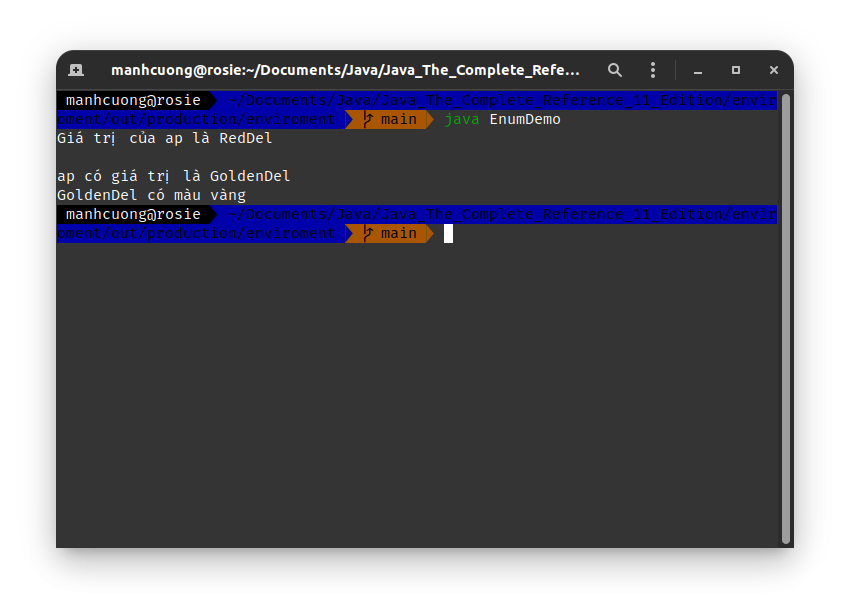
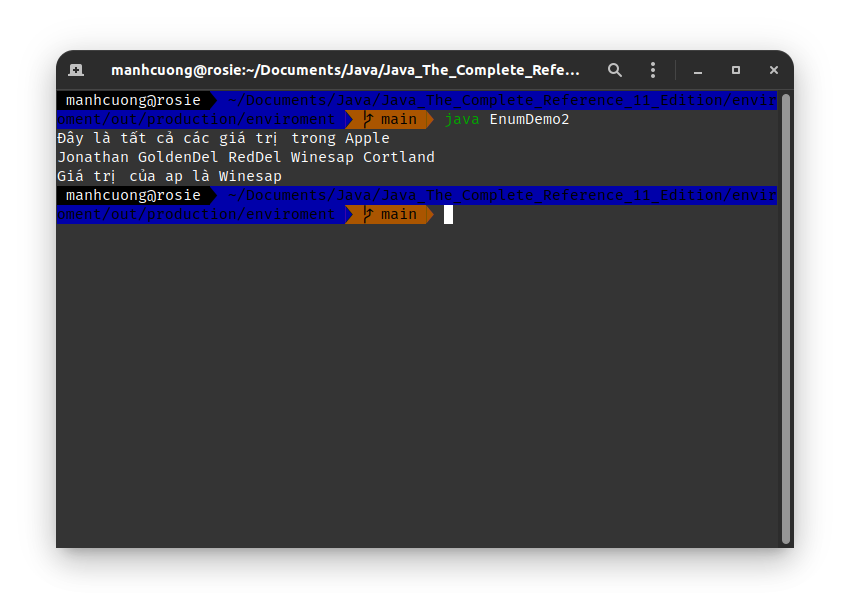
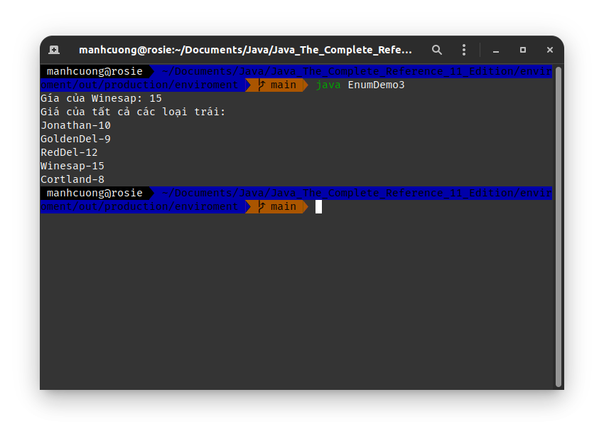

# 1. Enumarations
## 1.1. Enumaration Fundamentals
###### EnumDemo.java _[source code](./EnumDemo.java)_
```java
enum Apple {
    Jonathan, GoldenDel, RedDel, Winesap, Cortland
}

class EnumDemo {
    public static void main(String[] args) {
        Apple ap;
        ap = Apple.RedDel;

        System.out.println("Giá trị của ap là " + ap);
        System.out.println();

        ap = Apple.GoldenDel;

        if (ap == Apple.GoldenDel) {
            System.out.println("ap có giá trị là GoldenDel");
        }

        switch (ap) {
            case Jonathan:
                System.out.println("Jonathan có màu đỏ");
                break;
            case GoldenDel:
                System.out.println("GoldenDel có màu vàng");
                break;
            case RedDel:
                System.out.println("RedDel có màu đỏ.");
                break;
            case Winesap:
                System.out.println("Winesap có màu đỏ.");
                break;
            case Cortland:
                System.out.println("Cortland có màu đỏ.");
                break;
        }
    }
}
```


## 1.2. The `values()` and `valueOf()` Methods

###### EnumDemo2.java _[source code](./EnumDemo2.java)_
```java
enum Apple {
    Jonathan, GoldenDel, RedDel, Winesap, Cortland
}

class EnumDemo2 {
    public static void main(String[] args) {
        Apple ap;

        System.out.println("Đây là tất cả các giá trị trong Apple");
        Apple all_apples[] = Apple.values();

        for (var a: all_apples) {
            System.out.print(a + " ");
        }
        System.out.println();

        ap = Apple.valueOf("Winesap");
        System.out.println("Giá trị của ap là " + ap);

    }
}
```


## 1.3. Java Enumerations Are Class Types
###### EnumDemo3.java _[source code](./EnumDemo3.java)_
```java
enum Apple {
    Jonathan(10), GoldenDel(9), RedDel(12), Winesap(15), Cortland(8);

    private int price; // giá của từng loại trái

    Apple(int p) {price = p;}

    int getPrice() {
        return price;
    }
}

class EnumDemo3 {
    public static void main(String[] args) {
        Apple ap;

        System.out.println("Gía của Winesap: " + Apple.Winesap.getPrice());

        System.out.println("Giá của tất cả các loại trái: ");
        for (var a: Apple.values()) {
            System.out.println(a + "-" + a.getPrice() + " ");
        }
    }
}
```


