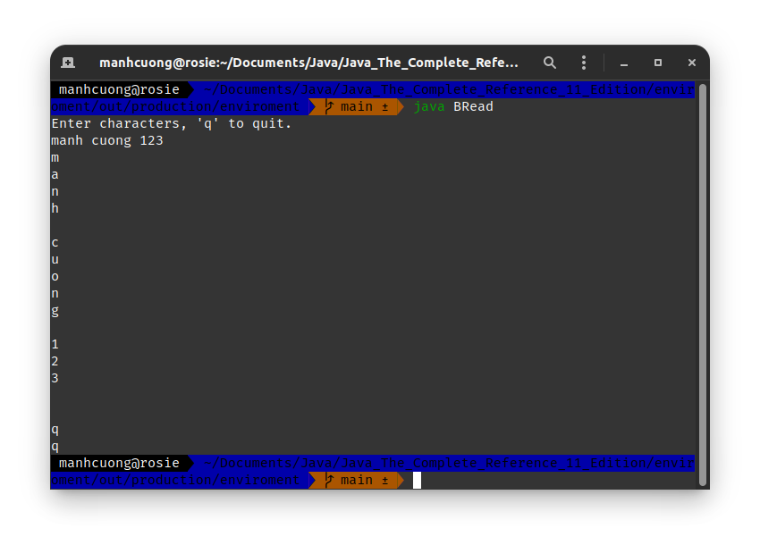
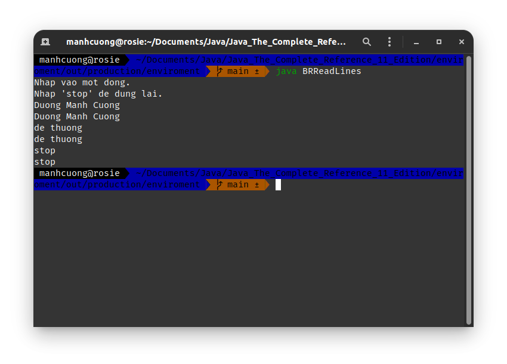

# 1. I/O Basics
# 2. Reading console input
## 2.1. Reading character
###### BRead.java _[source code](./BRead.java)_
```java
import java.io.*;

class BRead {
    public static void main(String[] args) throws IOException {
        char c;
        BufferedReader br = new BufferedReader(new InputStreamReader(System.in));
        System.out.println("Enter characters, 'q' to quit.");

        do {
            c = (char) br.read();
            System.out.println(c);
        } while (c != 'q');
    }
}
```


## 2.2. Reading Strings
###### BRReadLines.java _[source code](./BRReadLines.java)_
```java
import java.io.*;

class BRReadLines {
    public static void main(String[] args) throws IOException {
        BufferedReader br = new BufferedReader(new InputStreamReader(System.in));
        String str;

        System.out.println("Nhap vao mot dong.");
        System.out.println("Nhap 'stop' de dung lai.");
        do {
            str = br.readLine();
            System.out.println(str);
        } while (!str.equals("stop"));
    }
}
```
