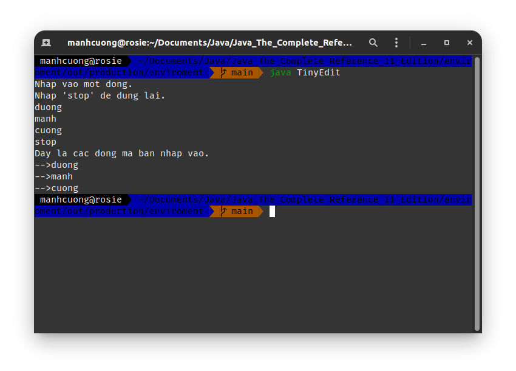
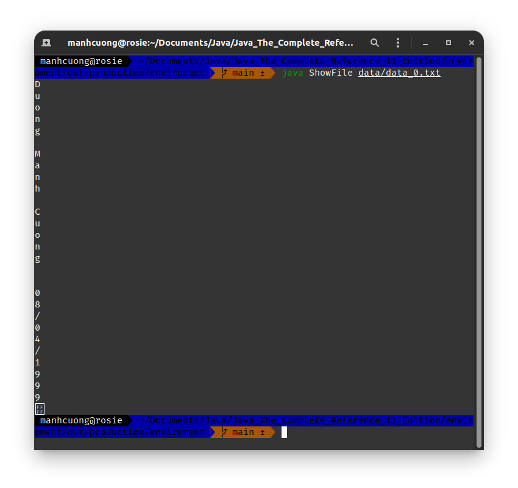
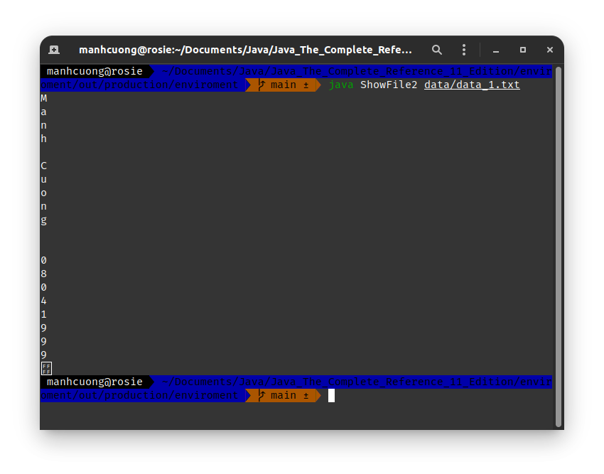
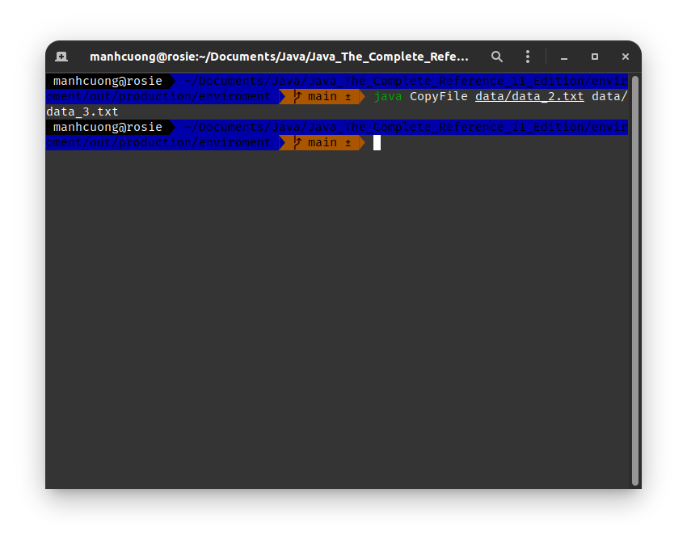

# 1. I/O Basics
# 2. Reading console input
## 2.1. Reading character
###### BRead.java _[source code](./BRead.java)_
```java
import java.io.*;

class BRead {
    public static void main(String[] args) throws IOException {
        char c;
        BufferedReader br = new BufferedReader(new InputStreamReader(System.in));
        System.out.println("Enter characters, 'q' to quit.");

        do {
            c = (char) br.read();
            System.out.println(c);
        } while (c != 'q');
    }
}
```


## 2.2. Reading Strings
###### BRReadLines.java _[source code](./BRReadLines.java)_
```java
import java.io.*;

class BRReadLines {
    public static void main(String[] args) throws IOException {
        BufferedReader br = new BufferedReader(new InputStreamReader(System.in));
        String str;

        System.out.println("Nhap vao mot dong.");
        System.out.println("Nhap 'stop' de dung lai.");
        do {
            str = br.readLine();
            System.out.println(str);
        } while (!str.equals("stop"));
    }
}
```


###### TinyEdit.java _[source code](./TinyEdit.java)_
```java
import java.io.*;

class TinyEdit {
    public static void main(String[] args) throws IOException {
        BufferedReader br = new BufferedReader(new InputStreamReader(System.in));
        String[] str = new String[100];

        System.out.println("Nhap vao mot dong.");
        System.out.println("Nhap 'stop' de dung lai.");
        for (int i = 0; i < 100; ++i) {
            str[i] = br.readLine();

            if (str[i].equals("stop")) break;
        }

        System.out.println("Day la cac dong ma ban nhap vao.");
        for (int i = 0; i < 100; ++i) {
            if (str[i].equals("stop")) break;

            System.out.println("-->" + str[i]);
        }
    }
}
```


# 3. Writing Console Output
# 5. Reading and Writing Files
###### ShowFile.java _[source code](./ShowFile.java)_
```java
import java.io.*;

class ShowFile {
    public static void main(String[] args) {
        int i;
        FileInputStream fin;

        if (args.length != 1) {
            return;
        }

        try {
            fin = new FileInputStream(args[0]);
        } catch (FileNotFoundException err) {
            System.out.println("Cannot open file");
            return;
        }

        try {
            do {
                i = fin.read();

                if (i != 1) {
                    System.out.println((char) i);
                }
            } while (i != -1);
        } catch (IOException err) {
            System.out.println("Error reading file");
        }

        try {
            fin.close();
        } catch (IOException err) {
            System.out.println("Error closing file");
        }
    }
}
```



###### ShowFile2.java _[source code](./ShowFile2.java)_
```java
import java.io.*;

class ShowFile2 {
    public static void main(String[] args) {
        int i;
        FileInputStream fin = null;

        if (args.length != 1) {
            return;
        }

        try {
            fin = new FileInputStream(args[0]);

            do {
                i = fin.read();

                if (i != 1) {
                    System.out.println((char) i);
                }
            } while (i != -1);
        } catch (IOException err) {
            System.out.println("Cannot open file");
            return;
        } finally {
            try {
                if (fin != null) fin.close();
            } catch (IOException err) {
                System.out.println("Error closing file");
            }
        }
    }
}
```


###### CopyFile.java _[source code](./CopyFile.java)_
```java
import java.io.*;

class CopyFile {
    public static void main(String[] args) throws IOException {
        int i;
        FileInputStream fin = null;
        FileOutputStream fout = null;

        if (args.length != 2) {
            return;
        }

        try {
            fin = new FileInputStream(args[0]);
            fout = new FileOutputStream(args[1]);

            do {
                i = fin.read();
                if (i != -1) fout.write(i);
            } while (i != -1);
        } catch (IOException err) {
            System.out.println("I/O Error");
        } finally {
            try {
                if (fin != null) fin.close();
            } catch (IOException err) {
                System.out.println("Error closing input file");
            }

            try {
                if (fout != null) fout.close();
            } catch (IOException err) {
                System.out.println("Error closing output file");
            }
        }
    }
}
```


# 6. Automatically Closing a File
