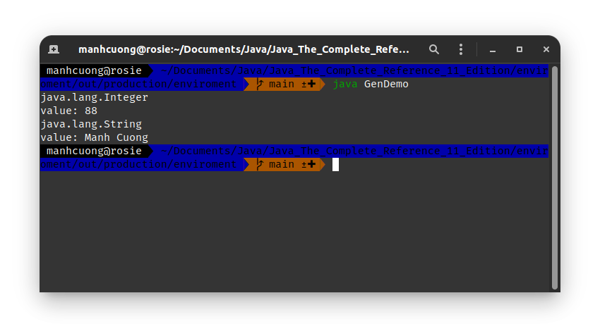

# 1. What are Generics?
# 2. A Simple Generics Example
###### GenDemo.java _[source code](./GenDemo.java)_
```java
class Gen<T> {
    T ob;

    Gen(T o) {
        ob = o;
    }

    T getob() {
        return ob;
    }

    void showType() {
        System.out.println(ob.getClass().getName());
    }
}

class GenDemo {
    public static void main(String[] args) {
        Gen<Integer> iOb;

        iOb = new Gen<Integer>(88);
        iOb.showType();

        System.out.println("value: " + iOb.getob());

        Gen<String> strOb = new Gen<String>("Manh Cuong");
        strOb.showType();

        System.out.println("value: " + strOb.getob());
    }
}
```


## 2.3. How Generics Improve Type Safety
###### NonGenDemo.java _[source code](./NonGenDemo.java)_
```java
class NonGen {
    Object ob;

    NonGen(Object o) {
        ob = o;
    }

    Object getob() {
        return ob;
    }

    void showType() {
        System.out.println(ob.getClass().getName());
    }
}

class NonGenDemo {
    public static void main(String[] args) {
        NonGen iOb = new NonGen(88);

        iOb.showType();
        System.out.println("value: " + (Integer) iOb.getob());

        NonGen strOb = new NonGen("Manh Cuong");

        strOb.showType();
        System.out.println("value: " + (String) strOb.getob());
    }
}
```


# 3. A Generic Class with Two Type Parameters
###### SimpGen.java _[source code](./SimpGen.java)_
```java
class TwoGen<T, V> {
    T ob1;
    V ob2;

    TwoGen(T o1, V o2) {
        ob1 = o1;
        ob2 = o2;
    }

    void showType() {
        System.out.println(ob1.getClass().getName());
        System.out.println(ob2.getClass().getName());
    }

    T getob1() {
        return ob1;
    }

    V getob2() {
        return ob2;
    }
}

class SimpGen {
    public static void main(String[] args) {
        TwoGen<Integer, String> tgObj = new TwoGen<Integer, String>(88, "Generics");
        tgObj.showType();

        System.out.println("ob1 = " + tgObj.getob1());
        System.out.println("ob2 = " + tgObj.getob2());
    }
}
```
