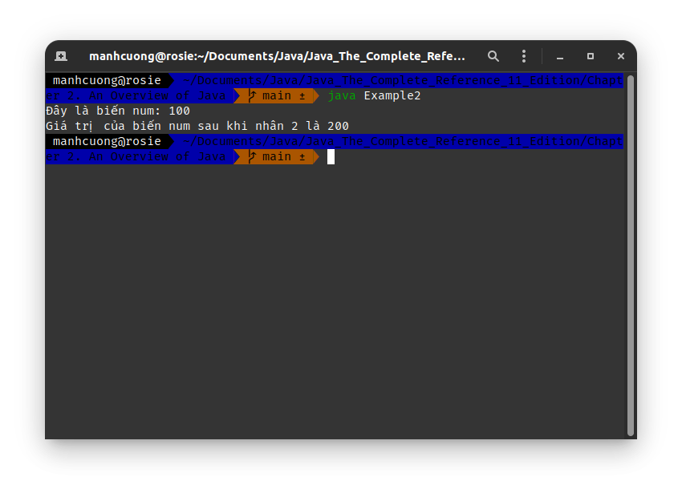
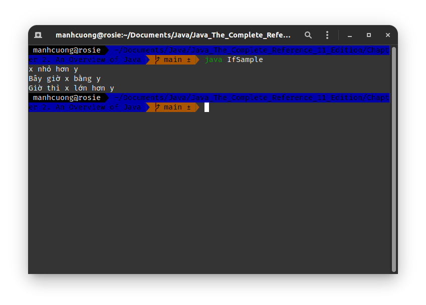
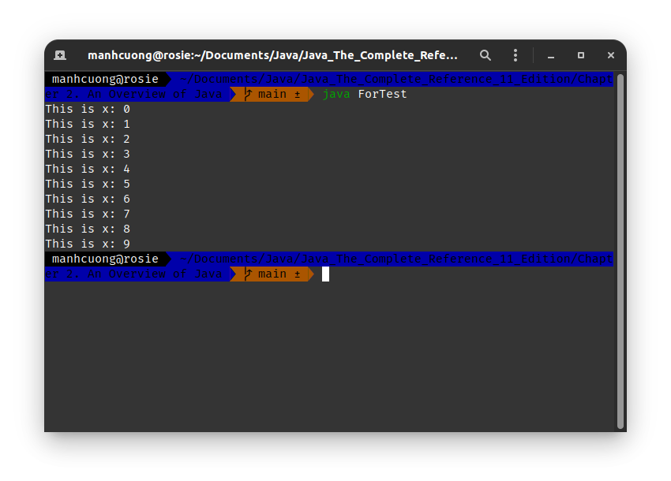
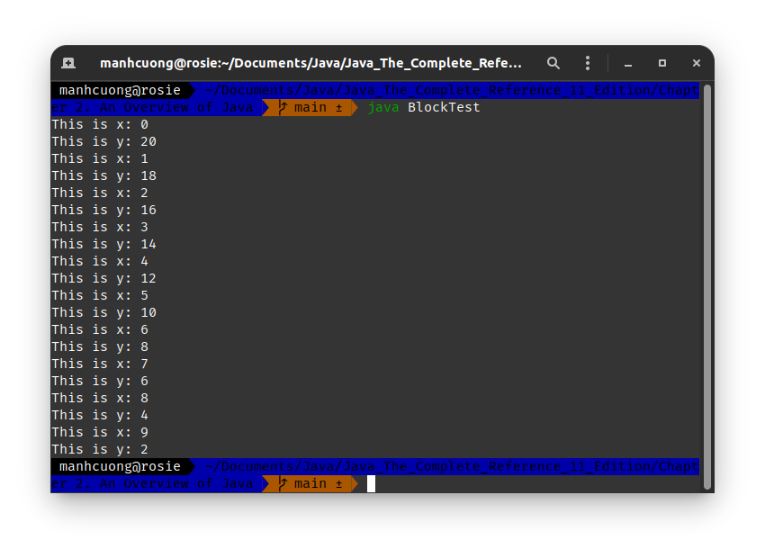

# 1. Chương trình đầu tiên - sơ bộ về Java _[A First Simple Program]_
## 1.1. Quy ước về cách đặt tên file trong Java
* Giả sử ta muốn tạo một chương trình có tên là **Example**, trước tiên ta cần tạo một file có tên là `Example.java`, với nội dung như sau:

###### Example.java _[source code](./Example.java)_
```java
/*
    Đây là một chương trình đơn giản của Java
    File này có tên là `Example.java`
*/
class Example {
    // Chương trình bắt đầu bằng việc gọi đến hàm main()
    public static void main(String args[]) {
        System.out.println("This is a simple Java program.");
    }
}
```
* Trong Java, **tất cả code phải nằm trong một `class`**.
* Ta có tên file là **Example** và tên `class` chứa hàm `main()` của file này cũng là **Example**, Java quy định tên của **main class** _[lớp chính]_ phải khớp với tên file chứa code của chương trình, kể cả tên file và tên `class` có viết hoa hay viết thường đi nữa phải bảo đảm khớp hoàn toàn vì Java có phân biệt chữ hoa và thường.

## 1.2. Biên dịch và chạy chương trình _[Compiling the program]_
* Để **compile** _[biên dịch]_ chương trình Example, thì tại thư mục chứa file `Example.java` ta mở terminal và gõ lệnh sau:
```
javac Example.java
```

* **Compiler** _[trình biên dịch]_ **`javac`** sẽ tạo ra một file mới có tên là **`Example.class`** chứa phiên bản bytecode của chương trình Example nằm ở cùng cấp thư mục với file `Example.java`.
  
* Để chạy chương trình, ngay tại thư mục chứa file `Example.class`, mở terminal và gõ lệnh dưới đây và nhấn enter:
```
java Example
```
  dưới đây là kết quả xuất ra terminal:
    

# 2. Chương trình nhỏ thứ hai _[A Second Short Program]_
* Cho đoạn mã `Example2.java` như sau:
###### Example2.java _[source code](./Example2.java)_
```java
/*
    Đây là file Example2.java
*/
class Example2 {
    public static void main(String args[]) {
        int num; // khai báo một biến dc gọi là `num`
        num = 100; // gán giá tri 100 cho biến `num`

        System.out.println("Đây là biến num: " + num);

        num = num * 2;
        System.out.print("Giá trị của biến num sau khi nhân 2 là ");
        System.out.println(num);
    }
}
```
> ##### Output:
> 

# 3. Tìm hiểu sơ bộ hai statement điều kiện `if` và vòng lặp `for` _[Two Control Statement]_
## 3.1. Statement `if`
###### IfSample.java _[source code](./IfSample.java)_
```java
/*
    Đây là file `IfSample.java`
*/
class IfSample {
    public static void main(String args[]) {
        int x, y;

        x = 10;
        y = 20;

        if (x < y) System.out.println("x nhỏ hơn y");

        x = x * 2;
        if (x == y) System.out.println("Bây giờ x bằng y");

        x = x * 2;
        if (x > y) System.out.println("Giờ thì x lớn hơn y");

        // Dòng này ko thỏa if nên sẽ ko in ra
        if (x == y) System.out.println("Dòng này sẽ ko dc in ra");
    }
}
```

> ##### Output:
> 

## 3.2. Statement `for`
###### ForTest.java _[source code](./ForTest.java)_
```java
/*
    Đây là file `ForTest.java`
*/
class ForTest {
    public static void main(String args[]) {
        int x;

        for (x = 0; x < 10; x = x + 1)
            System.out.println("This is x: " + x);
    }
}
```

> ##### Output:
> 

## 3.3. Sử dụng block code `{}`
###### BlockTest.java _[source code](./BlockTest.java)_
```java
/*
    File `Blockclass BlockTest.java`
*/
class BlockTest {
    public static void main(String args[]) {
        int x, y;
        
        y = 20;

        for (x = 0; x < 10; x++) {
            System.out.println("This is x: " + x);
            System.out.println("This is y: " + y);

            y = y - 2;
        }
    }
}
```

> ##### Output:
> 