# 1. Các kiểu dữ liệu nguyên thủy của Java _[The Primitive Types]_
* Java định nghĩa 8 kiểu dữ liệu nguyên thủy: **byte**, **short**, **int**, **long**, **char**, **float**, **double** và **boolean** và 8 kiểu này dc chia vào 4 nhóm chính:
  * **Integers**: bao gồm **byte**, **short**, **int** và **long** dành cho số có dấu và mang giá trị nguyên.
  * **Floating-point numbers**: bao gồm **float** và **double**, đại diện cho các số thực.
  * **Characters**: chỉ gồm **char**, đại diện cho **kí tự chữ** và **kí tự số**.
  * **Boolean**: chỉ gồm **boolean**, đại diện cho giá trị đúng sai `true/false`.

# 2. Nhóm Integers _[Integers]_
|Name|Bytes|Range|
|-|-|-|
|`long`|64|[-9,223,372,036,854,775,808; 9,223,372,036,854,775,807]|
|`int`|32|[-2,147,483,648; 2,147,483,647]|
|`short`|16|[-32,768; 32,767]|
|`byte`|8|[-128; 127]|

###### Light.java _[source code](./Light.java)_
```java
/*
    Chương trình tính khoảng cách ánh sáng sử dụng kiểu dữ liệu `long`
    File `Light.java`
*/
class Light {
    public static void main(String args[]) {
        int light_speed;
        long days, seconds, distance;

        days = 1000;
        light_speed = 186000; // xấp xỉ tốc độ ánh sáng thành met/second
        seconds = days*24*60*60;
        distance = light_speed*seconds;

        System.out.print("In " + days);
        System.out.print(" days light will travel about ");
        System.out.println(distance + " miles.");
    }
}
```

> ##### Output:
> 

# 3. Nhóm Floating-point numbers
|Name|Bytes|Range|
|-|-|-|
|`double`|64|[4.9e-324; 1.8e+308]|
|`float`|32|[1.4e-045; 3.4e+038]|

###### Area.java _[source code](./Area.java)_
```java
/*
    File `Area.java`
*/
class Area {
    public static void main(String args[]) {
        double pi, r, a;

        r = 10.8;
        pi = 3.1416;
        a = pi*r*r;

        System.out.println("Area of circle is " + a);
    }
}
```

> ##### Output:
> 

# 4. Nhóm Characters
* Sử dụng Unicode để biểu diễn các kí tự, tức một kí tự là 16 bits = 2 bytes, phạm vi của một kí tự là từ [0, 65,536] và ko có kí tự âm.
###### CharDemo.java _[source code](./CharDemo.java)_
```java
/*
    File `CharDemo.java`
*/
class CharDemo {
    public static void main(String args[]) {
        char ch1, ch2;

        ch1 = 88; // mã unicode cho kí tự X
        ch2 = 'Y';

        System.out.print("ch1 and ch2: ");
        System.out.println(ch1 + " " + ch2);
    }
}
```

> ##### Output:
> 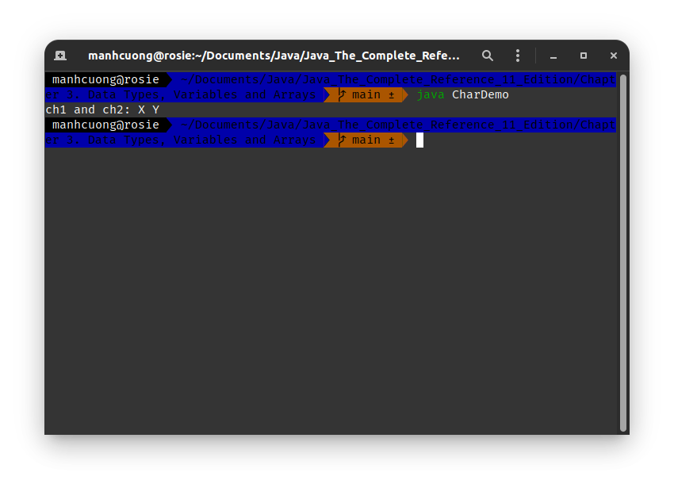

###### CharDemo2.java _[source code](CharDemo2.java)_
```java
/*
    File `CharDemo2.java`
*/
class CharDemo2 {
    public static void main(String args[]) {
        char ch1;

        ch1 = 'X';
        System.out.println("ch1 contains " + ch1);

        ch1++;
        System.out.println("ch1 is now " + ch1);
    }
}
```

> ##### Output:
> 

# 5. Nhóm Booleans
###### BoolTest.java _[source code](./BoolTest.java)_
```java
/*
    File `BoolTest.java`
*/
class BoolTest {
    public static void main(String args[]) {
        boolean b;

        b = false;
        System.out.println("b is " + b);

        b = true;
        System.out.println("b is " + b);

        // nếu b == true
        if (b) System.out.println("This is executed.");

        System.out.println("10 > 9 is " + (10 > 9));
    }
}
```

> ##### Output:
> 

# 6. Biến _[Variables]_
###### DynInit.java _[source code](./DynInit.java)_
```java
/*
    File `DynInit.java`
*/
class DynInit {
    public static void main(String args[]) {
        double a = 3., b = 4.;
        double c = Math.sqrt(a*a + b*b);

        System.out.println("Hypotenuse is " + c);
    }
}
```
> ##### Output:
> 

## 6.1. Phạm vị và quảng đời của biến _[Scope & Lifetime of Variables]_
###### Scope.java _[source code](./Scope.java)_
```java
/*
    File `Scope.java`
*/
class Scope {
    public static void main(String args[]) {
        int x = 10; // lúc này biến x dc định nghĩa trên toàn hàm main()

        if (x == 10) { // bắt đầu một scope mới, tạm gọi là s
            int y = 20; // y chỉ dc định nghĩa bên trong scope s
            
            System.out.println("x and y: " + x + " " + y);
            
            // cả x và y đều dc hiểu bên trong scope s này
            x = y * 2;
        }

        // y = 100; // Error!, lúc này y đã rời khỏi scope s và chưa dc khai báo

        // x lúc này vẫn dc hiểu do nó dc định nghĩa trên toàn hàm main()
        System.out.println("x is " + x); 
    } 
}
```

> ##### Output:
> 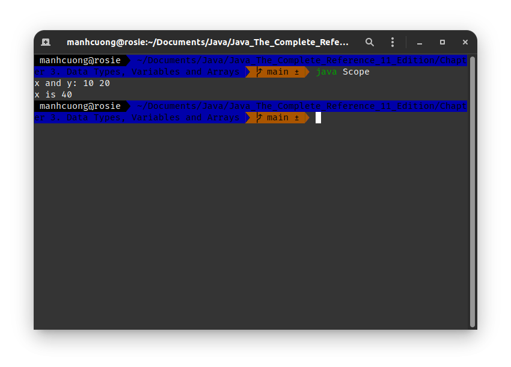

###### LifeTime.java _[source code](LifeTime.java)_
```java
/*
    File `LifeTime.java`
*/
class LifeTime {
    public static void main(String args[]) {
        for (int x = 0; x < 3; x++) {
            int y = -1;

            System.out.println("y is: " + y); // y dc khởi tạo mỗi khi truy cập vào scope này

            y = 100;
            System.out.println("y is now: " + y);
        }
    }
}
```

> ##### Output:
> 

# 7. Chuyển đổi kiểu dữ liệu _[Type conversion and Casting]_
* Đối với các biến có cùng một nhóm dữ liệu, thì Java sẽ auto chuyển kiểu dữ liệu giúp, giả sử ép kiểu từ `int` sang `long` (tuy nhiên ko thể ép ngược lại từ `long` sang `int` do phạm vi của `int` nhỏ hơn `long`). Tất cả điều trên dc gọi là conversion.
* Đối vs các biến khác nhóm dữ liệu nhau, như việc ta muốn ép kiểu một biến có type là `double` sang `byte` thì Java sẽ ko tự động ép cho chúng ta, mà ta phải thực hiện thủ công bằng một kĩ thuật là **casting**.

## 7.1. Casting
###### Conversion.java _[source code](./Conversion.java)_
```java
/*
    File `Conversion.java`
*/
class Conversion {
    public static void main(String args[]) {
        byte b;
        int i = 257;
        double d = 232.142;

        System.out.println("Conversion of int to byte.");
        b = (byte) i;
        System.out.println("i and b " + i + " " + b);

        System.out.println("\nConversion of double to int.");
        i = (int) d;
        System.out.println("d and i " + d + " " + i);

        System.out.println("\nConversion of double to byte.");
        b = (byte) d;
        System.out.println("d and b " + d + " " + b);
    }
}
```

> ##### Output:
> 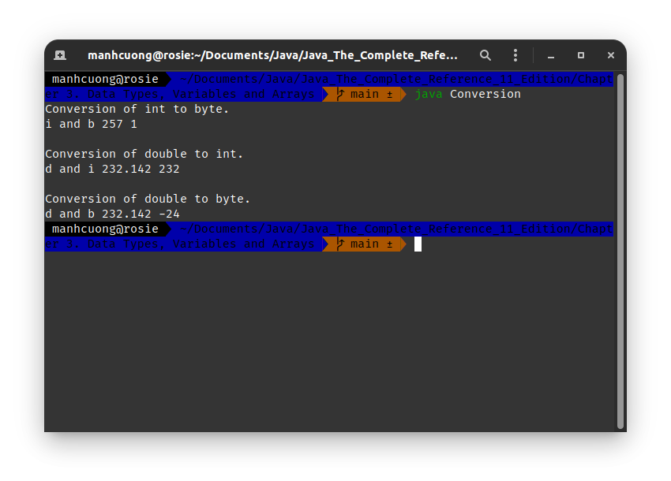

# 8. Tự động thăng hạng kiểu dữ liệu trong biểu thức _[Automatic type promotion in Expressions]_
* Giả sử ta có đoạn mã sau:
```java
byte a = 40;
byte b = 50;
byte c = 100;
int d = a * b / c;
```
* Kết quả của phép tính `a * b` lúc này sẽ vượt quá giới hạn của kiểu `byte`. Để giải quyết điều này, Java sẽ tự động ép kiểu từng biến sang kiểu `int` rồi sau đó thực hiện tính toán để bảo đảm ko bị tràn phạm vị của biến.
* Tuy nhiên, đoạn code dưới đây sẽ phát sinh lỗi:
```java
byte b = 50;
b = b * 2; // Error! ko thể gán kiểu int cho byte dc
```
* Lỗi này xảy ra vì như thường lệ, Java sẽ tự động ép kiểu từng biến trong biểu thức sang kiểu `int` trc khi nó thực hiện tính toán, nên phép toán `b * 2` lúc này sẽ trả về kiểu `int` chứ ko phải `byte`, nhưng kiểu `int` lại có phạm vị lớn hơn `byte` nên ko thể gán dc, lúc này ta phải thực hiện casting như dưới đây để tránh lỗi:
```java
byte b = 50;
b = (byte) (b * 2);
```
* Lúc này biến `b` sẽ có giá trị là 100.

## 8.1. Quy tắc thăng hạng _[The type promotion rules]_
* Các kiểu như `byte`, `short` và `char` đều thăng hạng lên `int`.
* Nếu biểu thức có một **operand** _[toán hạng, biến trong biểu thức]_ là `long`, thì toàn bộ biểu thức sẽ dc thăng hạng lên `long`.
* Tương tự, nếu có một operand là `float` thì toàn bộ biểu thức sẽ dc thăng hạng lên `float`, điều tương tự cũng dc áp dụng khi có một operand là `double`.

###### Promote.java _[source code](./Promote.java)_
```java
/*
    File `Promote.java`
*/
class Promote {
    public static void main(String args[]) {
        byte b = 42;
        char c = 'a';
        short s = 1024;
        int i = 50_000;
        float f = 5.67f;
        double d = .1234;
        double result = (f * b) + (i / c) - (d * s);

        System.out.println((f * b) + " + " + (i / c) + " - " + (d * s));
        System.out.println("result = " + result);
    }
}
```

> ##### Output:
> 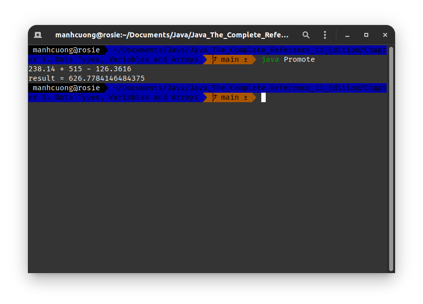
* Biểu thức con `(f * b)` dc thăng cấp thành `float`, sau đó `(i / c)` dc thăng cấp thành `int`, tiếp theo `(d * s)` dc thăng cấp thành `double`, cuối cùng ta có `float` + `int` - `double` nên toàn bộ dc thăng cấp lên `double` nên kiểu của toàn bộ biểu thức là `double`.

# 9. Mảng _[Arrays]_
* Cú pháp khai báo một mảng `array-var = new type[size]`, trong đó `array-var` là tên biến, `type` là kiểu dữ liệu của của toàn bộ mảng `array-var` và `size` dùng để chỉ định số phần tử trong `array-var`.

```java
month_days = new int[12];
```
* Đoạn code trên khai báo một mảng gồm 12 phần tử có kiểu `int`.
* Khi ta khởi tạo một mảng, Java sẽ tự động phát sinh giá trị ban đầu cho toàn bộ mảng, quy tắc như sau:
  * Nếu mảng thuộc nhóm số thì toàn bộ các phần tử trong mảng dc khởi tạo giá trị ban đầu là `0`.
  * Nếu mảng thuộc nhóm **boolean** thì toàn bộ mảng sẽ dc khởi tạo là `false`.
  * Nếu mảng tham chiếu đến một **object** _(tìm hiểu sau)_, thì toàn bộ mảng sẽ dc khởi tạo là `null`.

## 9.1. Mảng một chiều
###### Array.java _[source code](./Array.java)_
```java
/*
    File `Array.java`
*/
class Array {
    public static void main(String args[]) {
        int month_days[];
        month_days = new int[12];

        month_days[0] = 31;
        month_days[1] = 28;
        month_days[2] = 31;
        month_days[3] = 30;
        month_days[4] = 31;
        month_days[5] = 30;
        month_days[6] = 31;
        month_days[7] = 31;
        month_days[8] = 30;
        month_days[9] = 31;
        month_days[10] = 30;
        month_days[11] = 31;

        System.out.println("April has " + month_days[3] + " days");
    }
}
```

> ##### Output:
> 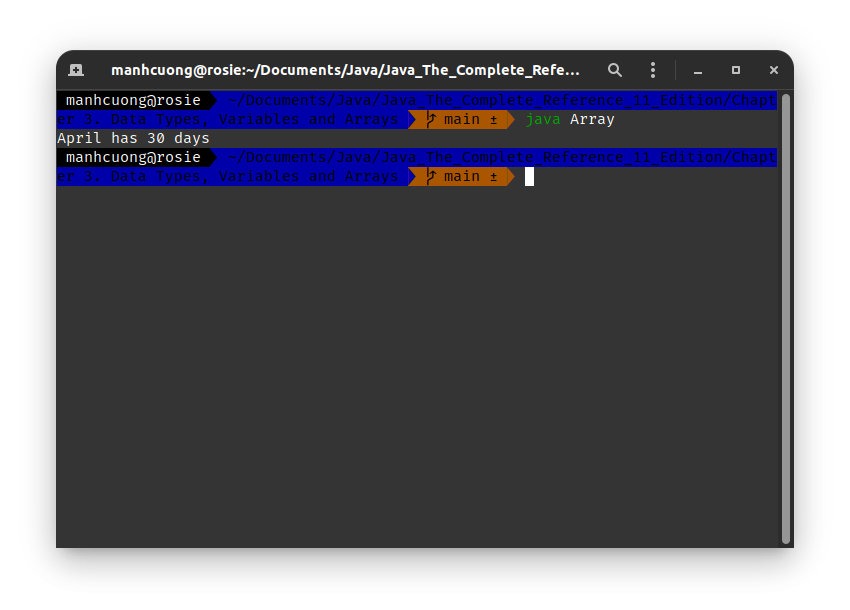

###### AutoArray.java _[source code](./AutoArray.java)_
```java
/*
    File `AutoArray.java`
*/
class AutoArray {
    public static void main(String args[]) {
        int month_days[] = { 31, 28, 31, 30, 31, 30, 31, 31, 30, 31, 30, 31 };

        System.out.println("April has " + month_days[3] + " days.");
    }
}
```

> ###### Output:
> 

###### Average.java _[source code](./Average.java)_
```java
/*
    File `Average.java`
*/
class Average {
    public static void main(String args[]) {
        double nums[] = { 10.1, 11.2, 12.3, 13.4, 14.5 };
        double result = 0;
        
        for (int i = 0; i < 5; ++i)
            result += nums[i];

        System.out.println("Average is " + result/5);
    }
}
```

> ##### Output:
> 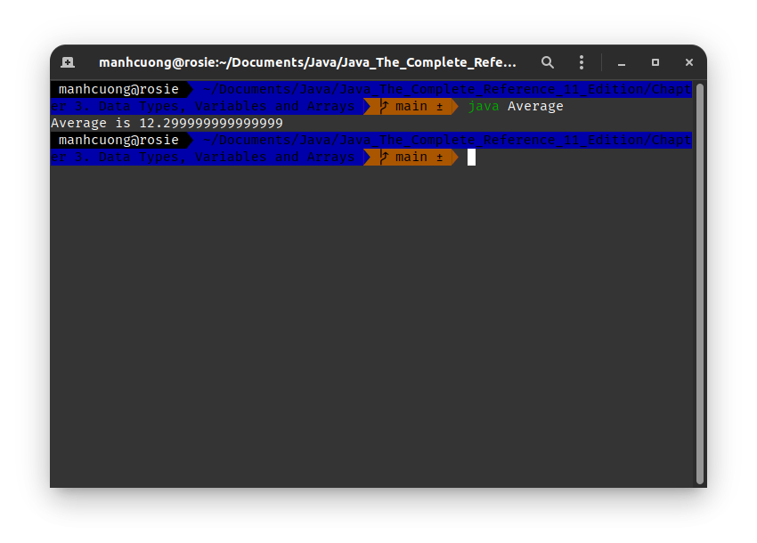

## 9.2. Mảng hai chiều
###### TwoDArray.java _[source code](./TwoDArray.java)_
```java
/*
    File `TwoDArray.java`
*/
class TwoDArray {
    public static void main(String args[]) {
        int twoD[][] = new int[4][5];
        int i, j, k = 0;

        for (i = 0; i < 4; ++i) {
            for (j = 0; j < 5; ++j) {
                twoD[i][j] = k++;
                System.out.print(twoD[i][j] + " ");
            }
            
            System.out.println();
        }
    }
}
```

> ##### Output:
> 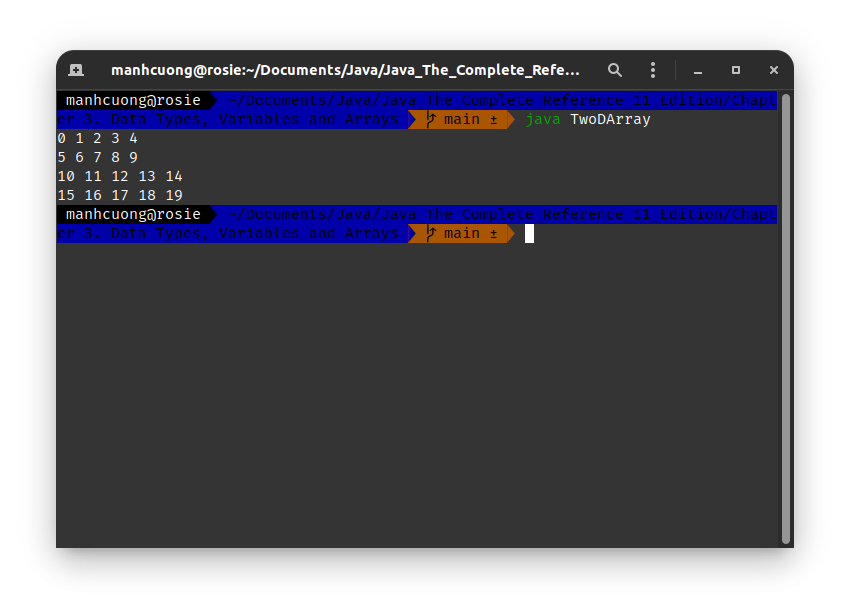

###### Matrix.java _[source code](./Matrix.java)_
```java
/*
    File `Matrix.java`
*/
class Matrix {
    public static void main(String args[]) {
        double m[][] = {
            {0*0, 1*0, 2*0, 3*0},
            {0*1, 1*1, 2*1, 3*1},
            {0*2, 1*2, 2*2, 3*2},
            {0*3, 1*3, 2*3, 3*3}
        };

        for (int i = 0; i < 4; ++i) {
            for (int j = 0; j < 4; ++j)
                System.out.print(m[i][j] + " ");

            System.out.println();
        }
    }
}
```

> ##### Output:
> 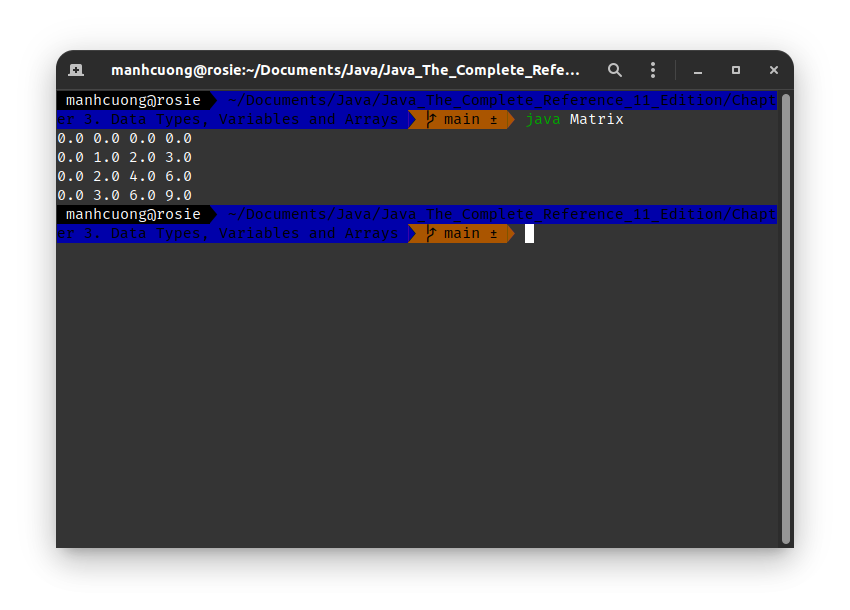

## 9.3. Ma trận răng cưa
###### TwoDAgain.java _[source code](./TwoDAgain.java)_
```java
/*
    File `TwoDAgain.java`
*/
class TwoDAgain {
    public static void main(String args[]) {
        int twoD[][] = new int[4][];

        for (int i = 0; i < 4; ++i)
            twoD[i] = new int[i + 1];
        
        int k = 0;
        for (int i = 0; i < 4; ++i) 
            for (int j = 0; j < i + 1; ++j)
                twoD[i][j] = k++;

        for (int i = 0; i < 4; ++i) {
            for (int j = 0; j < i + 1; ++j)
                System.out.print(twoD[i][j] + " ");

            System.out.println();
        }    
    }
}
```

> ##### Output:
> 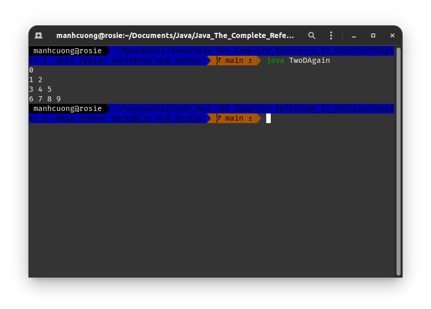

## 9.4. Mảng ba chiều
###### ThreeDMatrix.java _[source code](./ThreeDMatrix.java)_
```java
/*
    File `ThreeDMatrix.java`
*/
class ThreeDMatrix {
    public static void main(String args[]) {
        int threeD[][][] = new int[3][4][5];

        for (int i = 0; i < 3; ++i)
            for (int j = 0; j < 4; ++j)
                for (int k = 0; k < 5; ++k)
                    threeD[i][j][k] = i*j*k;

        for (int i = 0; i < 3; ++i) {
            for (int j = 0; j < 4; ++j) {
                for (int k = 0; k < 5; ++k)
                    System.out.print(threeD[i][j][k] + " ");

                System.out.println();
            }

            System.out.println();
        }
    }
}
```

> ##### Output:
> 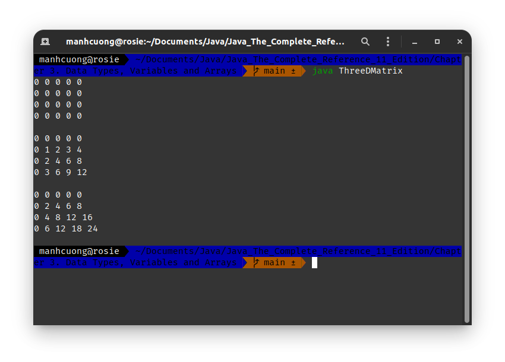

## 9.5. Các cách khai báo mảng độc lạ
* Có thể khai báo mảng một chiều bằng hai cách dưới đây:
```java
int arr1[] = new int[3];
int[] arr2 = new int[3];
```
* Tương tự, mảng hai chiều có thể khai báo như sau:
```java
char chars1[][] = new char[3][4];
char[][] chars2 = new char[3][4];
```
* Có thể khai báo nhiều mảng cùng một lúc:
```java
int[] arr1, arr2, arr3;
int arr1[], arr2[], arr3[];
```

# 10. Biến suy luận _[Type Inference with Local variables]_
###### VarDemo.java _[source code](./VarDemo.java)_
```java
/*
    File `VarDemo.java`
*/
class VarDemo {
    public static void main(String args[]) {
        var avg = 10.; // khai báo một biến suy luận avg, lúc này type của nó là double
        System.out.println("Value of avg: " + avg);

        int var = 1; // khai báo một biến có tên là `var` có type là int
        System.out.println("Value of var: " + var);

        // điều thú vị chổ này là ta vừa khai báo một biến suy luận và nhận giá trị của biến ta
        // đặt tên là `var` trc đó sau đó nhân cho -1
        var k = -var; 
        System.out.println("Value of k: " + k);
    }
}
```

> ##### Output:
> 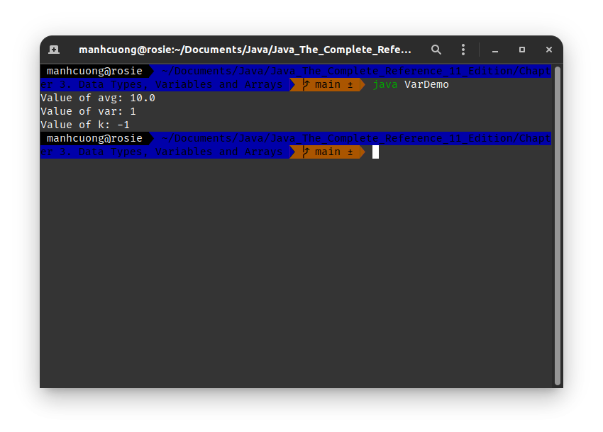

## 10.1. Cẩn thận khi sử dụng biến suy luận
* Có một vài lưu ý cần nhớ khi sử dụng biến suy luận vs mảng như sau:
```java
var my_arr = new int[10]; // hợp lệ
var[] my_arr = new int[10]; // ko hợp lệ
var my_arr = { 1, 2, 3 }; // kok hợp lệ
```

* Ngoài ra, nếu khai báo biến suy luận nhưng ko gán cho nó giá trị thì cũng ko dc, ví dụ như sau:
```java
var cnt; // lỗi, do ko khởi tạo giá trị ban đầu
```
* Ngoài ra, cần nhớ thêm là `var` chỉ có thể sử dụng để khai báo **local variables**, nó ko thể sử dụng khi khai báo các **instance variable** _(biến của `class`, nằm ngoài các method, constructor)_, tham số hoặc kiểu dữ liệu trả về.
* Một hạn chế khác của biến suy luận là mỗi lần chỉ có thể khai báo duy nhất một biến và ko dc phép gán giá trị khởi tạo cho nó là `null`.