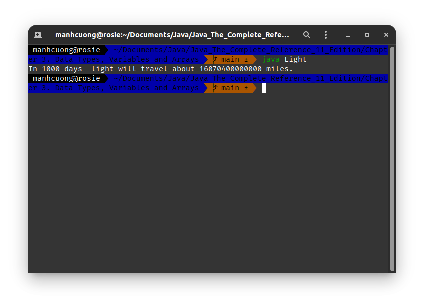
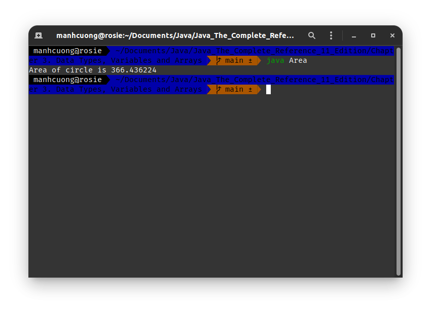
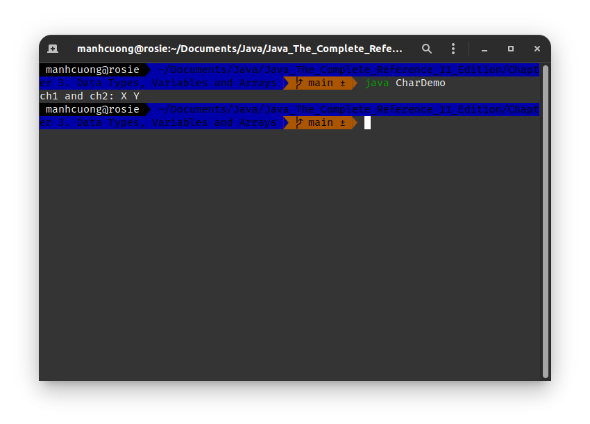
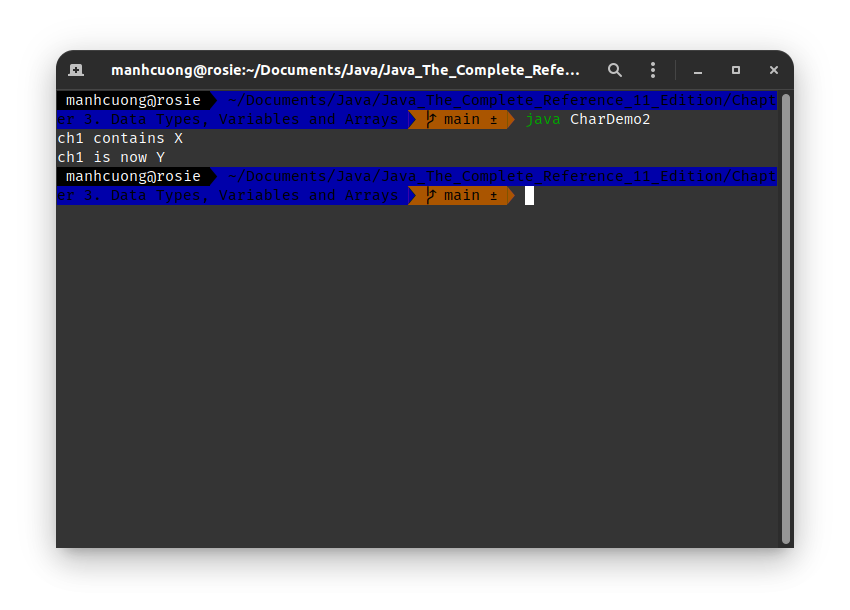
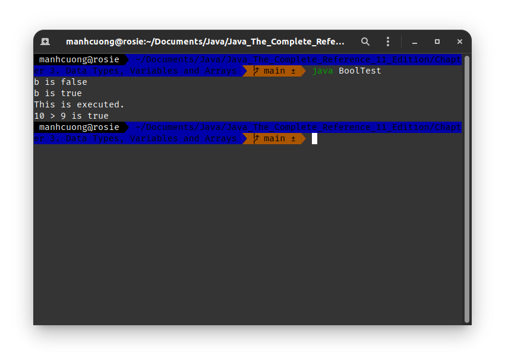
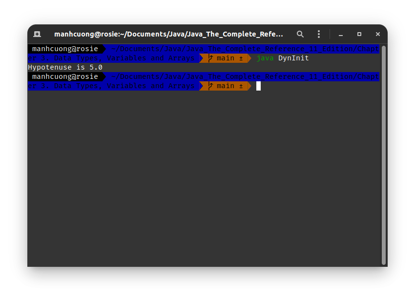

# 1. Các kiểu dữ liệu nguyên thủy của Java _[The Primitive Types]_
* Java định nghĩa 8 kiểu dữ liệu nguyên thủy: **byte**, **short**, **int**, **long**, **char**, **float**, **double** và **boolean** và 8 kiểu này dc chia vào 4 nhóm chính:
  * **Integers**: bao gồm **byte**, **short**, **int** và **long** dành cho số có dấu và mang giá trị nguyên.
  * **Floating-point numbers**: bao gồm **float** và **double**, đại diện cho các số thực.
  * **Characters**: chỉ gồm **char**, đại diện cho **kí tự chữ** và **kí tự số**.
  * **Boolean**: chỉ gồm **boolean**, đại diện cho giá trị đúng sai `true/false`.

# 2. Nhóm Integers _[Integers]_
|Name|Bytes|Range|
|-|-|-|
|`long`|64|[-9,223,372,036,854,775,808; 9,223,372,036,854,775,807]|
|`int`|32|[-2,147,483,648; 2,147,483,647]|
|`short`|16|[-32,768; 32,767]|
|`byte`|8|[-128; 127]|

###### Light.java _[source code](./Light.java)_
```java
/*
    Chương trình tính khoảng cách ánh sáng sử dụng kiểu dữ liệu `long`
    File `Light.java`
*/
class Light {
    public static void main(String args[]) {
        int light_speed;
        long days, seconds, distance;

        days = 1000;
        light_speed = 186000; // xấp xỉ tốc độ ánh sáng thành met/second
        seconds = days*24*60*60;
        distance = light_speed*seconds;

        System.out.print("In " + days);
        System.out.print(" days light will travel about ");
        System.out.println(distance + " miles.");
    }
}
```

> ##### Output:
> 

# 3. Nhóm Floating-point numbers
|Name|Bytes|Range|
|-|-|-|
|`double`|64|[4.9e-324; 1.8e+308]|
|`float`|32|[1.4e-045; 3.4e+038]|

###### Area.java _[source code](./Area.java)_
```java
/*
    File `Area.java`
*/
class Area {
    public static void main(String args[]) {
        double pi, r, a;

        r = 10.8;
        pi = 3.1416;
        a = pi*r*r;

        System.out.println("Area of circle is " + a);
    }
}
```

> ##### Output:
> 

# 4. Nhóm Characters
* Sử dụng Unicode để biểu diễn các kí tự, tức một kí tự là 16 bits = 2 bytes, phạm vi của một kí tự là từ [0, 65,536] và ko có kí tự âm.
###### CharDemo.java _[source code](./CharDemo.java)_
```java
/*
    File `CharDemo.java`
*/
class CharDemo {
    public static void main(String args[]) {
        char ch1, ch2;

        ch1 = 88; // mã unicode cho kí tự X
        ch2 = 'Y';

        System.out.print("ch1 and ch2: ");
        System.out.println(ch1 + " " + ch2);
    }
}
```

> ##### Output:
> 

###### CharDemo2.java _[source code](CharDemo2.java)_
```java
/*
    File `CharDemo2.java`
*/
class CharDemo2 {
    public static void main(String args[]) {
        char ch1;

        ch1 = 'X';
        System.out.println("ch1 contains " + ch1);

        ch1++;
        System.out.println("ch1 is now " + ch1);
    }
}
```

> ##### Output:
> 

# 5. Nhóm Booleans
###### BoolTest.java _[source code](./BoolTest.java)_
```java
/*
    File `BoolTest.java`
*/
class BoolTest {
    public static void main(String args[]) {
        boolean b;

        b = false;
        System.out.println("b is " + b);

        b = true;
        System.out.println("b is " + b);

        // nếu b == true
        if (b) System.out.println("This is executed.");

        System.out.println("10 > 9 is " + (10 > 9));
    }
}
```

> ##### Output:
> 

# 6. Biến _[Variables]_
###### DynInit.java _[source code](./DynInit.java)_
```java
/*
    File `DynInit.java`
*/
class DynInit {
    public static void main(String args[]) {
        double a = 3., b = 4.;
        double c = Math.sqrt(a*a + b*b);

        System.out.println("Hypotenuse is " + c);
    }
}
```
> ##### Output:
> 