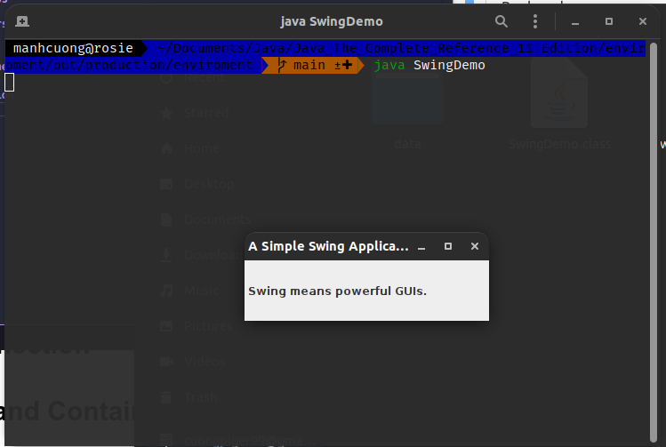
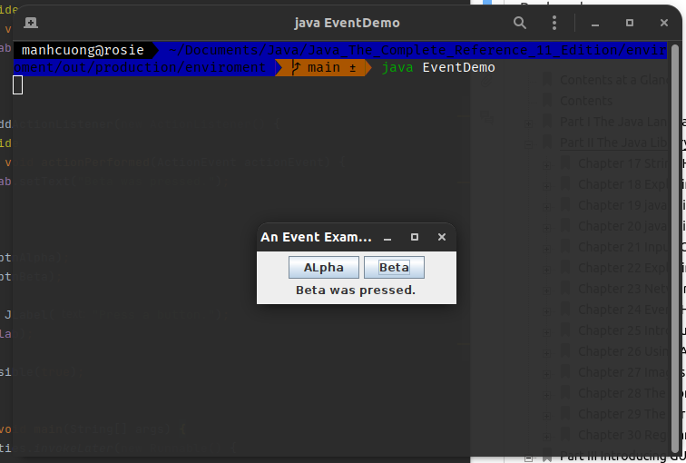
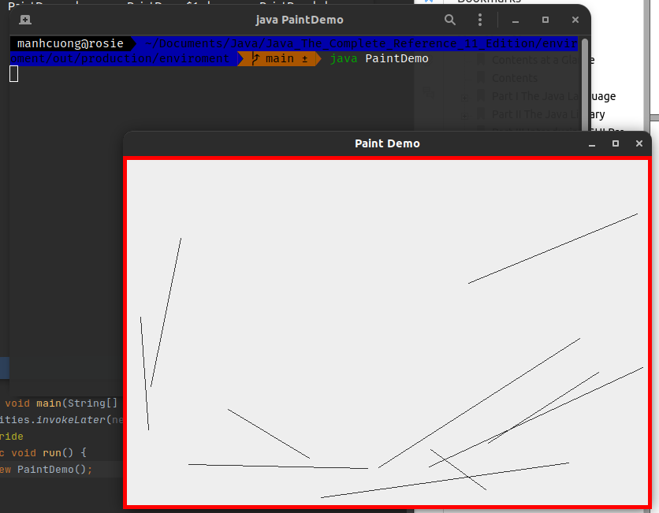

# 1. The Origins of Swing
# 2. Swing Is Built on the AWT
# 3. Two Key Swing Features
## 3.1. Swing Components Are Lightweight
## 3.2. Swing Supports a Pluggable Look and Feel
# 4. The MVC Connection
# 5. Components and Containers
## 5.1. Components
## 5.2. Containers
## 5.3. The Top-Level Container Panes
# 6. The Swing Packages
# 7. A Simple Swing Application
###### SwingDemo.java _[source code](./SwingDemo.java)_
```java
import javax.swing.*;

public class SwingDemo {
    SwingDemo() {
        JFrame jfrm = new JFrame("A Simple Swing Application");
        jfrm.setSize(275, 100);
        jfrm.setDefaultCloseOperation(JFrame.EXIT_ON_CLOSE);

        JLabel jlab = new JLabel(" Swing means powerful GUIs.");
        jfrm.add(jlab);
        jfrm.setVisible(true); // display the frame
    }

    public static void main(String[] args) {
        SwingUtilities.invokeLater(new Runnable() {
            @Override
            public void run() {
                new SwingDemo();
            }
        });
    }
}
```


# 8. Event Handling
###### EventDemo.java _[source code](./EventDemo.java)_
```java
import java.awt.*;
import java.awt.event.*;
import javax.swing.*;

public class EventDemo {
    JLabel jlab;

    EventDemo() {
        JFrame jfrm = new JFrame("An Event Example");
        jfrm.setLayout(new FlowLayout());
        jfrm.setSize(220, 90);
        jfrm.setDefaultCloseOperation(JFrame.EXIT_ON_CLOSE);

        JButton jbtnAlpha = new JButton("ALpha");
        JButton jbtnBeta = new JButton("Beta");

        jbtnAlpha.addActionListener(new ActionListener() {
            @Override
            public void actionPerformed(ActionEvent actionEvent) {
                jlab.setText("Alpha was pressed.");
            }
        });

        jbtnBeta.addActionListener(new ActionListener() {
            @Override
            public void actionPerformed(ActionEvent actionEvent) {
                jlab.setText("Beta was pressed.");
            }
        });

        jfrm.add(jbtnAlpha);
        jfrm.add(jbtnBeta);

        jlab = new JLabel("Press a button.");
        jfrm.add(jlab);

        jfrm.setVisible(true);
    }

    public static void main(String[] args) {
        SwingUtilities.invokeLater(new Runnable() {
            @Override
            public void run() {
                new EventDemo();
            }
        });
    }
}
```


# 9. Painting in Swing
## 9.1. Painting Fundamentals
## 9.2. Compute the Paintable Area
## 9.3. A Paint Example
###### PaintDemo.java _[source code](./PaintDemo.java)_
```java
import java.awt.*;
import java.awt.event.*;
import javax.swing.*;
import java.util.*;

class PaintPanel extends JPanel {
    Insets ins;
    Random rand;

    PaintPanel() {
        setBorder(
                BorderFactory.createLineBorder(Color.RED, 5)
        );

        rand = new Random();
    }

    protected void paintComponent(Graphics g) {
        super.paintComponent(g);
        int x, y, x2, y2;
        int height = getHeight();
        int width = getWidth();
        ins = getInsets();

        for (int i = 0; i < 10; ++i) {
            x = rand.nextInt(width - ins.left);
            y = rand.nextInt(height - ins.bottom);
            x2 = rand.nextInt(width - ins.left);
            y2 = rand.nextInt(height - ins.bottom);

            g.drawLine(x, y, x2, y2);
        }
    }
}

public class PaintDemo {
    JLabel jlab;
    PaintPanel pp;

    PaintDemo() {
        JFrame jfrm = new JFrame("Paint Demo");
        jfrm.setSize(200, 150);
        jfrm.setDefaultCloseOperation(JFrame.EXIT_ON_CLOSE);
        pp = new PaintPanel();
        jfrm.add(pp);
        jfrm.setVisible(true);
    }

    public static void main(String[] args) {
        SwingUtilities.invokeLater(new Runnable() {
            @Override
            public void run() {
                new PaintDemo();
            }
        });
    }
}
```
