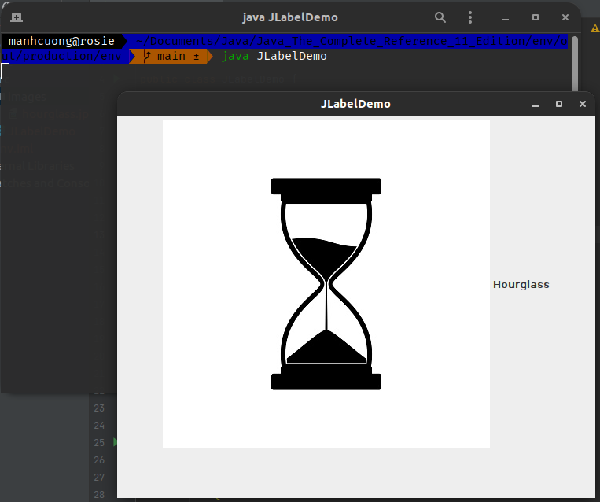
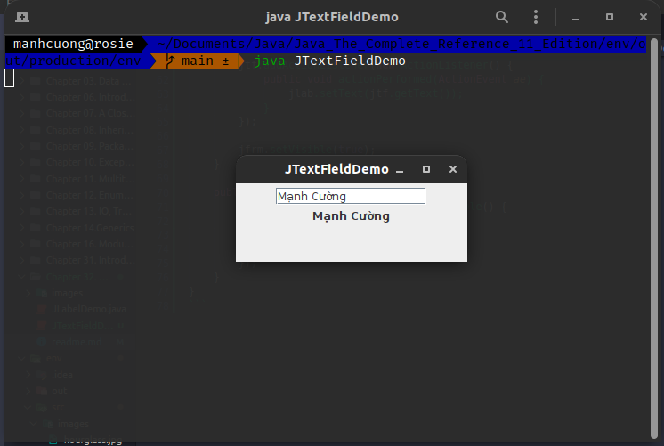
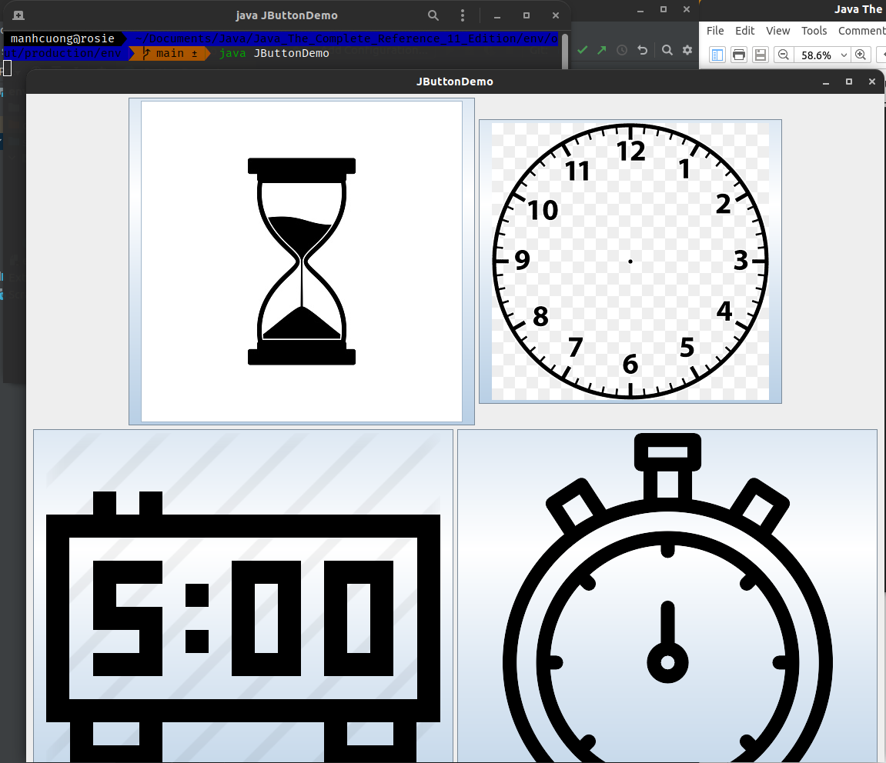
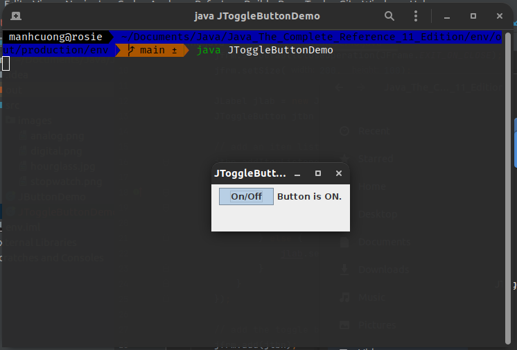
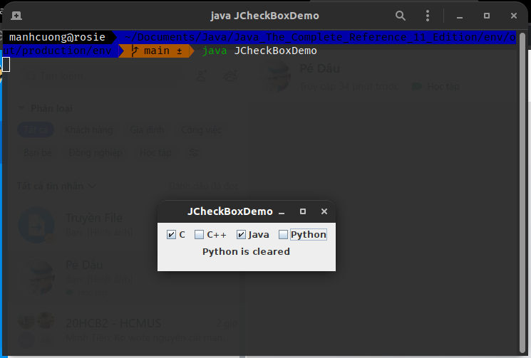
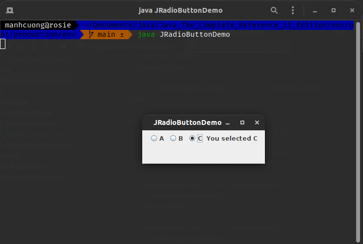
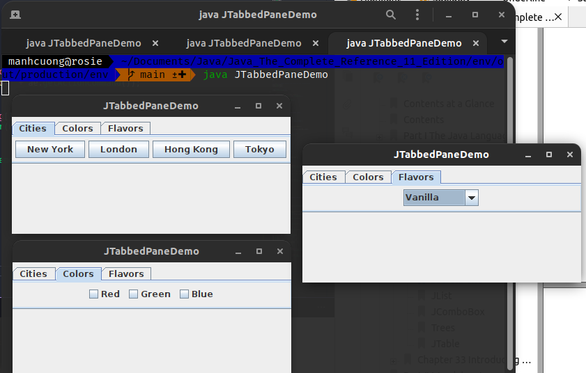

# 1. JLabel and ImageIcon
###### _[JLabelDemo.java](JLabelDemo.java)_
```java
import java.awt.*;
import javax.swing.*;

public class JLabelDemo {
    public JLabelDemo() {
        // Set up the JFrame
        JFrame jfrm = new JFrame("JLabelDemo");
        jfrm.setLayout(new FlowLayout());
        jfrm.setDefaultCloseOperation(JFrame.EXIT_ON_CLOSE);
        jfrm.setSize(260, 210);

        // Create an icon
        ImageIcon ii = new ImageIcon("./images/hourglass.jpg");

        // Create a label
        JLabel jl = new JLabel("Hourglass", ii, JLabel.CENTER);

        // Add the label to the content pane
        jfrm.add(jl);

        // Display the frame
        jfrm.setVisible(true);
    }

    public static void main(String[] args) {
        // Create the frame on the event dispatching thread
        SwingUtilities.invokeLater(new Runnable() {
            @Override
            public void run() {
                new JLabelDemo();
            }
        });
    }
}
```


# 2. JTextField
###### _[JTextFieldDemo.java](JTextFieldDemo.java)_
```java
import java.awt.*;
import java.awt.event.*;
import javax.swing.*;

public class JTextFieldDemo {
    public JTextFieldDemo() {
        JFrame jfrm = new JFrame("JTextFieldDemo");
        jfrm.setLayout(new FlowLayout());
        jfrm.setDefaultCloseOperation(JFrame.EXIT_ON_CLOSE);
        jfrm.setSize(260, 120);

        JTextField jtf = new JTextField(15);
        jfrm.add(jtf);

        JLabel jlab = new JLabel();
        jfrm.add(jlab);

        jtf.addActionListener(new ActionListener() {
            public void actionPerformed(ActionEvent ae) {
                jlab.setText(jtf.getText());
            } 
        });

        jfrm.setVisible(true);
    }

    public static void main(String[] args) {
        SwingUtilities.invokeLater(new Runnable() {
            public void run() {
                new JTextFieldDemo();
            }
        });
    }
}
```


# 3. The Swing Buttons
## 3.1. JButton
###### _[JButtonDemo.java](JButtonDemo.java)_
```java
import java.awt.*;
import java.awt.event.*;
import javax.swing.*;

public class JButtonDemo implements ActionListener {
    JLabel jlab;

    public JButtonDemo() {
        JFrame jfrm = new JFrame("JButtonDemo");
        jfrm.setLayout(new FlowLayout());
        jfrm.setDefaultCloseOperation(JFrame.EXIT_ON_CLOSE);
        jfrm.setSize(500, 450);

        ImageIcon hourglass = new ImageIcon("./images/hourglass.jpg");
        JButton jb = new JButton(hourglass);
        jb.setActionCommand("Hourglass");
        jb.addActionListener(this);
        jfrm.add(jb);

        ImageIcon analog = new ImageIcon("./images/analog.png");
        jb = new JButton(analog);
        jb.setActionCommand("Analog Clock");
        jb.addActionListener(this);
        jfrm.add(jb);

        ImageIcon digital = new ImageIcon("./images/digital.png");
        jb = new JButton(digital);
        jb.setActionCommand("Digital Clock");
        jb.addActionListener(this);
        jfrm.add(jb);

        ImageIcon stopwatch = new ImageIcon("./images/stopwatch.png");
        jb = new JButton(stopwatch);
        jb.setActionCommand("Stopwatch");
        jb.addActionListener(this);
        jfrm.add(jb);

        jlab = new JLabel("Choose a Timepiece");
        jfrm.add(jlab);

        // display the frame
        jfrm.setVisible(true);
    }

    public void actionPerformed(ActionEvent ae) {
        jlab.setText("You selected " + ae.getActionCommand());
    }

    public static void main(String[] args) {
        SwingUtilities.invokeLater(new Runnable() {
            @Override
            public void run() {
                new JButtonDemo();
            }
        });
    }
}
```


## 3.2. JToggleButton
###### _[JToggleButtonDemo.java](JToggleButtonDemo.java)_
```java
import java.awt.*;
import java.awt.event.*;
import javax.swing.*;

public class JToggleButtonDemo {
    public JToggleButtonDemo() {
        JFrame jfrm = new JFrame("JToggleButtonDemo");
        jfrm.setLayout(new FlowLayout());
        jfrm.setDefaultCloseOperation(JFrame.EXIT_ON_CLOSE);
        jfrm.setSize(200, 100);

        JLabel jlab = new JLabel("Button is off");
        JToggleButton jtbn = new JToggleButton("On/Off");

        // add an item listener for the toggle button
        jtbn.addItemListener(new ItemListener() {
            @Override
            public void itemStateChanged(ItemEvent ie) {
                if (jtbn.isSelected()) {
                    jlab.setText("Button is ON.");
                } else {
                    jlab.setText("Button is OFF.");
                }
            }
        });

        // add the toggle button and label to the content pane
        jfrm.add(jtbn);
        jfrm.add(jlab);

        // displat the frame
        jfrm.setVisible(true);
    }

    public static void main(String[] args) {
        SwingUtilities.invokeLater(new Runnable() {
            @Override
            public void run() {
                new JToggleButtonDemo();
            }
        });
    }
}
```


## 3.3. Check Boxes
###### _[JCheckBoxDemo.java](JCheckBoxDemo.java)_
```java
import java.awt.*;
import java.awt.event.*;
import javax.swing.*;

public class JCheckBoxDemo implements ItemListener {
    JLabel jlab;

    public JCheckBoxDemo() {
        JFrame jfrm = new JFrame("JCheckBoxDemo");
        jfrm.setLayout(new FlowLayout());
        jfrm.setDefaultCloseOperation(JFrame.EXIT_ON_CLOSE);
        jfrm.setSize(250, 100);

        // add check boxs to the content pane
        JCheckBox cb = new JCheckBox("C");
        cb.addItemListener(this);
        jfrm.add(cb);

        cb = new JCheckBox("C++");
        cb.addItemListener(this);
        jfrm.add(cb);

        cb = new JCheckBox("Java");
        cb.addItemListener(this);
        jfrm.add(cb);

        cb = new JCheckBox("Python");
        cb.addItemListener(this);
        jfrm.add(cb);

        jlab = new JLabel("Select language");
        jfrm.add(jlab);

        jfrm.setVisible(true);
    }

    public void itemStateChanged(ItemEvent ie) {
        JCheckBox cb = (JCheckBox) ie.getItem();

        if (cb.isSelected()) {
            jlab.setText(cb.getText() + " is selected");
        } else {
            jlab.setText(cb.getText() + " is cleared");
        }
    }

    public static void main(String[] args) {
        SwingUtilities.invokeLater(new Runnable() {
            @Override
            public void run() {
                new JCheckBoxDemo();
            }
        });
    }
}
```


## 3.4. Radio Buttons
###### _[JRadioButtonDemo.java](JRadioButtonDemo.java)_
```java
import java.awt.*;
import java.awt.event.*;
import javax.swing.*;

public class JRadioButtonDemo implements ActionListener {
    JLabel jlab;

    public JRadioButtonDemo() {
        JFrame jfrm = new JFrame("JRadioButtonDemo");
        jfrm.setLayout(new FlowLayout());
        jfrm.setDefaultCloseOperation(JFrame.EXIT_ON_CLOSE);
        jfrm.setSize(250, 100);

        JRadioButton b1 = new JRadioButton("A");
        b1.addActionListener(this);
        jfrm.add(b1);

        JRadioButton b2 = new JRadioButton("B");
        b2.addActionListener(this);
        jfrm.add(b2);

        JRadioButton b3 = new JRadioButton("C");
        b3.addActionListener(this);
        jfrm.add(b3);

        ButtonGroup bg = new ButtonGroup();
        bg.add(b1);
        bg.add(b2);
        bg.add(b3);

        jlab = new JLabel("Select one");
        jfrm.add(jlab);
        jfrm.setVisible(true);
    }

    public void actionPerformed(ActionEvent ae) {
        jlab.setText("You selected " + ae.getActionCommand());
    }

    public static void main(String[] args) {
        SwingUtilities.invokeLater(new Runnable() {
            @Override
            public void run() {
                new JRadioButtonDemo();
            }
        });
    }
}
```


# 4. JTabbedPane
###### _[JTabbedPaneDemo.java](JTabbedPaneDemo.java)_
```java
import javax.swing.*;
import java.awt.*;

class CitiesPanel extends JPanel {
    public CitiesPanel() {
        JButton b1 = new JButton("New York");
        add(b1);

        JButton b2 = new JButton("London");
        add(b2);

        JButton b3 = new JButton("Hong Kong");
        add(b3);

        JButton b4 = new JButton("Tokyo");
        add(b4);
    }
}

class ColorsPanel extends JPanel {
    public ColorsPanel() {
        JCheckBox cb1 = new JCheckBox("Red");
        add(cb1);

        JCheckBox cb2 = new JCheckBox("Green");
        add(cb2);

        JCheckBox cb3 = new JCheckBox("Blue");
        add(cb3);
    }
}

class FlavorsPanel extends JPanel {
    public FlavorsPanel() {
        JComboBox<String> jcb = new JComboBox<>();
        jcb.addItem("Vanilla");
        jcb.addItem("Chocolate");
        jcb.addItem("Strawberry");

        add(jcb);
    }
}

public class JTabbedPaneDemo {
    public JTabbedPaneDemo() {
        JFrame jfrm = new JFrame("JTabbedPaneDemo");
        jfrm.setLayout(new FlowLayout());
        jfrm.setDefaultCloseOperation(JFrame.EXIT_ON_CLOSE);
        jfrm.setSize(400, 200);

        JTabbedPane jtp = new JTabbedPane();
        jtp.addTab("Cities", new CitiesPanel());
        jtp.addTab("Colors", new ColorsPanel());
        jtp.addTab("Flavors", new FlavorsPanel());
        jfrm.add(jtp);

        jfrm.setVisible(true);
    }

    public static void main(String[] args) {
        SwingUtilities.invokeLater(new Runnable() {
            @Override
            public void run() {
                new JTabbedPaneDemo();
            }
        });
    }
}
```
