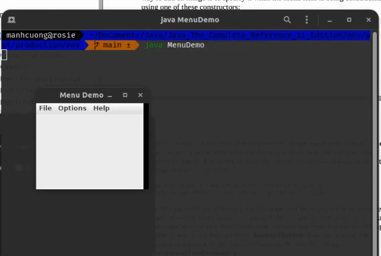
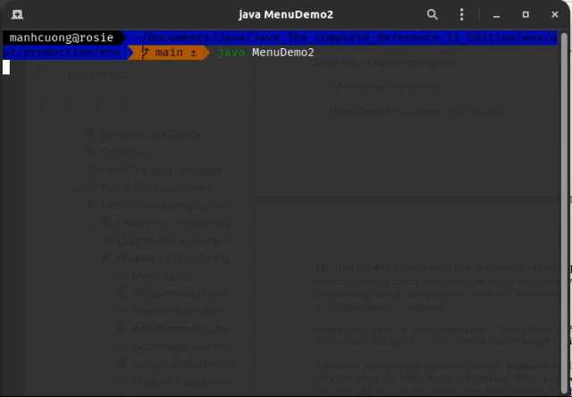

# 1. Menu Basics
# 2. An Overview of JMenuBar, JMenu, and JMenuItem
## 2.1. JMenuBar
## 2.2. JMenu
## 2.3. JMenuItem
# 3. Create a Main Menu
###### _[MenuDemo.java](MenuDemo.java)_
```java
import java.awt.*;
import java.awt.event.*;
import javax.swing.*;

public class MenuDemo implements ActionListener {
    JLabel jlab;

    MenuDemo() {
        JFrame jfrm = new JFrame("Menu Demo");
        jfrm.setLayout(new FlowLayout());
        jfrm.setSize(220, 200);
        jfrm.setDefaultCloseOperation(JFrame.EXIT_ON_CLOSE);

        jlab = new JLabel();

        // create the menu bar
        JMenuBar jmb = new JMenuBar();

        // Create the File menu
        JMenu jmFile = new JMenu("File");
        JMenuItem jmiOpen = new JMenuItem("Open");
        JMenuItem jmiClose = new JMenuItem("Close");
        JMenuItem jmiSave = new JMenuItem("Save");
        JMenuItem jmiExit = new JMenuItem("Exit");
        jmFile.add(jmiOpen);
        jmFile.add(jmiClose);
        jmFile.add(jmiSave);
        jmFile.addSeparator();
        jmFile.add(jmiExit);
        jmb.add(jmFile);

        // create the Options menu
        JMenu jmOptions = new JMenu("Options");

        // create the Colors submenu
        JMenu jmColors = new JMenu("Colors");
        JMenuItem jmiRed = new JMenuItem("Red");
        JMenuItem jmiGreen = new JMenuItem("Green");
        JMenuItem jmiBlue = new JMenuItem("Blue");
        jmColors.add(jmiRed);
        jmColors.add(jmiGreen);
        jmColors.add(jmiBlue);
        jmOptions.add(jmColors);

        // create the Priority submenu
        JMenu jmPriority = new JMenu("Priority");
        JMenuItem jmiHigh = new JMenuItem("High");
        JMenuItem jmiLow = new JMenuItem("Low");
        jmPriority.add(jmiHigh);
        jmPriority.add(jmiLow);
        jmOptions.add(jmPriority);

        JMenuItem jmiReset = new JMenuItem("Reset");
        jmOptions.addSeparator();
        jmOptions.add(jmiReset);

        // add the entire options meny to the menu bar
        jmb.add(jmOptions);

        JMenu jmHelp = new JMenu("Help");
        JMenuItem jmiAbout = new JMenuItem("About");
        jmHelp.add(jmiAbout);
        jmb.add(jmHelp);

        jmiOpen.addActionListener(this);
        jmiClose.addActionListener(this);
        jmiSave.addActionListener(this);
        jmiExit.addActionListener(this);
        jmiRed.addActionListener(this);
        jmiGreen.addActionListener(this);
        jmiBlue.addActionListener(this);
        jmiHigh.addActionListener(this);
        jmiLow.addActionListener(this);
        jmiReset.addActionListener(this);
        jmiAbout.addActionListener(this);

        jfrm.add(jlab);
        jfrm.setJMenuBar(jmb);
        jfrm.setVisible(true);
    }

    public void actionPerformed(ActionEvent ae) {
        String comStr = ae.getActionCommand();

        if (comStr.equals("Exit")) {
            System.exit(0);
        }

        jlab.setText(comStr + " selected");
    }

    public static void main(String[] args) {
        SwingUtilities.invokeLater(new Runnable() {
            @Override
            public void run() {
                new MenuDemo();
            }
        });
    }
}
```


# 4. Add Mnemonics and Accelerators to Menu Items
###### _[MenuDemo1.java](MenuDemo1.java)_
```java
import java.awt.*;
import java.awt.event.*;
import javax.swing.*;

public class MenuDemo1 implements ActionListener {
    JLabel jlab;

    MenuDemo1() {
        JFrame jfrm = new JFrame("Menu Demo");
        jfrm.setLayout(new FlowLayout());
        jfrm.setSize(220, 200);
        jfrm.setDefaultCloseOperation(JFrame.EXIT_ON_CLOSE);

        jlab = new JLabel();

        // create the menu bar
        JMenuBar jmb = new JMenuBar();

        // Create the File menu
        JMenu jmFile = new JMenu("File");
        jmFile.setMnemonic(KeyEvent.VK_F);
        JMenuItem jmiOpen = new JMenuItem("Open", KeyEvent.VK_O);
        jmiOpen.setAccelerator(KeyStroke.getKeyStroke(KeyEvent.VK_O, InputEvent.CTRL_DOWN_MASK));
        JMenuItem jmiClose = new JMenuItem("Close", KeyEvent.VK_C);
        jmiClose.setAccelerator(KeyStroke.getKeyStroke(KeyEvent.VK_C, InputEvent.CTRL_DOWN_MASK));
        JMenuItem jmiSave = new JMenuItem("Save", KeyEvent.VK_S);
        jmiSave.setAccelerator(KeyStroke.getKeyStroke(KeyEvent.VK_S, InputEvent.CTRL_DOWN_MASK));
        JMenuItem jmiExit = new JMenuItem("Exit", KeyEvent.VK_E);
        jmiExit.setAccelerator(KeyStroke.getKeyStroke(KeyEvent.VK_E, InputEvent.CTRL_DOWN_MASK));
        jmFile.add(jmiOpen);
        jmFile.add(jmiClose);
        jmFile.add(jmiSave);
        jmFile.addSeparator();
        jmFile.add(jmiExit);
        jmb.add(jmFile);

        // create the Options menu
        JMenu jmOptions = new JMenu("Options");

        // create the Colors submenu
        JMenu jmColors = new JMenu("Colors");
        JMenuItem jmiRed = new JMenuItem("Red");
        JMenuItem jmiGreen = new JMenuItem("Green");
        JMenuItem jmiBlue = new JMenuItem("Blue");
        jmColors.add(jmiRed);
        jmColors.add(jmiGreen);
        jmColors.add(jmiBlue);
        jmOptions.add(jmColors);

        // create the Priority submenu
        JMenu jmPriority = new JMenu("Priority");
        JMenuItem jmiHigh = new JMenuItem("High");
        JMenuItem jmiLow = new JMenuItem("Low");
        jmPriority.add(jmiHigh);
        jmPriority.add(jmiLow);
        jmOptions.add(jmPriority);

        JMenuItem jmiReset = new JMenuItem("Reset");
        jmOptions.addSeparator();
        jmOptions.add(jmiReset);

        // add the entire options meny to the menu bar
        jmb.add(jmOptions);

        JMenu jmHelp = new JMenu("Help");
        JMenuItem jmiAbout = new JMenuItem("About");
        jmHelp.add(jmiAbout);
        jmb.add(jmHelp);

        jmiOpen.addActionListener(this);
        jmiClose.addActionListener(this);
        jmiSave.addActionListener(this);
        jmiExit.addActionListener(this);
        jmiRed.addActionListener(this);
        jmiGreen.addActionListener(this);
        jmiBlue.addActionListener(this);
        jmiHigh.addActionListener(this);
        jmiLow.addActionListener(this);
        jmiReset.addActionListener(this);
        jmiAbout.addActionListener(this);

        jfrm.add(jlab);
        jfrm.setJMenuBar(jmb);
        jfrm.setVisible(true);
    }

    public void actionPerformed(ActionEvent ae) {
        String comStr = ae.getActionCommand();

        if (comStr.equals("Exit")) {
            System.exit(0);
        }

        jlab.setText(comStr + " selected");
    }

    public static void main(String[] args) {
        SwingUtilities.invokeLater(new Runnable() {
            @Override
            public void run() {
                new MenuDemo1();
            }
        });
    }
}
```


# 5. Add Images and Tooltips to Menu Items
###### _[MenuDemo2.java](MenuDemo2.java)_
```java
import java.awt.*;
import java.awt.event.*;
import javax.swing.*;

public class MenuDemo2 implements ActionListener {
    JLabel jlab;

    MenuDemo2() {
        JFrame jfrm = new JFrame("Menu Demo");
        jfrm.setLayout(new FlowLayout());
        jfrm.setSize(220, 200);
        jfrm.setDefaultCloseOperation(JFrame.EXIT_ON_CLOSE);

        jlab = new JLabel();

        // create the menu bar
        JMenuBar jmb = new JMenuBar();

        // Create the File menu
        JMenu jmFile = new JMenu("File");
        jmFile.setMnemonic(KeyEvent.VK_F);
        JMenuItem jmiOpen = new JMenuItem("Open", KeyEvent.VK_O);
        jmiOpen.setAccelerator(KeyStroke.getKeyStroke(KeyEvent.VK_O, InputEvent.CTRL_DOWN_MASK));
        JMenuItem jmiClose = new JMenuItem("Close", KeyEvent.VK_C);
        jmiClose.setAccelerator(KeyStroke.getKeyStroke(KeyEvent.VK_C, InputEvent.CTRL_DOWN_MASK));
        JMenuItem jmiSave = new JMenuItem("Save", KeyEvent.VK_S);
        jmiSave.setAccelerator(KeyStroke.getKeyStroke(KeyEvent.VK_S, InputEvent.CTRL_DOWN_MASK));
        JMenuItem jmiExit = new JMenuItem("Exit", KeyEvent.VK_E);
        jmiExit.setAccelerator(KeyStroke.getKeyStroke(KeyEvent.VK_E, InputEvent.CTRL_DOWN_MASK));
        jmFile.add(jmiOpen);
        jmFile.add(jmiClose);
        jmFile.add(jmiSave);
        jmFile.addSeparator();
        jmFile.add(jmiExit);
        jmb.add(jmFile);

        // create the Options menu
        JMenu jmOptions = new JMenu("Options");

        // create the Colors submenu
        JMenu jmColors = new JMenu("Colors");
        JMenuItem jmiRed = new JMenuItem("Red");
        JMenuItem jmiGreen = new JMenuItem("Green");
        JMenuItem jmiBlue = new JMenuItem("Blue");
        jmColors.add(jmiRed);
        jmColors.add(jmiGreen);
        jmColors.add(jmiBlue);
        jmOptions.add(jmColors);

        // create the Priority submenu
        JMenu jmPriority = new JMenu("Priority");
        JMenuItem jmiHigh = new JMenuItem("High");
        JMenuItem jmiLow = new JMenuItem("Low");
        jmPriority.add(jmiHigh);
        jmPriority.add(jmiLow);
        jmOptions.add(jmPriority);

        JMenuItem jmiReset = new JMenuItem("Reset");
        jmOptions.addSeparator();
        jmOptions.add(jmiReset);

        // add the entire options meny to the menu bar
        jmb.add(jmOptions);

        JMenu jmHelp = new JMenu("Help");
        ImageIcon icon = new ImageIcon("./images/penguin.png");
        JMenuItem jmiAbout = new JMenuItem("About", icon);
        jmHelp.add(jmiAbout);
        jmb.add(jmHelp);

        jmiOpen.addActionListener(this);
        jmiClose.addActionListener(this);
        jmiSave.addActionListener(this);
        jmiExit.addActionListener(this);
        jmiRed.addActionListener(this);
        jmiGreen.addActionListener(this);
        jmiBlue.addActionListener(this);
        jmiHigh.addActionListener(this);
        jmiLow.addActionListener(this);
        jmiReset.addActionListener(this);
        jmiAbout.addActionListener(this);

        jfrm.add(jlab);
        jfrm.setJMenuBar(jmb);
        jfrm.setVisible(true);
    }

    public void actionPerformed(ActionEvent ae) {
        String comStr = ae.getActionCommand();

        if (comStr.equals("Exit")) {
            System.exit(0);
        }

        jlab.setText(comStr + " selected");
    }

    public static void main(String[] args) {
        SwingUtilities.invokeLater(new Runnable() {
            @Override
            public void run() {
                new MenuDemo2();
            }
        });
    }
}
```
