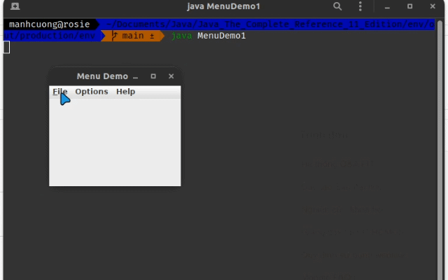
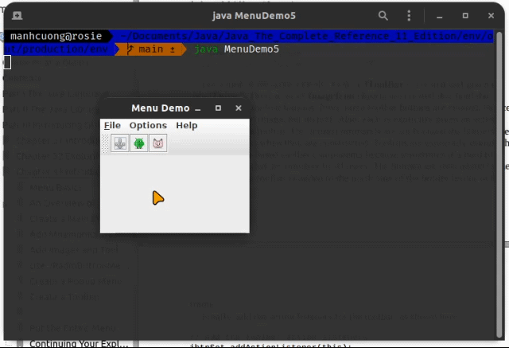

# 1. Menu Basics
# 2. An Overview of JMenuBar, JMenu, and JMenuItem
## 2.1. JMenuBar
## 2.2. JMenu
## 2.3. JMenuItem
# 3. Create a Main Menu
###### _[MenuDemo.java](MenuDemo.java)_
```java
import java.awt.*;
import java.awt.event.*;
import javax.swing.*;

public class MenuDemo implements ActionListener {
    JLabel jlab;

    MenuDemo() {
        JFrame jfrm = new JFrame("Menu Demo");
        jfrm.setLayout(new FlowLayout());
        jfrm.setSize(220, 200);
        jfrm.setDefaultCloseOperation(JFrame.EXIT_ON_CLOSE);

        jlab = new JLabel();

        // create the menu bar
        JMenuBar jmb = new JMenuBar();

        // Create the File menu
        JMenu jmFile = new JMenu("File");
        JMenuItem jmiOpen = new JMenuItem("Open");
        JMenuItem jmiClose = new JMenuItem("Close");
        JMenuItem jmiSave = new JMenuItem("Save");
        JMenuItem jmiExit = new JMenuItem("Exit");
        jmFile.add(jmiOpen);
        jmFile.add(jmiClose);
        jmFile.add(jmiSave);
        jmFile.addSeparator();
        jmFile.add(jmiExit);
        jmb.add(jmFile);

        // create the Options menu
        JMenu jmOptions = new JMenu("Options");

        // create the Colors submenu
        JMenu jmColors = new JMenu("Colors");
        JMenuItem jmiRed = new JMenuItem("Red");
        JMenuItem jmiGreen = new JMenuItem("Green");
        JMenuItem jmiBlue = new JMenuItem("Blue");
        jmColors.add(jmiRed);
        jmColors.add(jmiGreen);
        jmColors.add(jmiBlue);
        jmOptions.add(jmColors);

        // create the Priority submenu
        JMenu jmPriority = new JMenu("Priority");
        JMenuItem jmiHigh = new JMenuItem("High");
        JMenuItem jmiLow = new JMenuItem("Low");
        jmPriority.add(jmiHigh);
        jmPriority.add(jmiLow);
        jmOptions.add(jmPriority);

        JMenuItem jmiReset = new JMenuItem("Reset");
        jmOptions.addSeparator();
        jmOptions.add(jmiReset);

        // add the entire options meny to the menu bar
        jmb.add(jmOptions);

        JMenu jmHelp = new JMenu("Help");
        JMenuItem jmiAbout = new JMenuItem("About");
        jmHelp.add(jmiAbout);
        jmb.add(jmHelp);

        jmiOpen.addActionListener(this);
        jmiClose.addActionListener(this);
        jmiSave.addActionListener(this);
        jmiExit.addActionListener(this);
        jmiRed.addActionListener(this);
        jmiGreen.addActionListener(this);
        jmiBlue.addActionListener(this);
        jmiHigh.addActionListener(this);
        jmiLow.addActionListener(this);
        jmiReset.addActionListener(this);
        jmiAbout.addActionListener(this);

        jfrm.add(jlab);
        jfrm.setJMenuBar(jmb);
        jfrm.setVisible(true);
    }

    public void actionPerformed(ActionEvent ae) {
        String comStr = ae.getActionCommand();

        if (comStr.equals("Exit")) {
            System.exit(0);
        }

        jlab.setText(comStr + " selected");
    }

    public static void main(String[] args) {
        SwingUtilities.invokeLater(new Runnable() {
            @Override
            public void run() {
                new MenuDemo();
            }
        });
    }
}
```


# 4. Add Mnemonics and Accelerators to Menu Items
###### _[MenuDemo1.java](MenuDemo1.java)_
```java
import java.awt.*;
import java.awt.event.*;
import javax.swing.*;

public class MenuDemo1 implements ActionListener {
    JLabel jlab;

    MenuDemo1() {
        JFrame jfrm = new JFrame("Menu Demo");
        jfrm.setLayout(new FlowLayout());
        jfrm.setSize(220, 200);
        jfrm.setDefaultCloseOperation(JFrame.EXIT_ON_CLOSE);

        jlab = new JLabel();

        // create the menu bar
        JMenuBar jmb = new JMenuBar();

        // Create the File menu
        JMenu jmFile = new JMenu("File");
        jmFile.setMnemonic(KeyEvent.VK_F);
        JMenuItem jmiOpen = new JMenuItem("Open", KeyEvent.VK_O);
        jmiOpen.setAccelerator(KeyStroke.getKeyStroke(KeyEvent.VK_O, InputEvent.CTRL_DOWN_MASK));
        JMenuItem jmiClose = new JMenuItem("Close", KeyEvent.VK_C);
        jmiClose.setAccelerator(KeyStroke.getKeyStroke(KeyEvent.VK_C, InputEvent.CTRL_DOWN_MASK));
        JMenuItem jmiSave = new JMenuItem("Save", KeyEvent.VK_S);
        jmiSave.setAccelerator(KeyStroke.getKeyStroke(KeyEvent.VK_S, InputEvent.CTRL_DOWN_MASK));
        JMenuItem jmiExit = new JMenuItem("Exit", KeyEvent.VK_E);
        jmiExit.setAccelerator(KeyStroke.getKeyStroke(KeyEvent.VK_E, InputEvent.CTRL_DOWN_MASK));
        jmFile.add(jmiOpen);
        jmFile.add(jmiClose);
        jmFile.add(jmiSave);
        jmFile.addSeparator();
        jmFile.add(jmiExit);
        jmb.add(jmFile);

        // create the Options menu
        JMenu jmOptions = new JMenu("Options");

        // create the Colors submenu
        JMenu jmColors = new JMenu("Colors");
        JMenuItem jmiRed = new JMenuItem("Red");
        JMenuItem jmiGreen = new JMenuItem("Green");
        JMenuItem jmiBlue = new JMenuItem("Blue");
        jmColors.add(jmiRed);
        jmColors.add(jmiGreen);
        jmColors.add(jmiBlue);
        jmOptions.add(jmColors);

        // create the Priority submenu
        JMenu jmPriority = new JMenu("Priority");
        JMenuItem jmiHigh = new JMenuItem("High");
        JMenuItem jmiLow = new JMenuItem("Low");
        jmPriority.add(jmiHigh);
        jmPriority.add(jmiLow);
        jmOptions.add(jmPriority);

        JMenuItem jmiReset = new JMenuItem("Reset");
        jmOptions.addSeparator();
        jmOptions.add(jmiReset);

        // add the entire options meny to the menu bar
        jmb.add(jmOptions);

        JMenu jmHelp = new JMenu("Help");
        JMenuItem jmiAbout = new JMenuItem("About");
        jmHelp.add(jmiAbout);
        jmb.add(jmHelp);

        jmiOpen.addActionListener(this);
        jmiClose.addActionListener(this);
        jmiSave.addActionListener(this);
        jmiExit.addActionListener(this);
        jmiRed.addActionListener(this);
        jmiGreen.addActionListener(this);
        jmiBlue.addActionListener(this);
        jmiHigh.addActionListener(this);
        jmiLow.addActionListener(this);
        jmiReset.addActionListener(this);
        jmiAbout.addActionListener(this);

        jfrm.add(jlab);
        jfrm.setJMenuBar(jmb);
        jfrm.setVisible(true);
    }

    public void actionPerformed(ActionEvent ae) {
        String comStr = ae.getActionCommand();

        if (comStr.equals("Exit")) {
            System.exit(0);
        }

        jlab.setText(comStr + " selected");
    }

    public static void main(String[] args) {
        SwingUtilities.invokeLater(new Runnable() {
            @Override
            public void run() {
                new MenuDemo1();
            }
        });
    }
}
```


# 5. Add Images and Tooltips to Menu Items
###### _[MenuDemo2.java](MenuDemo2.java)_
```java
import java.awt.*;
import java.awt.event.*;
import javax.swing.*;

public class MenuDemo2 implements ActionListener {
    JLabel jlab;

    MenuDemo2() {
        JFrame jfrm = new JFrame("Menu Demo");
        jfrm.setLayout(new FlowLayout());
        jfrm.setSize(220, 200);
        jfrm.setDefaultCloseOperation(JFrame.EXIT_ON_CLOSE);

        jlab = new JLabel();

        // create the menu bar
        JMenuBar jmb = new JMenuBar();

        // Create the File menu
        JMenu jmFile = new JMenu("File");
        jmFile.setMnemonic(KeyEvent.VK_F);
        JMenuItem jmiOpen = new JMenuItem("Open", KeyEvent.VK_O);
        jmiOpen.setAccelerator(KeyStroke.getKeyStroke(KeyEvent.VK_O, InputEvent.CTRL_DOWN_MASK));
        JMenuItem jmiClose = new JMenuItem("Close", KeyEvent.VK_C);
        jmiClose.setAccelerator(KeyStroke.getKeyStroke(KeyEvent.VK_C, InputEvent.CTRL_DOWN_MASK));
        JMenuItem jmiSave = new JMenuItem("Save", KeyEvent.VK_S);
        jmiSave.setAccelerator(KeyStroke.getKeyStroke(KeyEvent.VK_S, InputEvent.CTRL_DOWN_MASK));
        JMenuItem jmiExit = new JMenuItem("Exit", KeyEvent.VK_E);
        jmiExit.setAccelerator(KeyStroke.getKeyStroke(KeyEvent.VK_E, InputEvent.CTRL_DOWN_MASK));
        jmFile.add(jmiOpen);
        jmFile.add(jmiClose);
        jmFile.add(jmiSave);
        jmFile.addSeparator();
        jmFile.add(jmiExit);
        jmb.add(jmFile);

        // create the Options menu
        JMenu jmOptions = new JMenu("Options");

        // create the Colors submenu
        JMenu jmColors = new JMenu("Colors");
        JMenuItem jmiRed = new JMenuItem("Red");
        JMenuItem jmiGreen = new JMenuItem("Green");
        JMenuItem jmiBlue = new JMenuItem("Blue");
        jmColors.add(jmiRed);
        jmColors.add(jmiGreen);
        jmColors.add(jmiBlue);
        jmOptions.add(jmColors);

        // create the Priority submenu
        JMenu jmPriority = new JMenu("Priority");
        JMenuItem jmiHigh = new JMenuItem("High");
        JMenuItem jmiLow = new JMenuItem("Low");
        jmPriority.add(jmiHigh);
        jmPriority.add(jmiLow);
        jmOptions.add(jmPriority);

        JMenuItem jmiReset = new JMenuItem("Reset");
        jmOptions.addSeparator();
        jmOptions.add(jmiReset);

        // add the entire options meny to the menu bar
        jmb.add(jmOptions);

        JMenu jmHelp = new JMenu("Help");
        ImageIcon icon = new ImageIcon("./images/penguin.png");
        JMenuItem jmiAbout = new JMenuItem("About", icon);
        jmHelp.add(jmiAbout);
        jmb.add(jmHelp);

        jmiOpen.addActionListener(this);
        jmiClose.addActionListener(this);
        jmiSave.addActionListener(this);
        jmiExit.addActionListener(this);
        jmiRed.addActionListener(this);
        jmiGreen.addActionListener(this);
        jmiBlue.addActionListener(this);
        jmiHigh.addActionListener(this);
        jmiLow.addActionListener(this);
        jmiReset.addActionListener(this);
        jmiAbout.addActionListener(this);

        jfrm.add(jlab);
        jfrm.setJMenuBar(jmb);
        jfrm.setVisible(true);
    }

    public void actionPerformed(ActionEvent ae) {
        String comStr = ae.getActionCommand();

        if (comStr.equals("Exit")) {
            System.exit(0);
        }

        jlab.setText(comStr + " selected");
    }

    public static void main(String[] args) {
        SwingUtilities.invokeLater(new Runnable() {
            @Override
            public void run() {
                new MenuDemo2();
            }
        });
    }
}
```


# 6. Use JRadioButtonMenuItem and JCheckBoxMenuItem
###### _[MenuDemo3.java](MenuDemo3.java)_
```java
import java.awt.*;
import java.awt.event.*;
import javax.swing.*;

public class MenuDemo3 implements ActionListener {
    JLabel jlab;

    MenuDemo3() {
        JFrame jfrm = new JFrame("Menu Demo");
        jfrm.setLayout(new FlowLayout());
        jfrm.setSize(220, 200);
        jfrm.setDefaultCloseOperation(JFrame.EXIT_ON_CLOSE);

        jlab = new JLabel();

        // create the menu bar
        JMenuBar jmb = new JMenuBar();

        // Create the File menu
        JMenu jmFile = new JMenu("File");
        jmFile.setMnemonic(KeyEvent.VK_F);
        JMenuItem jmiOpen = new JMenuItem("Open", KeyEvent.VK_O);
        jmiOpen.setAccelerator(KeyStroke.getKeyStroke(KeyEvent.VK_O, InputEvent.CTRL_DOWN_MASK));
        JMenuItem jmiClose = new JMenuItem("Close", KeyEvent.VK_C);
        jmiClose.setAccelerator(KeyStroke.getKeyStroke(KeyEvent.VK_C, InputEvent.CTRL_DOWN_MASK));
        JMenuItem jmiSave = new JMenuItem("Save", KeyEvent.VK_S);
        jmiSave.setAccelerator(KeyStroke.getKeyStroke(KeyEvent.VK_S, InputEvent.CTRL_DOWN_MASK));
        JMenuItem jmiExit = new JMenuItem("Exit", KeyEvent.VK_E);
        jmiExit.setAccelerator(KeyStroke.getKeyStroke(KeyEvent.VK_E, InputEvent.CTRL_DOWN_MASK));
        jmFile.add(jmiOpen);
        jmFile.add(jmiClose);
        jmFile.add(jmiSave);
        jmFile.addSeparator();
        jmFile.add(jmiExit);
        jmb.add(jmFile);

        // create the Options menu
        JMenu jmOptions = new JMenu("Options");

        // create the Colors submenu
        JMenu jmColors = new JMenu("Colors");
        JCheckBoxMenuItem jmiRed = new JCheckBoxMenuItem("Red");
        JCheckBoxMenuItem jmiGreen = new JCheckBoxMenuItem("Green");
        JCheckBoxMenuItem jmiBlue = new JCheckBoxMenuItem("Blue");
        jmColors.add(jmiRed);
        jmColors.add(jmiGreen);
        jmColors.add(jmiBlue);
        jmOptions.add(jmColors);

        // create the Priority submenu
        JMenu jmPriority = new JMenu("Priority");
        JRadioButtonMenuItem jmiHigh = new JRadioButtonMenuItem("High", true);
        JRadioButtonMenuItem jmiLow = new JRadioButtonMenuItem("Low");
        jmPriority.add(jmiHigh);
        jmPriority.add(jmiLow);
        jmOptions.add(jmPriority);

        ButtonGroup bg = new ButtonGroup();
        bg.add(jmiHigh);
        bg.add(jmiLow);

        JMenuItem jmiReset = new JMenuItem("Reset");
        jmOptions.addSeparator();
        jmOptions.add(jmiReset);

        // add the entire options meny to the menu bar
        jmb.add(jmOptions);

        JMenu jmHelp = new JMenu("Help");
        ImageIcon icon = new ImageIcon("./images/penguin.png");
        JMenuItem jmiAbout = new JMenuItem("About", icon);
        jmHelp.add(jmiAbout);
        jmb.add(jmHelp);

        jmiOpen.addActionListener(this);
        jmiClose.addActionListener(this);
        jmiSave.addActionListener(this);
        jmiExit.addActionListener(this);
        jmiRed.addActionListener(this);
        jmiGreen.addActionListener(this);
        jmiBlue.addActionListener(this);
        jmiHigh.addActionListener(this);
        jmiLow.addActionListener(this);
        jmiReset.addActionListener(this);
        jmiAbout.addActionListener(this);

        jfrm.add(jlab);
        jfrm.setJMenuBar(jmb);
        jfrm.setVisible(true);
    }

    public void actionPerformed(ActionEvent ae) {
        String comStr = ae.getActionCommand();

        if (comStr.equals("Exit")) {
            System.exit(0);
        }

        jlab.setText(comStr + " selected");
    }

    public static void main(String[] args) {
        SwingUtilities.invokeLater(new Runnable() {
            @Override
            public void run() {
                new MenuDemo3();
            }
        });
    }
}
```


# 7. Create a Popup Menu
###### MenuDemo4.java
```java
import java.awt.*;
import java.awt.event.*;
import javax.swing.*;

public class MenuDemo4 implements ActionListener {
    JLabel jlab;
    JPopupMenu jpu;

    MenuDemo4() {
        JFrame jfrm = new JFrame("Menu Demo");
        jfrm.setLayout(new FlowLayout());
        jfrm.setSize(220, 200);
        jfrm.setDefaultCloseOperation(JFrame.EXIT_ON_CLOSE);

        jlab = new JLabel();

        // create the menu bar
        JMenuBar jmb = new JMenuBar();

        // Create the File menu
        JMenu jmFile = new JMenu("File");
        jmFile.setMnemonic(KeyEvent.VK_F);
        JMenuItem jmiOpen = new JMenuItem("Open", KeyEvent.VK_O);
        jmiOpen.setAccelerator(KeyStroke.getKeyStroke(KeyEvent.VK_O, InputEvent.CTRL_DOWN_MASK));
        JMenuItem jmiClose = new JMenuItem("Close", KeyEvent.VK_C);
        jmiClose.setAccelerator(KeyStroke.getKeyStroke(KeyEvent.VK_C, InputEvent.CTRL_DOWN_MASK));
        JMenuItem jmiSave = new JMenuItem("Save", KeyEvent.VK_S);
        jmiSave.setAccelerator(KeyStroke.getKeyStroke(KeyEvent.VK_S, InputEvent.CTRL_DOWN_MASK));
        JMenuItem jmiExit = new JMenuItem("Exit", KeyEvent.VK_E);
        jmiExit.setAccelerator(KeyStroke.getKeyStroke(KeyEvent.VK_E, InputEvent.CTRL_DOWN_MASK));
        jmFile.add(jmiOpen);
        jmFile.add(jmiClose);
        jmFile.add(jmiSave);
        jmFile.addSeparator();
        jmFile.add(jmiExit);
        jmb.add(jmFile);

        // create the Options menu
        JMenu jmOptions = new JMenu("Options");

        // create the Colors submenu
        JMenu jmColors = new JMenu("Colors");
        JCheckBoxMenuItem jmiRed = new JCheckBoxMenuItem("Red");
        JCheckBoxMenuItem jmiGreen = new JCheckBoxMenuItem("Green");
        JCheckBoxMenuItem jmiBlue = new JCheckBoxMenuItem("Blue");
        jmColors.add(jmiRed);
        jmColors.add(jmiGreen);
        jmColors.add(jmiBlue);
        jmOptions.add(jmColors);

        // create the Priority submenu
        JMenu jmPriority = new JMenu("Priority");
        JRadioButtonMenuItem jmiHigh = new JRadioButtonMenuItem("High", true);
        JRadioButtonMenuItem jmiLow = new JRadioButtonMenuItem("Low");
        jmPriority.add(jmiHigh);
        jmPriority.add(jmiLow);
        jmOptions.add(jmPriority);

        ButtonGroup bg = new ButtonGroup();
        bg.add(jmiHigh);
        bg.add(jmiLow);

        JMenuItem jmiReset = new JMenuItem("Reset");
        jmOptions.addSeparator();
        jmOptions.add(jmiReset);

        // add the entire options meny to the menu bar
        jmb.add(jmOptions);

        JMenu jmHelp = new JMenu("Help");
        ImageIcon icon = new ImageIcon("./images/penguin.png");
        JMenuItem jmiAbout = new JMenuItem("About", icon);
        jmHelp.add(jmiAbout);
        jmb.add(jmHelp);

        jmiOpen.addActionListener(this);
        jmiClose.addActionListener(this);
        jmiSave.addActionListener(this);
        jmiExit.addActionListener(this);
        jmiRed.addActionListener(this);
        jmiGreen.addActionListener(this);
        jmiBlue.addActionListener(this);
        jmiHigh.addActionListener(this);
        jmiLow.addActionListener(this);
        jmiReset.addActionListener(this);
        jmiAbout.addActionListener(this);

        jfrm.add(jlab);
        jfrm.setJMenuBar(jmb);
        jfrm.setVisible(true);

        // create an Edit popup menu
        jpu = new JPopupMenu();

        JMenuItem jmiCut = new JMenuItem("Cut");
        JMenuItem jmiCopy = new JMenuItem("Copy");
        JMenuItem jmiPaste = new JMenuItem("Paste");

        jpu.add(jmiCut);
        jpu.add(jmiCopy);
        jpu.add(jmiPaste);

        jmiCut.addActionListener(this);
        jmiCopy.addActionListener(this);
        jmiPaste.addActionListener(this);

        jfrm.addMouseListener(new MouseAdapter() {
            @Override
            public void mousePressed(MouseEvent me) {
                super.mousePressed(me);

                if (me.isPopupTrigger()) {
                    jpu.show(me.getComponent(), me.getX(), me.getY());
                }
            }

            @Override
            public void mouseReleased(MouseEvent me) {
                super.mousePressed(me);

                if (me.isPopupTrigger()) {
                    jpu.show(me.getComponent(), me.getX(), me.getY());
                }
            }
        });
    }

    public void actionPerformed(ActionEvent ae) {
        String comStr = ae.getActionCommand();

        if (comStr.equals("Exit")) {
            System.exit(0);
        }

        jlab.setText(comStr + " selected");
    }

    public static void main(String[] args) {
        SwingUtilities.invokeLater(new Runnable() {
            @Override
            public void run() {
                new MenuDemo4();
            }
        });
    }
}
```


# 8. Create a Toolbar
###### _[MenuDemo5.java](MenuDemo5.java)_
```java
import java.awt.*;
import java.awt.event.*;
import javax.swing.*;

public class MenuDemo5 implements ActionListener {
    JLabel jlab;
    JPopupMenu jpu;

    MenuDemo5() {
        JFrame jfrm = new JFrame("Menu Demo");
        jfrm.setSize(220, 200);
        jfrm.setDefaultCloseOperation(JFrame.EXIT_ON_CLOSE);

        jlab = new JLabel();

        // create the menu bar
        JMenuBar jmb = new JMenuBar();

        // Create the File menu
        JMenu jmFile = new JMenu("File");
        jmFile.setMnemonic(KeyEvent.VK_F);
        JMenuItem jmiOpen = new JMenuItem("Open", KeyEvent.VK_O);
        jmiOpen.setAccelerator(KeyStroke.getKeyStroke(KeyEvent.VK_O, InputEvent.CTRL_DOWN_MASK));
        JMenuItem jmiClose = new JMenuItem("Close", KeyEvent.VK_C);
        jmiClose.setAccelerator(KeyStroke.getKeyStroke(KeyEvent.VK_C, InputEvent.CTRL_DOWN_MASK));
        JMenuItem jmiSave = new JMenuItem("Save", KeyEvent.VK_S);
        jmiSave.setAccelerator(KeyStroke.getKeyStroke(KeyEvent.VK_S, InputEvent.CTRL_DOWN_MASK));
        JMenuItem jmiExit = new JMenuItem("Exit", KeyEvent.VK_E);
        jmiExit.setAccelerator(KeyStroke.getKeyStroke(KeyEvent.VK_E, InputEvent.CTRL_DOWN_MASK));
        jmFile.add(jmiOpen);
        jmFile.add(jmiClose);
        jmFile.add(jmiSave);
        jmFile.addSeparator();
        jmFile.add(jmiExit);
        jmb.add(jmFile);

        // create the Options menu
        JMenu jmOptions = new JMenu("Options");

        // create the Colors submenu
        JMenu jmColors = new JMenu("Colors");
        JCheckBoxMenuItem jmiRed = new JCheckBoxMenuItem("Red");
        JCheckBoxMenuItem jmiGreen = new JCheckBoxMenuItem("Green");
        JCheckBoxMenuItem jmiBlue = new JCheckBoxMenuItem("Blue");
        jmColors.add(jmiRed);
        jmColors.add(jmiGreen);
        jmColors.add(jmiBlue);
        jmOptions.add(jmColors);

        // create the Priority submenu
        JMenu jmPriority = new JMenu("Priority");
        JRadioButtonMenuItem jmiHigh = new JRadioButtonMenuItem("High", true);
        JRadioButtonMenuItem jmiLow = new JRadioButtonMenuItem("Low");
        jmPriority.add(jmiHigh);
        jmPriority.add(jmiLow);
        jmOptions.add(jmPriority);

        ButtonGroup bg = new ButtonGroup();
        bg.add(jmiHigh);
        bg.add(jmiLow);

        JMenuItem jmiReset = new JMenuItem("Reset");
        jmOptions.addSeparator();
        jmOptions.add(jmiReset);

        // add the entire options meny to the menu bar
        jmb.add(jmOptions);

        JMenu jmHelp = new JMenu("Help");
        ImageIcon icon = new ImageIcon("./images/penguin.png");
        JMenuItem jmiAbout = new JMenuItem("About", icon);
        jmHelp.add(jmiAbout);
        jmb.add(jmHelp);

        jmiOpen.addActionListener(this);
        jmiClose.addActionListener(this);
        jmiSave.addActionListener(this);
        jmiExit.addActionListener(this);
        jmiRed.addActionListener(this);
        jmiGreen.addActionListener(this);
        jmiBlue.addActionListener(this);
        jmiHigh.addActionListener(this);
        jmiLow.addActionListener(this);
        jmiReset.addActionListener(this);
        jmiAbout.addActionListener(this);

        jfrm.add(jlab, BorderLayout.CENTER);
        jfrm.setJMenuBar(jmb);

        JToolBar jtb = new JToolBar("Debug");

        ImageIcon set = new ImageIcon("./images/anchor.png");
        ImageIcon clear = new ImageIcon("./images/android.png");
        ImageIcon resume = new ImageIcon("./images/animal.png");

        JButton jbtnSet = new JButton(set);
        jbtnSet.setActionCommand("Set Breakpoint");
        jbtnSet.setToolTipText("Set Breakpoint");

        JButton jbtnClear = new JButton(clear);
        jbtnClear.setActionCommand("Clear Breakpoint");
        jbtnClear.setToolTipText("Clear Breakpoint");

        JButton jbtnResume = new JButton(resume);
        jbtnResume.setActionCommand("Resume");
        jbtnResume.setToolTipText("Resume");

        jtb.add(jbtnSet);
        jtb.add(jbtnClear);
        jtb.add(jbtnResume);
        jfrm.add(jtb, BorderLayout.NORTH);

        jbtnSet.addActionListener(this);
        jbtnClear.addActionListener(this);
        jbtnResume.addActionListener(this);

        jfrm.setVisible(true);

        // create an Edit popup menu
        jpu = new JPopupMenu();

        JMenuItem jmiCut = new JMenuItem("Cut");
        JMenuItem jmiCopy = new JMenuItem("Copy");
        JMenuItem jmiPaste = new JMenuItem("Paste");

        jpu.add(jmiCut);
        jpu.add(jmiCopy);
        jpu.add(jmiPaste);

        jmiCut.addActionListener(this);
        jmiCopy.addActionListener(this);
        jmiPaste.addActionListener(this);

        jfrm.addMouseListener(new MouseAdapter() {
            @Override
            public void mousePressed(MouseEvent me) {
                super.mousePressed(me);

                if (me.isPopupTrigger()) {
                    jpu.show(me.getComponent(), me.getX(), me.getY());
                }
            }

            @Override
            public void mouseReleased(MouseEvent me) {
                super.mousePressed(me);

                if (me.isPopupTrigger()) {
                    jpu.show(me.getComponent(), me.getX(), me.getY());
                }
            }
        });
    }

    public void actionPerformed(ActionEvent ae) {
        String comStr = ae.getActionCommand();

        if (comStr.equals("Exit")) {
            System.exit(0);
        }

        jlab.setText(comStr + " selected");
    }

    public static void main(String[] args) {
        SwingUtilities.invokeLater(new Runnable() {
            @Override
            public void run() {
                new MenuDemo5();
            }
        });
    }
}
```


# 9. Use Actions
###### _[MenuDemo6.java](MenuDemo6.java)_
```java
import java.awt.*;
import java.awt.event.*;
import java.security.Key;
import javax.swing.*;

public class MenuDemo6 implements ActionListener {
    JLabel jlab;
    JMenuBar jmb;
    JToolBar jtb;
    JPopupMenu jpu;

    DebugAction setAct;
    DebugAction clearAct;
    DebugAction resumeAct;

    class DebugAction extends AbstractAction {
        public DebugAction(String name, Icon image, int mnem, int accel, String tTip) {
            super(name, image);
            putValue(ACCELERATOR_KEY, KeyStroke.getKeyStroke(accel, InputEvent.CTRL_DOWN_MASK));
            putValue(MNEMONIC_KEY, mnem);
            putValue(SHORT_DESCRIPTION, tTip);
        }

        public void actionPerformed(ActionEvent ae) {
            String comStr = ae.getActionCommand();
            jlab.setText(comStr + " selected.");

            if (comStr.equals("Set Breakpoint")) {
                clearAct.setEnabled(true);
                setAct.setEnabled(false);
            } else if (comStr.equals("Clear Breakpoint")) {
                clearAct.setEnabled(false);
                setAct.setEnabled(true);
            }
        }
    }

    void makeFileMenu() {
        JMenu jmFile = new JMenu("File");
        jmFile.setMnemonic(KeyEvent.VK_F);
        JMenuItem jmiOpen = new JMenuItem("Open", KeyEvent.VK_O);
        jmiOpen.setAccelerator(KeyStroke.getKeyStroke(KeyEvent.VK_O, InputEvent.CTRL_DOWN_MASK));
        JMenuItem jmiClose = new JMenuItem("Close", KeyEvent.VK_C);
        jmiClose.setAccelerator(KeyStroke.getKeyStroke(KeyEvent.VK_C, InputEvent.CTRL_DOWN_MASK));
        JMenuItem jmiSave = new JMenuItem("Save", KeyEvent.VK_S);
        jmiSave.setAccelerator(KeyStroke.getKeyStroke(KeyEvent.VK_S, InputEvent.CTRL_DOWN_MASK));
        JMenuItem jmiExit = new JMenuItem("Exit", KeyEvent.VK_E);
        jmiExit.setAccelerator(KeyStroke.getKeyStroke(KeyEvent.VK_E, InputEvent.CTRL_DOWN_MASK));

        jmFile.add(jmiOpen);
        jmFile.add(jmiClose);
        jmFile.add(jmiSave);
        jmFile.addSeparator();
        jmFile.add(jmiExit);
        jmb.add(jmFile);

        jmiOpen.addActionListener(this);
        jmiClose.addActionListener(this);
        jmiSave.addActionListener(this);
        jmiExit.addActionListener(this);
    }

    void makeActions() {
        ImageIcon setIcon = new ImageIcon("./images/anchor.png");
        ImageIcon clearIcon = new ImageIcon("./images/android.png");
        ImageIcon resumeIcon = new ImageIcon("./images/animal.png");

        setAct = new DebugAction("Set Breakpoint", setIcon, KeyEvent.VK_S, KeyEvent.VK_B, "Set a break point");
        clearAct = new DebugAction("Clear Breakpoint", clearIcon, KeyEvent.VK_C, KeyEvent.VK_L, "Clear a break point.");
        resumeAct = new DebugAction("Resume Breakpoint", clearIcon, KeyEvent.VK_R, KeyEvent.VK_R, "Resume excution after breakpoint.");

        clearAct.setEnabled(false);
    }

    void makeToolBar() {
        JButton jbtnSet = new JButton(setAct);
        JButton jbtnClear = new JButton(clearAct);
        JButton jbtnResume = new JButton(resumeAct);

        jtb = new JToolBar("Breakpoints");
        jtb.add(jbtnSet);
        jtb.add(jbtnClear);
        jtb.add(jbtnResume);
    }

    void makeOptionsMenu() {
        // create the Options menu
        JMenu jmOptions = new JMenu("Options");

        // create the Colors submenu
        JMenu jmColors = new JMenu("Colors");
        JCheckBoxMenuItem jmiRed = new JCheckBoxMenuItem("Red");
        JCheckBoxMenuItem jmiGreen = new JCheckBoxMenuItem("Green");
        JCheckBoxMenuItem jmiBlue = new JCheckBoxMenuItem("Blue");

        jmColors.add(jmiRed);
        jmColors.add(jmiGreen);
        jmColors.add(jmiBlue);
        jmOptions.add(jmColors);

        JMenu jmPriority = new JMenu("Priority");

        JRadioButtonMenuItem jmiHigh = new JRadioButtonMenuItem("High", true);
        JRadioButtonMenuItem jmiLow = new JRadioButtonMenuItem("Low");

        jmPriority.add(jmiHigh);
        jmPriority.add(jmiLow);
        jmOptions.add(jmPriority);

        ButtonGroup bg = new ButtonGroup();
        bg.add(jmiHigh);
        bg.add(jmiLow);

        JMenu jmDebug = new JMenu("Debug");
        JMenuItem jmiSetBP = new JMenuItem(setAct);
        JMenuItem jmiClearBP = new JMenuItem(clearAct);
        JMenuItem jmiResume = new JMenuItem(resumeAct);

        jmDebug.add(jmiSetBP);
        jmDebug.add(jmiClearBP);
        jmDebug.add(jmiResume);
        jmOptions.add(jmDebug);

        JMenuItem jmiReset = new JMenuItem("Reset");
        jmOptions.addSeparator();
        jmOptions.add(jmiReset);

        jmb.add(jmOptions);

        jmiRed.addActionListener(this);
        jmiGreen.addActionListener(this);
        jmiBlue.addActionListener(this);
        jmiHigh.addActionListener(this);
        jmiLow.addActionListener(this);
        jmiReset.addActionListener(this);
    }

    void makeHelpMenu() {
        JMenu jmHelp = new JMenu("Help");
        ImageIcon icon = new ImageIcon("./images/penguin.png");
        JMenuItem jmiAbout = new JMenuItem("About", icon);
        jmiAbout.setToolTipText("Info about the MenuDemo6 program.");
        jmHelp.add(jmiAbout);
        jmb.add(jmHelp);

        jmiAbout.addActionListener(this);
    }

    void makeEditPUMenu() {
        jpu = new JPopupMenu();

        JMenuItem jmiCut = new JMenuItem("Cut");
        JMenuItem jmiCopy = new JMenuItem("Copy");
        JMenuItem jmiPaste = new JMenuItem("Paste");

        jpu.add(jmiCut);
        jpu.add(jmiCopy);
        jpu.add(jmiPaste);

        jmiCut.addActionListener(this);
        jmiCopy.addActionListener(this);
        jmiPaste.addActionListener(this);
    }

    public void actionPerformed(ActionEvent ae) {
        String comStr = ae.getActionCommand();

        if (comStr.equals("Exit")) {
            System.exit(0);
        }

        jlab.setText(comStr + " selected");
    }

    MenuDemo6() {
        JFrame jfrm = new JFrame("Complete Menu Demo 6");
        jfrm.setSize(360, 200);
        jfrm.setDefaultCloseOperation(JFrame.EXIT_ON_CLOSE);

        jlab = new JLabel();
        jmb = new JMenuBar();

        makeFileMenu();
        makeActions();
        makeToolBar();
        makeOptionsMenu();
        makeHelpMenu();
        makeEditPUMenu();

        jfrm.addMouseListener(new MouseAdapter() {
            @Override
            public void mousePressed(MouseEvent me) {
                super.mousePressed(me);

                if (me.isPopupTrigger()) {
                    jpu.show(me.getComponent(), me.getX(), me.getY());
                }
            }

            @Override
            public void mouseReleased(MouseEvent me) {
                super.mousePressed(me);

                if (me.isPopupTrigger()) {
                    jpu.show(me.getComponent(), me.getX(), me.getY());
                }
            }
        });

        jfrm.add(jlab, SwingConstants.CENTER);
        jfrm.add(jtb, BorderLayout.NORTH);
        jfrm.setJMenuBar(jmb);
        jfrm.setVisible(true);
    }

    public static void main(String[] args) {
        SwingUtilities.invokeLater(new Runnable() {
            @Override
            public void run() {
                new MenuDemo6();
            }
        });
    }
}
```


# 10. Put the Entire MenuDemo Program Together
# 11. Continuing Your Exploration of Swing