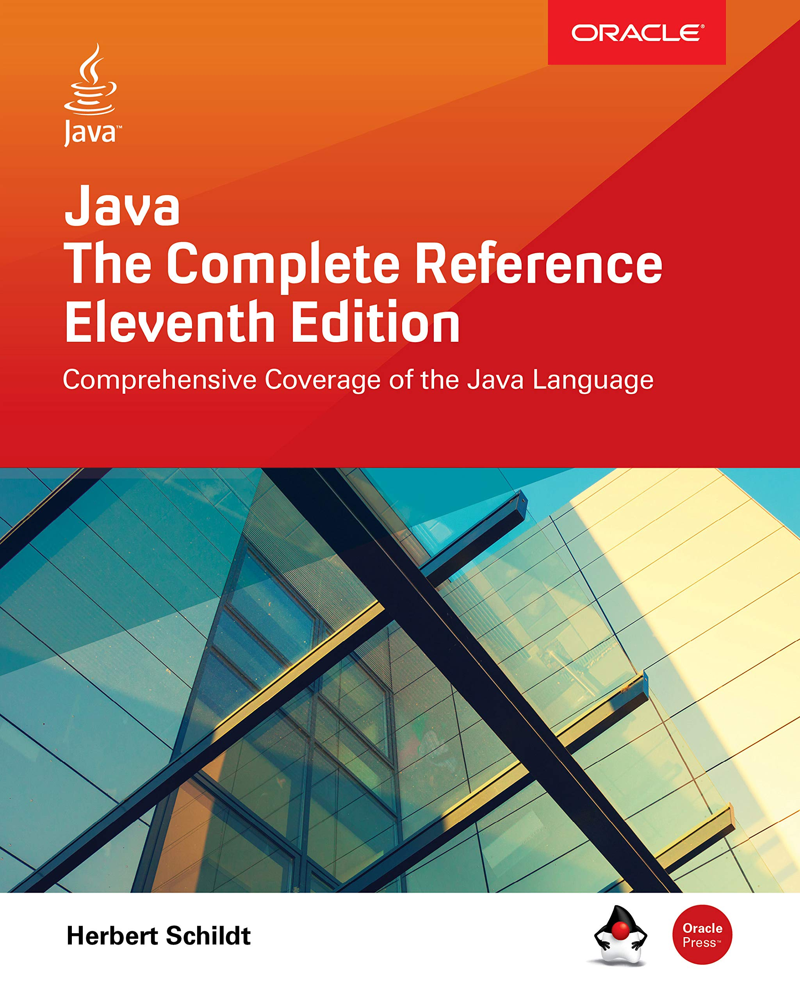

  
  [link](https://github.com/cuongpiger/documents/blob/master/Java/Java%20The%20Complete%20Reference%2C%20Eleventh%20Edition%20by%20Herbert%20Schildt.pdf)

# Contents

##### 💠 [Chapter 2: Tổng quan về Java](./Chapter%202.%20An%20Overview%20of%20Java) 
1. Chương trình đầu tiên - sơ bộ về Java _[A First Simple Program]_
  
  1.1. Quy ước về cách đặt tên file trong Java
  1.2. Biên dịch và chạy chương trình _[Compiling the program]_